Alcatel IPRAN (XML)
===========

1.	OBJETIVO
------------

El objetivo del documento será el de presentar y explicar los procesos que genera IPRAN.

2.	ALCANCE 
-----------

Áreas involucradas: Performance de Red

3.	DEFINICIONES
----------------

Cortado: Servidor UNIX en donde se importan los archivos desde el proveedor. El nombre del servidor es cortado.claro.amx y la dirección IP física es 10.105.146.8.
Falda: Servidor de desarrollo en donde se desarrollan todos los proyectos antes de su pasaje a producción.

4.	DESCRIPCION GENERAL 
-----------------------

El IPRAN abarca todos los routers Alcatel que tiene instalado Claro. Estos equipos se encuentran en Argentina, Uruguay y Paraguay. 
Los IPRAN se conectan a tramas E1, SDH, topología en anillo, a celdas, entre otros.
Hay dos gestores que se utilizan: uno se llama SAM y otro se llama PNM.

5.	MACRO FLUJO DEL PROCESO
---------------------------

En IPRAN hay cuatro macroflujos.

   a.  IpranSyncroXML.sh

        Este Script corre cada 5 minutos copiando los XML que existan, los parsea y los inserta en la raw.
        Los Macroflujos de las tablas raw se muestran a continuación.

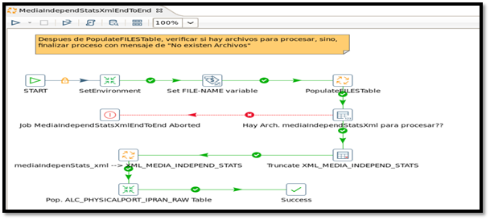

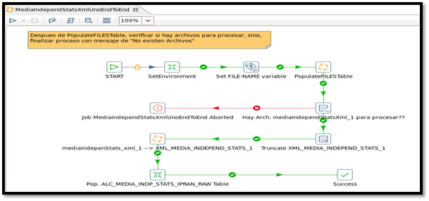

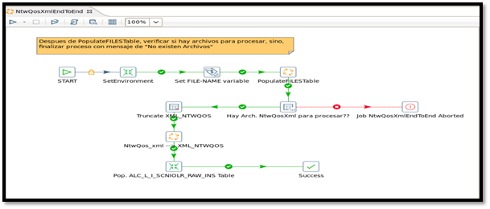

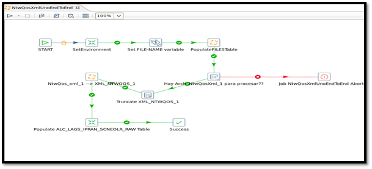

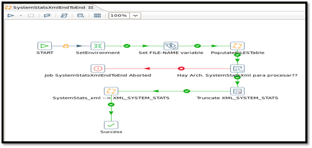

De la última tabla RAW tenemos varios procesos macroflujos que le suceden:

  b.  SumIPRAN_HourEndToEnd.kjb

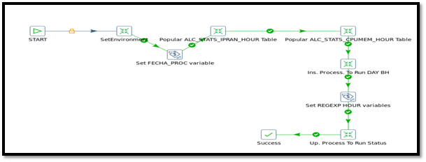

  c.  SumIPRAN_BH_DAY_IBHW_EndToEnd.kjb

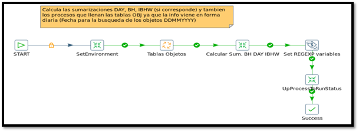

  d.  TablasObjetosEndToEnd.kjb

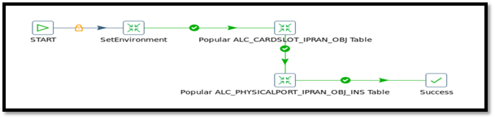

6.	DESCRIPCIÓN DETALLADA
--------------------------

6.1.	Datos Origen
********************

• Server Origen: 10.84.92.20

• Path Origen: /opt/5620sam/server/xml_output
  
• Usuario: nokia  
  
• Password: claro123
  
• Cantidad de archivos origen y formato: vienen diferentes archivos de acuerdo a la medición. Ver documento de requerimiento.
  
• Frecuencia de actualización: Cada 15 minutos.
  
• Tipo de archivo: XML

6.2.	Datos Destino
*********************
• Server Destino: cortado.claro.amx

• Tabla Files: SI

• Tabla Auxiliar: Si

• Frecuencia de corrida del proceso: 1 vez por hora y cada 5 minutos para la raw.

• Regionales: No

• RAW Si/No: Si

• Hour Si/No: Si

• Day Si/No: Si

• BH Si/No: Si

• ISABH Si/No: Si

• Países: Argentina, Uruguay y Paraguay

• Directorio Destino (File System): /calidad/NokiaAluIPRAN

6.3.	Shell Copiar Archivos Origen a Destino y limpieza de los mismos
***********************************************************************

Scripts tienen las siguientes funciones:
1- Copiar los archivos
2- Limpieza
3- Ejecutar Pentaho

Los scripts son los siguientes:
El Script NokiaWIFIEndToEnd.sh es la raíz del proceso.
Los Scrips a utilizar son:

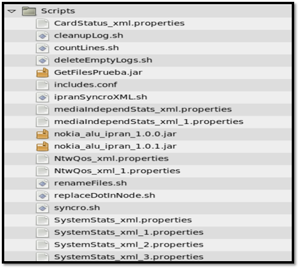

6.4.	Listado de Tablas Utilizadas
************************************

Las tablas utilizadas son las siguientes:

• Tablas RAW

  alc_lags_ipran_scneolr_raw

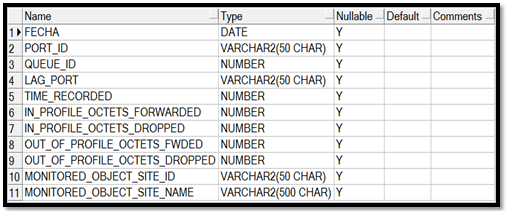

• Tabla OBJETOS

  alc_cardslot_ipran_obj

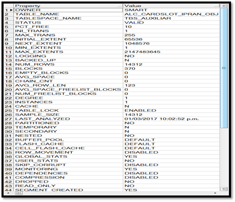

  alc_physicalport_ipran_obj

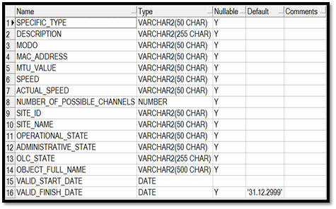

  alc_ipran_links
 
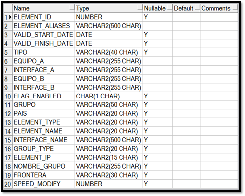

Sumarizaciones

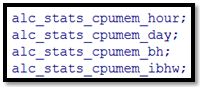

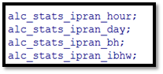

6.5.	Pentaho
***************
 
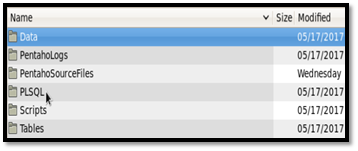

7.  CONTROLES
-------------

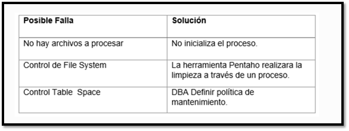

8.	REPROCESO MANUAL
--------------------

No aplica esta sub-seccion.

8.	SMART
---------

Los reportes en la herramienta Smart se muestran de la siguiente manera: 

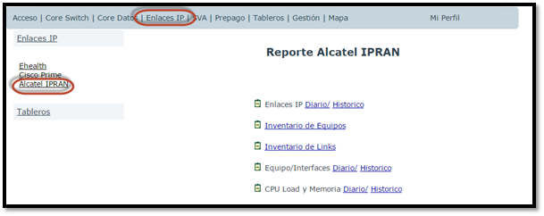

9. CONTROL DE CAMBIOS
---------------------

.. raw:: html 

   

  <table border="3">
  <tr>
    <th>Fecha</th>
    <th>Responsable</th>
    <th>Ticket Jira</th>
    <th>Detalle</th>
    <th>Repositorio</th>
  </tr>
  <tr>
    <td> 29/05/2017 </td>
    <td> Franco Rinaldi </td>
    <td> 
<a href="http://jira.harriague.com.ar/jira/browse/CL-1184"> CL-1184 </a>
  </td>
    <td> Creacion de documentación de Proyecto existente.
          Proyecto actual - Cortado. </td>
    <td> Servidor: CORTADO </td>
  </tr>
  </table>