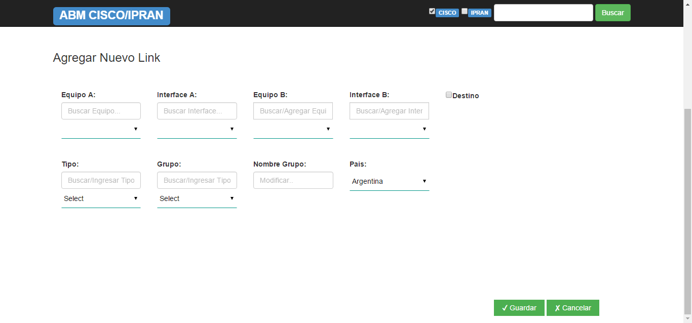

MANUAL DE USUARIO- ABM CISCO
============================

1.	ACCESO A SMART 
------------------

Para ingresar al ABM CISCO:  http://performance.cti

Debe ingresar a: 
Gestión --> ABM --> ABM CISCO/IPRAN 

Al hacer clic en ABM CISCO/IPRAN se direcciona a: 

2.	CREACIÓN NUEVO LINK
-----------------------

Al crear un nuevo link o enlace, lo que estamos haciendo conceptualmente, es asignar el extremo A y el extremo B a un enlace, y agregarle rótulos como Tipo, Grupo, Nombre de Grupo, etc.

Para crear un nuevo link se debe hacer clic en el botón --> Nuevo Link

.. image:: ../_static/images/abmcisco/pag4.3.png
  :align: center

El extremo A compuesto por el Equipo_A e Interfaz_A se elige de un listado de 37.000 interfaces que Smart levanta hora tras hora del sistema Cisco Prime. Lo mismo para el extremo B.
No es posible elegir un extremo que ya está siendo utilizado en otro enlace “activo” (o sea con el campo Enabled “S”) y la herramienta lo indicará con un mensaje; en este caso si deberíamos eliminar primero el vínculo en cuestión (el campo enabled pasa a “N” o sea inactivo).
Es importante destacar que, aunque no construyéramos un enlace con sus dos extremos, igualmente se cuentan en la base de datos de Smart con todas las mediciones hora x hora de las 37.000 interfaces.
Si se selecciona la opción “Destino”: en algunos casos el Extremo B del enlace o link no corresponde a un router de Claro, sino a un proveedor externo, en este caso debemos tildar el campo "Destino" y escribir con texto libre el nombre del router o proveedor del extremo b. Ej: Google Cache

Luego, se deben completar los siguientes campos: 

Al finalizar la carga de los datos se debe hacer clic sobre el botón --> Guardar

.. image:: ../_static/images/abmcisco/pag5.2.png
  :align: center

Al hacer clic en el botón Guardar, muestra un mensaje de confirmación: 

+	En el caso de confirmar la creacion se debe hacer clic sobre el boton --> Aceptar 

+	En caso contrario se debe hacer clic sobre el boton --> Cancelar

3.	EDITAR LINK 
---------------

Para editar un link que fue creado se debe hacer clic sobre |lapiz|

Al presionar el botón editar, muestra los siguientes campos a modificar:   

En el caso de que se deban agregar más datos, se debe hacer clic en el checkbox --> Más

Completar los siguientes campos: 

.. image:: ../_static/images/abmcisco/pag7.2.png
  :align: center

Al finalizar la carga de los campos, se debe hacer clic en el boton --> Guardar

4.	ELIMINAR LINK
-----------------

.. |cruz| image:: ../_static/images/abmcisco/cruz.png

Para eliminar un link, se debe hacer clic sobre |cruz|

Al hacer clic sobre |cruz|  , se pide confirmar la acción con el siguiente  mensaje: 

.. image:: ../_static/images/abmcisco/pag9.png
  :align: center

+	En el caso de confirmar la eliminacion se debe hacer clic sobre el boton --> Aceptar 
+	En caso contrario se debe hacer clic sobre el boton --> Cancelar

Al eliminar el enlace hay que tener en cuenta que el enlace no es borrado, solo se cambia el estado (Enabled) de activo “S” a inactictivo “N”.

5.	INVENTARIO DE LINKS 
-----------------------

Para obtener el listado de los links creados, se debe hacer clic en:

Enlaces IP --> Cisco Prime --> Inventarios de Links

Cuando ingresa al Inventario de Links muestra los siguientes datos: 

Utilizando el ABM CISCO/IPRAN se realiza la búsqueda de los links necesarios: 

•	Seleccionando la opción Cisco

.. image:: ../_static/images/abmcisco/pag11.png
  :align: center

•	Ingresando el Aliases y luego haciendo clic en el botón --> Buscar 

Una vez finalizada la búsqueda muestra el Aliases con la opción de Editar o Eliminar el link. 