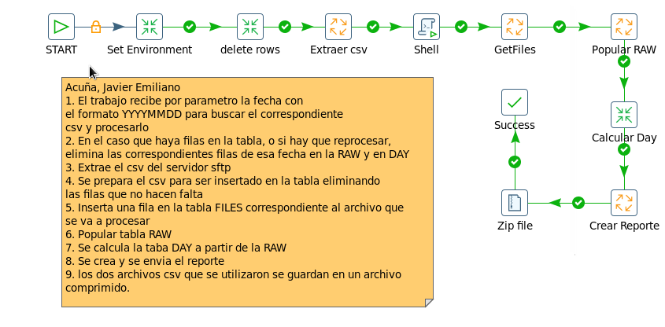
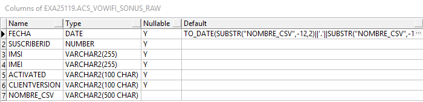
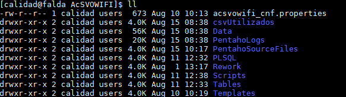
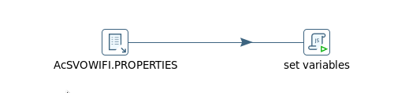
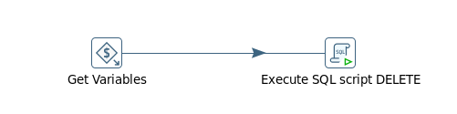
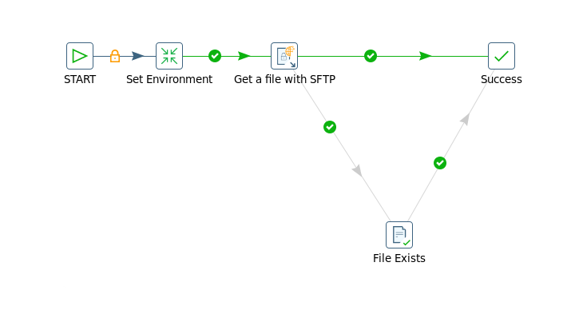
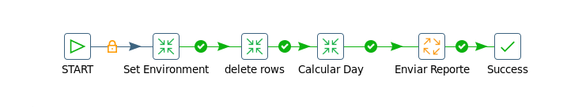
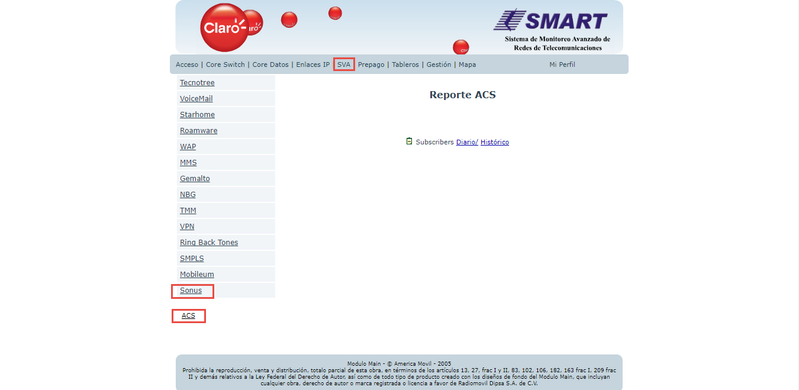
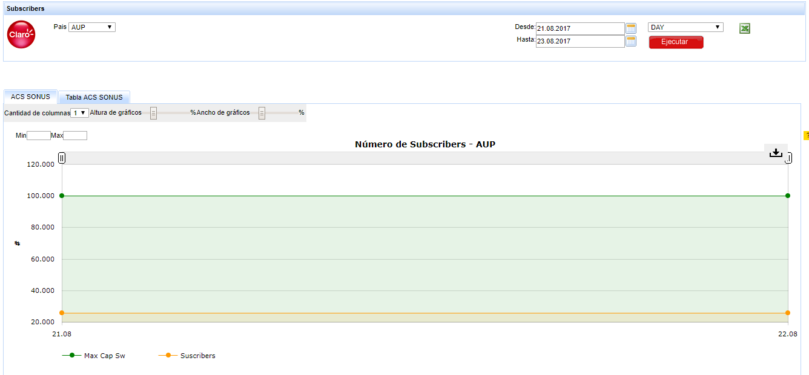
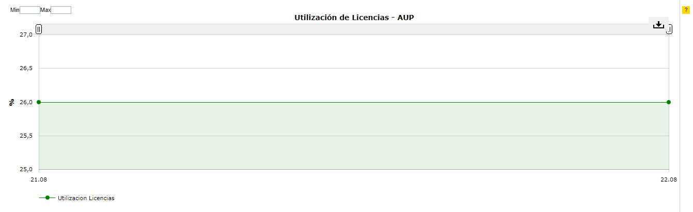

SONUS - AcS
===========

1. OBJETIVO
------------

El objetivo de este documento es describir el proceso de recolección de KPIs que realiza la herramienta Smart sobre la plataforma AcS de SONUS, como se almacena la información en la base de datos, los controles, los reportes en Smart que utilizará el usuario final.

2. ALCANCE
-----------

Areas involucradas: Performance de Red.

3. DEFINICIONES
----------------

• Cortado: Servidor UNIX en donde se importan los XML desde el proveedor, y en donde se encuentra Smart. El nombre es cortado.claro.amx y la dirección ip física es 10.105.146.8.

4. DESCRIPCION GENERAL
-----------------------

AcS SONUS es una plataforma que se encarga de autenticar todos los usuarios de VOWIFI que se instalaron alguna vez el cliente SONUS. El cliente SONUS se debe instalar en todo celular que no tenga el cliente VOWIFI nativo como por ejemplo IPHONE que si lo tiene.

Sus funciones más importantes son:

•	CHECKEA QUE EL USUARIO QUE SE CONECTA ES QUIEN DICE SER Y QUE ESTA AUTORIZADO PARA EL USO DEL SERVICIO.

•	PROVEE CONFIGURACIÓN DE LAS CREDENCIALES DE DATOS Y USUARIOS PARA LA APLICACIÓN DE VOWIFI.

•	ADMINISTRA LA BASE DE DATOS DE USUARIO.

•	REALIZA LA RECONFIGURACIÓN DE LA APLICACIÓN CUANDO LA CONFIGURACIÓN DE DATOS ES MODIFICADA.

Diseño detallado de AcS:

.. _S9_AcS_Detailed_Design_v4: ../_static/images/acs/S9_AcS_Detailed_Design_v4.pptx

+ S9_AcS_Detailed_Design_v4_

5. MACROFLUJO DEL PROCESO
--------------------------

6. DESCRIPCION DETALLADA
-------------------------

6.1 Datos origen
****************

• Server Origen y Path: 10.104.8.20, /var/www/reports
• Cantidad de archivos origen: 5 a 8 archivos
• Frecuencia actualización: Frecuencia diaria
• Tipo de Archivo: CSV

6.2 Datos destino
*****************

	• Server Destino: cortado.claro.amx
	• Conversión de Archivos: No
	• Tabla Auxiliar: No
	• Frecuencia de corrida del proceso: 1 por dia
	• Regionales: No
	• RAW Si/No: Si
	• Hour Si/No: No
	• Day Si/No: Si
	• BH Si/No: No
	• IBHW Si/No: No
	• Países: No
	• Directorio Destino (File System): /calidad/AcsVOWIFI

6.3. Shell Copiar Archivos Origen a Destino y limpieza de los mismo
********************************************************************

.. _AcS_DAY_EndToEnd.sh: ../_static/images/acs/AcS_DAY_EndToEnd.sh

.. _AcS_RAW_Diario.sh: ../_static/images/acs/AcS_RAW_Diario.sh

.. _AcS_RAW_EndToEnd.sh: ../_static/images/acs/AcS_RAW_EndToEnd.sh

.. _cleanupLogs.sh: ../_static/images/acs/cleanupLogs.sh

.. _deleteEmptyLogs.sh: ../_static/images/acs/deleteEmptyLogs.sh

.. _AcS_DAY_Diario.sh: ../_static/images/acs/AcS_DAY_Diario.sh

Scripts tienen las siguientes funciones:

+ a) Copiar los archivos

+ b) Limpieza

+ c) Ejecutar Pentaho

Los scripts son los siguientes: AcS_RAW_EndToEnd.sh, este shellscript esta croneado para correr todos los dias a las 6 AM, una vez llena la tabla RAW se corre automaticamente el shellscript AcS_DAY_EndToEnd.sh que llena la tabla DAY.

Los Scrips a utilizar son: 

+ AcS_DAY_EndToEnd.sh_

+ AcS_DAY_Diario.sh_

+ AcS_RAW_Diario.sh_

+ AcS_RAW_EndToEnd.sh_

+ cleanupLogs.sh_

+ deleteEmptyLogs.sh_

6.4 Listado de Tablas Utilizadas
********************************

+ ACS_VOWIFI_SONUS_RAW

+ ACS_VOWIFI_SONUS_DAY

.. image:: ../_static/images/acs/image12.png
  :align: center

6.5. Pentaho
*************

Estructura del proyecto : 

+ Proceso Pentaho End to End Raw

+ Pentaho Set Environment

+ Pentaho delete rows

+ Pentaho Extraer CSV

+ Proceso Pentaho End to End DAY

6.6. Controles 
***************

Para realizar el control sobre las tablas RAW y DAY se ejecutan los siguientes bloques sql.

.. _ControlRAW.sql: ../_static/images/acs/ControlRAW.sql

* ControlRAW.sql_

.. _ControlDAY.sql: ../_static/images/acs/ControlDAY.sql

* ControlDAY.sql_

7. Reproceso Manual
-------------------

Se debe ejecutar el script AcS_RAW_Rework.sh , el cual debe recibir por parámetro la Fecha solicitada, para realizar la limpieza, para luego ejecutar el AcSVOWIFI_RAW_EndToEnd.kjb en Pentaho de manera manual.

Ubicación de los scripts en la carpeta /home/calidad/AcSVOWIFI/Scripts

El Formato de la fecha es el siguiente:

YYYYMMDD

.. _AcS_RAW_Rework.sh: ../_static/images/acs/AcS_RAW_Rework.sh

* AcS_RAW_Rework.sh_

Para realizar el reproceso a nivel DAY se debe ejecutar el siguiente script AcS_DAY_Rework.sh

El Formato de la fecha es el siguiente:

DD.MM.YYYY

.. _AcS_DAY_Rework.sh: ../_static/images/acs/AcS_DAY_Rework.sh

* AcS_DAY_Rework.sh_

8. Reportes de Smart
---------------------

Los reportes en la herramienta Smart se muestran de la siguiente manera:

**DIARIO**

.. image:: ../_static/images/acs/image10.png
  :align: center

**HISTORICO**

