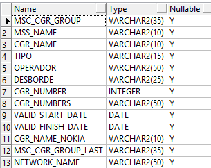
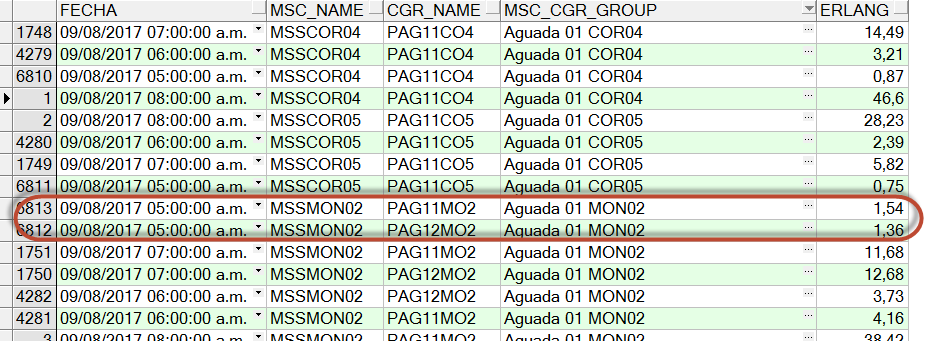

CGR : TRONCALES INDIVIDUALES Y AGRUPADOS
========================================

1. OBJETIVO
------------

El objetivo de este documento es describir el proceso de recolección de KPIs que realiza la herramienta Smart sobre los Circuit Groups (CGR) de equipos MSS Nokia, la nomenclatura utilizada y el procedimiento manual de agrupación de CGR.

2. ALCANCE
-----------

Este documento alcanza al área Performance de Red.

3. DEFINICIONES
----------------

+ CGR – Circuit Group

Es el circuito que se utiliza para conectar diferentes equipos MSS.  También conocido como línea troncal.  En lenguaje técnico de telefonía, una línea troncal es un enlace que interconecta las llamadas externas de una central telefónica, concentrando y unificando varias comunicaciones simultáneas en una sola señal para un transporte y transmisión a distancia más eficiente (generalmente digital) y poder establecer comunicaciones con otra central o una red entera de ellas.

+ MSC – Mobile Switching Center

El MSC (Central de Conmutación Móvil) es una sofisticada Central Teléfónica la cual proporciona conmutación de llamadas, Administración de movilidad y Servicios de GSM para los teléfonos móviles dentro de su área de servicio. En otras palabras, trasmisión de voz, datos y servicios de fax así como Servicios de Mensajes Cortos o SMS y desvío de llamadas.
En el sistema de teléfonos móviles GSM, en contraste con los iniciales servicios analógicos, la información de datos y fax es enviada codificada digitalmente directamente al MSC. únicamente en la MSC esta señal es convertida en una señal "analógica" (estrictamente se debería decir que es convertida en una señal PCM, a una cadencia de 64 kbit/s, conocida como DS0 en USA y el resto del mundo).
Hay diferentes nombres para la MSC en diferentes contextos lo cual refleja la complejidad de sus funciones dentro de la red, es así como los siguientes términos pueden hacer referencia a la MSC pero en diferentes momentos y dependiendo de la actividad que realice en ese momento.

Gateway MSC, es la MSC que determina cual es la MSC que "visita" al suscriptor que está siendo llamado, es también las interfaz en la Red de Conmutada de Telefonía Pública. Todas las llamadas de Móvil a Móvil y PSTN a Móvil son enrutadas a través del GMSC.

Visited MSC, es la MSC donde el suscriptor está actualmente ubicado. El VLR asociado a dicha MSC tendrá los datos del suscriptor en ella.

Anchor MSC, es la MSC desde la cual un handover ha sido iniciado.

Target MSC, es la MSC hacia donde el Handover deberá dirigirse.

El MSC se conecta con:

+	el HLR para obtener datos sobre el SIM y el MSISDN
+	las BSS que realizan la comunicación radio con los terminales 2G y 2.5G
+	las UTRAN que realizan la comunicación radio con los terminales 3G
+	el VLR para determinar qué suscriptores tiene bajo su control
+	otros MSC (e.g. para handover)

* MSS – Mobile Switching Server Centre 

MSS – Mobile Switching Server Centre 
El Mobile Switching Centre Server o MSS no es sino una variante sencilla de un MSC, que proporciona conmutación de circuitos, gestión de movilidad y servicios GSM a los terminales 

El Mobile Switching Centre Server o MSS no es sino una variante sencilla de un MSC, que proporciona conmutación de circuitos, gestión de movilidad y servicios GSM a los terminales móviles que pululan por el área que éste sirve. La funcionalidad de un MSS permite separar el control (señalización) y el plano de usuario, lo que garantiza una mejor ubicación de los elementos de la red.
Los MSS y los MGW (Media Gateway) hacen posible la interconexión entre circuitos que usan IP, ATM AAL2 y TDM.

+ HLR –Home Location Register

El HLR (Home Location Register, o registro de ubicación base) es una base de datos que almacena la posición del usuario dentro de la red, si está conectado o no y las características de su abono (servicios que puede y no puede usar, tipo de terminal, etcétera). Es de carácter más bien permanente; cada número de teléfono móvil está adscrito a un HLR determinado y único, que administra su operador móvil.

+	Perdido: Servidor UNIX en donde se importan los XML desde el proveedor, y en donde se encuentra Smart.

+	OSS: Servidor propuesto por nokia para la obtencion de informacion.

+   Diagrama de topologia MSS:

.. image:: ../_static/images/cgr/topologia.png
  :align: center

4. DESCRIPCION GENERAL
-----------------------

Para las diferentes líneas troncales o CGR se miden los siguientes KPIs:

+	Tráfico de entrada

+	Tráfico de salida

+	Tráfico total

+	Porcentaje de utilización del circuito en relación a su capacidad

+	Capacidad

Nomenclatura

.. _Nomenclatura_Argentina: ../_static/images/cgr/NomenclaturaArgentina.xlsx

.. _Nomenclatura_de_Centrales_Telecom: ../_static/images/cgr/NomenclaturadeCentralesTelecom.xlsx

.. _Nomenclatura_Paraguay: ../_static/images/cgr/NomenclaturaParaguay.xlsx

.. _Nomenclatura_Uruguay: ../_static/images/cgr/NomenclaturaUruguay.xlsx

.. _ListadodeTroncalesExistentes: ../_static/images/cgr/ListadodeTroncalesExistentes.xlsx

A continuacion se muestran el listado de equipos - MSS existentes:

.. raw:: html 

   

  <table border="3">
  <tr>
    <th>Numero</th>
    <th>MSS</th>
  </tr>
  <tr>
    <td> 1 </td>
    <td> MSSASU02 </td>
  </tr>
  <tr>
    <td> 2 </td>
    <td> MSSASU03 </td>
  </tr>
  <tr>
    <td> 3 </td>
    <td> MSSBAH03 </td>
  </tr>
  <tr>
    <td> 4 </td>
    <td> MSSBAH01 </td>
  </tr>
  <tr>
    <td> 5 </td>
    <td> MSSCOM02 </td>
  </tr>
  <tr>
    <td> 6 </td>
    <td> MSSCON02 </td>
  </tr>
  <tr>
    <td> 7 </td>
    <td> MSSCOR04 </td>
  </tr>
  <tr>
    <td> 8 </td>
    <td> MSSCOR05 </td>
  </tr>
  <tr>
    <td> 9 </td>
    <td> MSSCRR03 </td>
  </tr>
  <tr>
    <td> 10 </td>
    <td> MSSGRA01 </td>
  </tr>
  <tr>
    <td> 11 </td>
    <td> MSSJON03 </td>
  </tr>
  <tr>
    <td> 12 </td>
    <td> MSSLAU02 </td>
  </tr>
  <tr>
    <td> 13 </td>
    <td> MSSMAR02 </td>
  </tr>
  <tr>
    <td> 14 </td>
    <td> MSSMEN03 </td>
  </tr>
  <tr>
    <td> 15 </td>
    <td> MSSMON02 </td>
  </tr>
  <tr>
    <td> 16 </td>
    <td> MSSMON03 </td>
  </tr>
  <tr>
    <td> 17 </td>
    <td> MSSMON04 </td>
  </tr>
  <tr>
    <td> 18 </td>
    <td> MSSMON05 </td>
  </tr>
  <tr>
    <td> 19 </td>
    <td> MSSNEU02 </td>
  </tr>
  <tr>
    <td> 20 </td>
    <td> MSSOLL01 </td>
  </tr>
  <tr>
    <td> 21 </td>
    <td> MSSPOS01 </td>
  </tr>
  <tr>
    <td> 22 </td>
    <td> MSSROS04 </td>
  </tr>
  <tr>
    <td> 23 </td>
    <td> MSSROS05 </td>
  </tr>
  <tr>
    <td> 24 </td>
    <td> MSSSAL02 </td>
  </tr>
  <tr>
    <td> 25 </td>
    <td> MSSSAN03 </td>
  </tr>
  <tr>
    <td> 26 </td>
    <td> MSSTOR03 </td>
  </tr>
  <tr>
    <td> 27 </td>
    <td> MSSTRE01 </td>
  </tr>
  <tr>
    <td> 28 </td>
    <td> MSSTUC03 </td>
  </tr>
  <tr>
    <td> 29 </td>
    <td> MSSUSH01 </td>
  </tr>
  <tr>
    <td> 30 </td>
    <td> MSSVIC02 </td>
  </tr>
  </table>

La nomenclatura usada en Claro Argentina, Paraguay y Uruguay es: (poner el link a los archivos adjuntos)

*	Nomenclatura_Argentina_ 

*	Nomenclatura_Uruguay_ 

*	Nomenclatura_Paraguay_ 

La nomenclatura de las centrales de Telecom es: (poner el link a los archivos adjuntos)

*	Nomenclatura_de_Centrales_Telecom_ 

Listado de Troncales - CGR

El listado completo de troncales es: ListadodeTroncalesExistentes_

**CGR Type** : Servicio al cual se conecta el CGR.

Existen diferentes tipos :

5. MACROFLUJO DEL PROCESO
--------------------------

6. DESCRIPCION DETALLADA
-------------------------

6.1 Datos origen
****************

Los datos origen a nivel inicial se toman del OSS.

•	Servidor origen: OSS
•	Frecuencia actualización: Frecuencia Horaria
•	Tablas Origen - Destino:

.. image:: ../_static/images/cgr/tableorigendestino.png
  :align: center

6.2 Datos destino
*****************

•	Server Destino: perdido.claro.amx
•	Conversión de Archivos: No
•	Tabla Auxiliar: Si
•	Frecuencia de corrida del proceso: 1 vez por hora
•	Regionales: No
•	Sumarizacions disponibles segun tablas:

.. image:: ../_static/images/cgr/sumarizaciones.png
  :align: center

•	Directorio Destino (File System): /calidad/msc/cgr/hourly

6.3 Listado de Tablas Utilizadas
********************************

Tablas CGR Individuales
+++++++++++++++++++++++

nokia_msc_cgr_hour

.. image:: ../_static/images/cgr/table1.png
  :align: center 

nokia_msc_cgr_day

.. image:: ../_static/images/cgr/table2.png
  :align: center 

nokia_msc_cgr_bh

.. image:: ../_static/images/cgr/table3.png
  :align: center 

nokia_msc_cgr_bh_week

.. image:: ../_static/images/cgr/table4.png
  :align: center 

Tablas CGR Grupo
++++++++++++++++

nokia_msc_cgr_group_hour

.. image:: ../_static/images/cgr/table5.png
  :align: center 

nokia_msc_cgr_group_day

.. image:: ../_static/images/cgr/table6.png
  :align: center 

nokia_msc_cgr_group_bh

.. image:: ../_static/images/cgr/table7.png
  :align: center 

nokia_msc_cgr_group_bh_week

.. image:: ../_static/images/cgr/table8.png
  :align: center 

nokia_msc_cgr_group_day_mh_obj

.. image:: ../_static/images/cgr/table9.png
  :align: center 

Tablas mk
+++++++++++

nokia_msc_cgr_mk_hour

.. image:: ../_static/images/cgr/table10.png
  :align: center 

nokia_msc_cgr_mk_day

.. image:: ../_static/images/cgr/table11.png
  :align: center 

nokia_msc_cgr_mk_bh

.. image:: ../_static/images/cgr/table12.png
  :align: center 

Tablas Objetos
+++++++++++++

Las tablas objeto se actualizan automaticamente al insertarse un nuevo switch.

core_nsn_objects: Contiene listado de switches.

.. image:: ../_static/images/cgr/table13.png
  :align: center 

NOKIA_OBJECTS_CGR_RELATION: Contiene las relaciones entre todos los troncales individuales(a que grupo pertenecen).

**Ejemplos de consultas SQL:**

Consulta sobre tabla core_nsn_objects:

.. _consulta_core: ../_static/images/cgr/consulta_uno.sql

*	consulta_core_ 

Consulta sobre tabla nokia_msc_cgr_group_day:

.. _consulta_nokia_msc_cgr_group_day: ../_static/images/cgr/consulta_dos.sql

*	consulta_nokia_msc_cgr_group_day_ 

Consulta sobre tabla nokia_msc_cgr_day:

.. _consulta_nokia_msc_cgr_day: ../_static/images/cgr/consulta_tres.sql

*	consulta_nokia_msc_cgr_day_ 

Ejemplos CGR individuales y agrupados
+++++++++++++++++++++++++++++++++++++

Aqui se muestran ejemplos de los CGR agrupados con los CGR Individuales que lo componen, cómo aparecen los mismos en las tablas objetos y cómo aparecen en las tablas de KPI/Counters. Tambien se muestra que la suma del tráfico en Erlangs de los CGR Individuales da lo mismo que el tráfico en Erlangs del CGR Agrupado.

+ Tabla CGR Individual Group Aguada01 MON02 Dia 09/08 a las 05:00:00 am

+ Tabla CGR Agrupada Group Aguada01 MON02 Dia 09/08 a las 05 am

.. image:: ../_static/images/cgr/ejemplo2.png
  :align: center

+ Objeto

6.4 Shell Copiar Archivos Origen a Destino 
******************************************

El Shell Script nokia_msc_cgr_hour.sh esta croneado para correr una ves por hora.

.. _nokia_msc_cgr_hour.sh: ../_static/images/cgr/nokia_msc_cgr_hour.sh

*	nokia_msc_cgr_hour.sh_ 

Se ingresan los parametros:

+ FECHA_DESDE: DD.MM.YYYY HH24
+ FECHA_HASTA: DD.MM.YYYY HH24

Dentro del Shell Scrip se define la siguiente funcion Main f_Main_Msc_Cgr_Hourly:

.. _f_Main_Msc_Cgr_Hourly: ../_static/images/cgr/f_Main_Msc_Cgr_Hourly.sh

*	f_Main_Msc_Cgr_Hourly_ 

Esta funcion lo que hace es llamar a las siguentes funciones:

.. _f_Msc_Cgr_Hourly: ../_static/images/cgr/f_Msc_Cgr_Hourly

*	f_Msc_Cgr_Hourly_: Se encuentran los procesos sql para llenar las tablas hourly por troncales individuales y por mercado.

.. _f_Msc_Cgr_Group_Hourly: ../_static/images/cgr/f_Msc_Cgr_Group_Hourly

*	f_Msc_Cgr_Group_Hourly_: Se enuentran los procesos sql para agrupar por grupos los troncales.

**Procesos SQL dentro de f_Msc_Cgr_Hourly**

.. _nokia_msc_cgr_hour.sql: ../_static/images/cgr/nokia_msc_cgr_hour.sql

*	nokia_msc_cgr_hour.sql_

.. _nokia_msc_cgr_mk_hour.sql: ../_static/images/cgr/nokia_msc_cgr_mk_hour.sql

*	nokia_msc_cgr_mk_hour.sql_

**Procesos SQL dentro de f_Msc_Cgr_Group_Hourly**

.. _nokia_msc_cgr_group_hour.sql: ../_static/images/cgr/nokia_msc_cgr_group_hour.sql

*	nokia_msc_cgr_group_hour.sql_

CGR Type
Type.: Servicio al cual se conecta el CGR.

7. Reproceso Automático y Manual
*********************************

Para el hour se debe ejecutar el siguiente script:

.. _nokia_msc_cgr_hour_rec.sh: ../_static/images/cgr/nokia_msc_cgr_hour_rec.sh

*	nokia_msc_cgr_hour_rec.sh_

Se ingresan los parametros:

+ FECHA_DESDE: DD.MM.YYYY HH24
+ FECHA_HASTA: DD.MM.YYYY HH24

Para el gruplal se realizan los mismos pasos.

.. _nokia_msc_cgr_group_rec.sh: ../_static/images/cgr/nokia_msc_cgr_group_rec.sh

*	nokia_msc_cgr_group_rec.sh_

8. Reportes de Smart
*********************

La visualización de CGR en la herramienta Smart se realiza desde los siguientes reportes:

Ruta del reporte: Core Switch / MSS / CGR

**Reportes disponibles:**

**CGR Individual Principales KPI Diario / Histórico**

**Diario**

.. image:: ../_static/images/cgr/reporte1.png
  :align: center

**Historico**

.. image:: ../_static/images/cgr/reporte2.png
  :align: center

.. image:: ../_static/images/cgr/reporte10.png
  :align: center

**CGR Individual Principales KPI(NEW) Diario/ Histórico**

**Diario**

.. image:: ../_static/images/cgr/reporte3.png
  :align: center

**Historico**

**CGR Agrupado Principales KPI Diario / Histórico**

**Diario**

.. image:: ../_static/images/cgr/reporte5.png
  :align: center

**Historico**

.. image:: ../_static/images/cgr/reporte6.png
  :align: center

.. image:: ../_static/images/cgr/reporte13.png
  :align: center

**Huawei CGRs Diario / Histórico**

**Tablero Utilizacion POI Tablero**

.. image:: ../_static/images/cgr/reporte9.png
  :align: center

