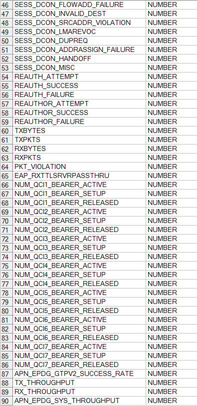

CISCO EPDG y SAMOG
==================

1. OBJETIVO
-----------

El presente documento buscar explicar y detallar el proceso que genera Cisco EPDG y SAMOG

2. ALCANCE
----------

Áreas involucradas: Performance de Red

3. DEFINICIONES
---------------

•	Cortado: Servidor UNIX en donde se importan los XML desde el proveedor, y en donde se encuentra Smart. El nombre es cortado.claro.amx y la dirección ip física es 10.105.146.8.

4. DESCRIPCION GENERAL
----------------------

.. _Medición_Plataforma_EPDG_SAMOG: ../_static/images/ciscoepdgsamog/_Medición_Plataforma_EPDG_SAMOG.xlsx 

Documento de Requerimiento: Medición_Plataforma_EPDG_SAMOG_

5. MACROFLUJO 
-------------

.. image:: ../_static/images/ciscoepdgsamog/pag3.png
  :align: center 

6. DESCRIPCIÓN DETALLADA
------------------------

6.1. Datos Origen
*****************

+	Server Origen y Path: perdido.claro.amx (preguntar - Servidor de los datos de la tabla Raw)

+	Frecuencia actualización: Frecuencia hour

+	Tipo de Archivo: .txt

6.2. Datos Destino
******************

+	Server Destino: Falda

+	Conversión de Archivos: No

+	Tabla Files: No

+	Tabla Auxiliar: No

+	Frecuencia de corrida del proceso: -

+	Regionales: No

+	RAW Si/No: Si

+	Hour Si/No: Si

+	Day Si/No: Si

+	BH Si/No: Si

+	ISABHW Si/No: Si 

+	Países: No

+	Directorio Destino (File System): -(en base de datos)

6.3.	Tablas Utilizadas
*************************

**FUENTE DE DATOS**:  CISCO_FILES_GGSN_raw

•	CISCO_GGSN_EPDG_SCH1_RAW_VW@SMART.WORLD_T1

•	CISCO_GGSN_EPDG_SCH3_RAW_VW@SMART.WORLD_T2

•	CISCO_GGSN_EPDG_SCH4_RAW_VW@SMART.WORLD_T3

•	CISCO_GGSN_EPDG_SCH7_RAW_VW@SMART.WORLD_T4

•	CISCO_GGSN_SAMOG_SCH1_RAW_VW@SMART.WORLD_T1

•	CISCO_GGSN_SAMOG_SCH3_RAW_VW@SMART.WORLD_T2

Las 6 vistas son traídas de la tabla Raw, declaradas en el servidor Perdido 

Tablas utilizadas: 

•	CISCO_GGSN_SAMOG_HOUR

.. image:: ../_static/images/ciscoepdgsamog/pag5.png
  :align: center 

•	CISCO_GGSN_EPDG_HOUR

.. image:: ../_static/images/ciscoepdgsamog/pag7.png
  :align: center 

•	CISCO_GGSN_SAMOG_DAY

.. image:: ../_static/images/ciscoepdgsamog/pag8.png
  :align: center 

•	CISCO_GGSN_EPDG_DAY

.. image:: ../_static/images/ciscoepdgsamog/pag9.png
  :align: center 

•	CISCO_GGSN_SAMOG_BH

.. image:: ../_static/images/ciscoepdgsamog/pag11.png
  :align: center 

.. image:: ../_static/images/ciscoepdgsamog/pag12.png
  :align: center 

•	CISCO_GGSN_EPDG_BH

.. image:: ../_static/images/ciscoepdgsamog/pag13.png
  :align: center 

•	CISCO_GGSN_SAMOG_ISABHW

.. image:: ../_static/images/ciscoepdgsamog/pag15.png
  :align: center 

•	CISCO_GGSN_EPDG_ISABHW

.. image:: ../_static/images/ciscoepdgsamog/pag16.png
  :align: center 

7.	REPROCESO
-------------

7.1 Administración de particiones
*********************************

Antes de realizar el reproceso manual se debe realizar la administración de particiones, la cual se encarga de borrar los datos que serán reprocesados e insertados nuevamente a la tabla.

Para realizar este proceso se debe ejecutar la siguiente querie: 

Parámetros: 

• Nombre de la tabla
• Fecha desde (DD.MM.YYYY)
• Fecha hasta (DD.MM.YYYY)

Para todos los niveles se utilizan los mismos parámetros de ejecución. 

Por ejemplo: 

• G_PARTITION_MGMT.P_DROP_PARTITION_WEEK('CISCO_GGSN_EPDG_ISABHW','01.01.2017','07.01.2017');

.. _G_PARTITION_MGMT: ../_static/images/archivo/G_PARTITION_MGMT.sql 

7.2 Procedimiento de reproceso manual paso a paso
*************************************************

.. _G_CISCO_GGSN_EPDG_SAMOG: ../_static/images/ciscoepdgsamog/G_CISCO_GGSN_EPDG_SAMOG.sql

El reproceso manual se lleva a cabo ejecutando los siguientes procedimientos, dependiendo si se necesita reprocesar datos tanto a nivel horario, día o semanal: 

  + Formato fecha a nivel  horario: DD.MM.YYYY HH24 

  + Formato fecha a nivel día o semanal: DD.MM.YYYY

  + Para ejecutar a nivel semanal se debe tomar desde el domingo como comienzo de semana al día sábado. 

• P_CISCO_GGSN_EPDG_REWORK_HOUR
• P_CISCO_GGSN_EPDG_REWORK_DAY 
• P_CISCO_GGSN_EPDG_REWORK_BH
• P_CISCO_GGSN_EPDG_REWORK_WEEK
• P_CISCO_GGSN_SAMOG_REWORK_HOUR
• P_CISCO_GGSN_SAMOG_REWORK_DAY
• P_CISCO_GGSN_SAMOG_REWORK_BH
• P_CISCO_GGSN_SAMOG_REWORK_WEEK

Los procedimientos para ejecutarlos correctamente se ingresar por parámetro la fecha en la cual desea reprocesar los datos: 

La descripción detallada de cada procedimiento se encuentra en el paquete G_CISCO_GGSN_EPDG_SAMOG: 

+ G_CISCO_GGSN_EPDG_SAMOG_

8.	SMART
---------

En la herramienta Smart se muestra la información de la siguiente manera:

.. image:: ../_static/images/ciscoepdgsamog/pag20.png
  :align: center

.. image:: ../_static/images/ciscoepdgsamog/pag20.2.png
  :align: center

9. CONTROL DE CAMBIOS
---------------------

.. raw:: html 

   

  <table border="3">
  <tr>
    <th>Fecha</th>
    <th>Responsable</th>
    <th>Ticket Jira</th>
    <th>Detalle</th>
    <th>Repositorio</th>
  </tr>
  <tr>
    <td> 24/02/2017 </td>
    <td>  Matias Orquera</td>
    <td> 
<a href="http://jira.harriague.com.ar/jira/browse/CL-965"> CL-965 </a>
  </td>
    <td> Se actualizaron los nombres de procedimientos de mantenimiento de particiones.</td>
    <td> </td>
  </tr>
  <tr>
    <td> 07/03/2017 </td>
    <td>  Marcelo Carrasco </td>
    <td> 
<a href="http://jira.harriague.com.ar/jira/browse/CL-832"> CL-832 </a>
  </td>
    <td> RFC 1- Implementar a Producción</td>
    <td> </td>
  </tr>
  <tr>
    <td> 09/03/2017 </td>
    <td>  Marcela Medrano </td>
    <td> 
<a href="http://jira.harriague.com.ar/jira/browse/CL-968"> CL-968 </a>
  </td>
    <td> RFC 2- Corregir error en el procedimiento de reproceso </td>
    <td> </td>
  </tr>

 </table>