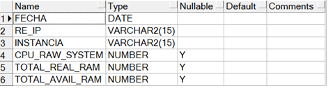
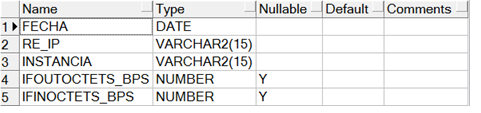
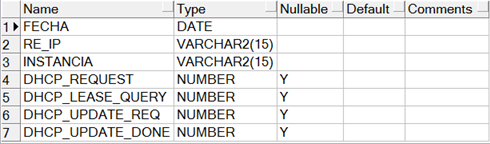

Cisco PNR - PCP
===========

1.	OBJETIVO
------------

El presente documento busca explicar y detallar el proceso que genera PNR MIBS

2.	ALCANCE 
-----------

Áreas involucradas: Performance de Red

3.	DEFINICIONES
----------------

Las MIBS se cargan en el servidor guerrero.claro.amx cuya base de datos es Scott.
Las tablas están en el servidor perdido.claro.amx cuya base de datos se llama Smart.

4.	DESCRIPCION GENERAL 
-----------------------

PNR es una plataforma que maneja las IP asignadas mediante DHCP. En el servidor de PNR existen MIBS que contienen información de distintos indicadores propios del equipo tales como CPU, Memoria, Mensajes DHCP, etc., los cuales serán mostrados en este.

5.	MACRO FLUJO DEL PROCESO
---------------------------

No aplica sub-seccion.

6.	DESCRIPCIÓN DETALLADA
--------------------------

6.1.	Datos Origen
********************

•	Server Origen y Path: 

    10.104.200.182
    10.104.217.86

• MIBS a levantar:

    1.3.6.1.4.1.2021.11.52      CPU LOAD

    1.3.6.1.4.1.2021.4.5        MEMORIA TOTAL

    1.3.6.1.4.1.2021.4.6        MEMORIA DISPONIBLE

    1.3.6.1.4.1.2021.4.11       IFOUTOCTETS

    1.3.6.1.2.1.2.2.1.16        IFINOCTETS

    1.3.6.1.4.1.9.10.102.1.3.1  DHCP DISCOVERS
    
    1.3.6.1.4.1.9.10.102.1.3.2  DHCP OFFERS
    
    1.3.6.1.4.1.9.10.102.1.3.5  DHCP LEASE

• Puerto: 4444
• Comunidad SNMP: nm5r0c0m

6.2.	Datos Destino
*********************

• Server Destino: perdido.claro.amx
• Conversión de Archivos: No.
• Tabla Files: No
• Tabla Auxiliar: No
• Frecuencia de corrida del proceso: cada 1 hora
• Regionales: No
• RAW Si/No: Si
• Hour Si/No: Si
• Day Si/No: Si
• BH Si/No: Si
• ISABH Si/No: Si

6.3.	Shell Copiar Archivos Origen a Destino y limpieza de los mismos
***********************************************************************

Los Scripts tienen las siguientes funciones: 

1-	Copiar los archivos

2-	Ejecutar Pentaho:

No aplica esta sub-seccion.

6.4.	Listado de Tablas Utilizadas
************************************

Las tablas utilizadas son las siguientes:

• Tablas RAW

  CALIDAD_SNMP_RAW@SSW

• Tablas HOUR

SVA_PNR_RECURSOS_HOUR

SVA_PNR_INTERFACES_HOUR

SVA_PNR_DHCP_HOUR

• Tablas DAY

  SVA_PNR_RECURSOS_DAY
  SVA_PNR_INTERFACES_DAY
  SVA_PNR_DHCP_DAY

• Tablas BH

  SVA_PNR_RECURSOS_BH
  SVA_PNR_INTERFACES_BH
  SVA_PNR_DHCP_BH

• Tablas ISABHWEEK

  SVA_PNR_RECURSOS_IBHW
  SVA_PNR_INTERFACES_IBHW
  SVA_PNR_DHCP_IBHW

Los procedimientos utilizados son:

• P_SVA_PNR_INTERFACES_HOUR.PRC
• P_SVA_PNR_INTERFACES_DAY.PRC
• P_SVA_PNR_INTERFACES_BH.PRC
• P_SVA_PNR_INTERFACES_IBHW.PRC
• P_SVA_PNR_JOB_HOUR.PRC
• P_SVA_PNR_JOB_DAILY.PRC
• P_SVA_PNR_JOB_IBHW.PRC
• P_SVA_PNR_RECURSOS_HOUR.PRC
• P_SVA_PNR_RECURSOS_DAY.PRC
• P_SVA_PNR_RECURSOS_BH.PRC
• P_SVA_PNR_RECURSOS_IBHW.PRC

Los controles que se deben realizar son los siguientes:

• El analista reporta los faltantes de datos.
• Se revisa que los datos se estén generando en el origen.
• Se revisa los procedimientos y las horas faltantes que cargan las tablas.
• Una vez detectado el problema se procede a reclamar al proveedor por los datos faltantes o se reprocesan las tablas en caso de ser un error de carga de las tablas.

6.5.	Pentaho
***************

No aplica esta sub-seccion.

7.	REPROCESO MANUAL
--------------------

P_SVA_PNR_REC_HOUR (P_FECHA_DESDE IN CHAR, P_FECHA_HASTA IN CHAR )

P_SVA_PNR_REC_IBHW (P_FECHA_DESDE IN CHAR, P_FECHA_HASTA IN CHAR )

P_SVA_PNR_REC_DAILY (P_FECHA_DESDE IN CHAR, P_FECHA_HASTA IN CHAR)

8.	SMART
---------

Los reportes en la herramienta Smart se muestran de la siguiente manera: 

 .. image:: ../_static/images/ciscopnrpsp/image4.png
  :align: center 

 .. image:: ../_static/images/ciscopnrpsp/image5.png
  :align: center 

 .. image:: ../_static/images/ciscopnrpsp/image6.png
  :align: center 

 .. image:: ../_static/images/ciscopnrpsp/image7.png
  :align: center 

9. CONTROL DE CAMBIOS
---------------------

.. raw:: html 

   

  <table border="3">
  <tr>
    <th>Fecha</th>
    <th>Responsable</th>
    <th>Ticket Jira</th>
    <th>Detalle</th>
    <th>Repositorio</th>
  </tr>
  <tr>
    <td> 19/05/2017 </td>
    <td>  Franco Rinaldi</td>
    <td> 
<a href="http://jira.harriague.com.ar/jira/browse/CL-1184"> CL-1184 </a>
  </td>
    <td> Creacion del documento.</td>
    <td> </td>
  </tr>
  
 </table>