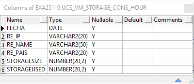
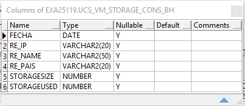

CISCO UCS
=======

1.	OBJETIVO
------------
El presente documento buscar explicar y detallar el proceso que genera el CISCO UCS.

2.	ALCANCE 
-----------
Áreas involucradas: Performance de Red

3.	DEFINICIONES
----------------
•	Cortado: Servidor LINUX en donde se importan las MBI desde el proveedor.
El nombre es cortado.claro.amx y la dirección IP física es 10.105.146.8

4.	DESCRIPCION GENERAL 
-----------------------

Campos de la tabla TABLE UCS_VM_STORAGE_HOUR: 

Campos de la tabla UCS_VM_INTERFACES_HOUR: 

.. image:: ../_static/images/ciscoucs/image2.png
  :align: center 

Campos de la tabla UCS_VM_RECURSOS_HOUR:

Campos de la tabla UCS_VM_RECURSOS_CONS_HOUR:

Campos de la tabla UCS_VM_INTERFACES_BH:

Campos de la tabla UCS_VM_STORAGE_CONS_HOUR: 

Campos de la tabla UCS_VM_RECURSOS_DAY: 

Campos de la tabla UCS_VM_RECURSOS_CONS_DAY: 

Campos de la tabla UCS_VM_RECURSOS_BH: 

.. image:: ../_static/images/ciscoucs/image9.png
  :align: center 

Campos de la tabla UCS_VM_RECURSOS_CONS_BH: 

Campos de la tabla UCS_VM_STORAGE_CONS_DAY: 

Campos de la tabla UCS_VM_STORAGE_DAY: 

Campos de la tabla UCS_VM_INTERFACES_DAY: 

Campos de la tabla UCS_VM_STORAGE_BH: 

Campos de la tabla UCS_VM_STORAGE_CONS_BH: 

Campos de la tabla UCS_VM_RECURSOS_IBHW: 

Campos de la tabla UCS_VM_RECURSOS_CONS_IBHW: 

Campos de la tabla UCS_VM_STORAGE_IBHW: 

.. image:: ../_static/images/ciscoucs/image18.png
  :align: center 

Campos de la tabla UCS_VM_STORAGE_CONS_IBHW: 

Campos de la tabla UCS_VM_INTERFACES_IBHW: 

  

5.	MACRO FLUJO DEL PROCESO 
---------------------------

**BHDayISHW**

.. image:: ../_static/images/ciscoucs/image21.png
  :align: center 

**Hour**

.. image:: ../_static/images/ciscoucs/image22.png
  :align: center 

6.	DESCRIPCION DETALLADA
------------------------- 

6.1.  Datos de Origen 
.................

•	Server Origen

.. image:: ../_static/images/ciscoucs/image23.png
  :align: center 

• Path y archivos 

•	Frecuencia actualización: Frecuencia diaria

•	Tipo de Archivo: Mibs

6.2.	Datos Destino
.....................

•	Server Destino: Cortado

•	Conversión de Archivos: No 

•	Tabla Files: No 

•	Tabla Auxiliar: No

•	Frecuencia de corrida del proceso: 1 vez al día

•	Regionales: No

•	RAW Si/No: Si

•	Hour Si/No: Si

•	Day Si/No: Si

•	BH Si/No: Si

•	Países: No

•	Directorio Destino (File System): /calidad/CiscoUCS/

6.3.	Shell Copiar Archivos Origen a Destino y limpieza de los mismos
.......................................................................

Los Scripts tienen las siguientes funciones: 

1-	Copiar los archivos

2-	Limpieza 

3-	Ejecutar Pentaho

Los scripts son los siguientes:

.. _CiscoUCS_BHDayISHW_EndToEnd: ../_static/images/ciscoucs/CiscoUCS_BHDayISHW_EndToEnd.sh 

.. _CiscoUCS_BHDayISHW_Rework: ../_static/images/ciscoucs/CiscoUCS_BHDayISHW_Rework.sh 

.. _CiscoUCS_BHDayISHWDiario: ../_static/images/ciscoucs/CiscoUCS_BHDayISHWDiario.sh 

.. _CiscoUCS_BHDayISHWRun: ../_static/images/ciscoucs/CiscoUCS_BHDayISHWRun.sh 

.. _CiscoUCS_Hour_EndToEnd: ../_static/images/ciscoucs/CiscoUCS_Hour_EndToEnd.sh 

.. _CiscoUCS_Hour_Rework: ../_static/images/ciscoucs/CiscoUCS_Hour_Rework.sh 

.. _staticCiscoUCS_HourDiario: ../_static/images/ciscoucs/CiscoUCS_HourDiario.sh 

.. _CiscoUCS_HourRun: ../_static/images/ciscoucs/CiscoUCS_HourRun.sh 

.. _reporteHourCiscoUCSRun: ../_static/images/ciscoucs/reporteHourCiscoUCSRun.sh 

.. _reporteNivelHourCiscoUCS: ../_static/images/ciscoucs/CiscoUCS_HourRun.sh 

.. _cleanupLogs: ../_static/images/ciscoucs/cleanupLogs.sh 

.. _deleteEmptyLogs:  ../_static/images/ciscoucs/deleteEmptyLogs.sh

**Busy Hour, Day, ISHW**

* CiscoUCS_BHDayISHW_EndToEnd_ 

Ejecuta el proyecto en pentaho

* CiscoUCS_BHDayISHW_Rework_ 

Ejecuta el proyecto de recupero de datos.

* CiscoUCS_BHDayISHWDiario_ 

Limpia y ejecuta el proyecto en pentaho

* CiscoUCS_BHDayISHWRun_ 

Llama a CiscoUCS_BHDayISHW_EndToEnd y ejecuta el proyecto en pentaho

**Hour**

* CiscoUCS_Hour_EndToEnd_ 

Ejecuta el proyecto en pentajo

* CiscoUCS_Hour_Rework_ 

Ejecuta el proyecto de recupero de datos.

* CiscoUCS_HourDiario_ 

Limpia y ejecuta el proyecto en pentaho

* CiscoUCS_HourRun_ 

Llama a CiscoUCS_Hour_EndToEnd y ejecuta el proyecto en pentaho

**Reporte**

* reporteHourCiscoUCSRun_ 

* reporteNivelHourCiscoUCS_

**Limpieza**

*	cleanupLogs_ 

Saca lineas innecesarias de los logs antes de ser enviados via email
Params: RUTA = <PROYECTO>/PentahoLogs

*	deleteEmptyLogs_

Borra los logs de la carpeta <PROYECTO>/PentahoLogs cuyo tamaño es 0 
o tiene una sola linea que no representa error

6.4.	Listado de Tablas Utilizadas
................................

Las tablas utilizadas son las siguientes: 

6.5.	Pentaho
..............

Estructura del proyecto: 

.. image:: ../_static/images/ciscoucs/estructuraproyecto.png
  :align: center 

•	Proceso Pentaho End to End 

BHDayISHW
~~~~~~~~~~

.. image:: ../_static/images/ciscoucs/image21.png
  :align: center 

Hour
~~~~

.. image:: ../_static/images/ciscoucs/image22.png
  :align: center 

Tenemos el Shell CiscoUCS_HourRun.sh que trae datos para el servidor Cortado. Luego setea variables de entorno, directorios donde se encuentran los datos para procesar los archivos disponibles. 

•	Pentaho Calculo Sumarizaciones

**Busy Hour, Day, ISHW**

Las sumarizaciones se calculan a día vencido (el día anterior al actual), para dicho cálculo se debe llamar al procedimiento
G_CISCO_UCS.P_SUM_DAY_BH_IBHW_CISCOUCS.

**Hour**

Las sumarizaciones se calculan a día vencido (el día anterior al actual), para dicho cálculo se debe llamar al procedimiento G_CISCO_UCS.P_Calcular_hour

6.6.	Controles 
.................

.. image:: ../_static/images/wapZte/pag11.3.png
  :align: center 

7.	REPROCESO MANUAL
--------------------

7.1 Procedimiento de reproceso manual paso a paso: 
..................................................

HOUR
~~~~

Se debe ejecutar el script CiscoUCS_Hour_Rework.sh, el cual debe recibir por parámetro la Fecha solicitada, para realizar la limpieza, para luego ejecutar el CiscoUCS_Hour_EndToEnd.kjb en Pentaho de manera manual.

Ubicación de los scripts en la carpeta /calidad/CiscoUCS/Scripts

Ubicación del Rework de ejecución en Pentaho: /calidad/CiscoUCS/Rework

El Formato de la fecha es el siguiente:

•	 DD.MM.YYYY HH24

Por consola se utiliza de la siguiente manera: 

•	./Pentaho61/data-integration/kitchen.sh -file=/calidad/CiscoUCS/PentahoSourceFiles/CiscoUCS_Hour_EndToEnd.kjb -param:P_FECHA_DESDE=$1 -param:P_FECHA_HASTA=$2

BH, DAY e IBHW
~~~~~~~~~~~~~~~~

Se debe ejecutar el script CiscoUCS_BHDayISHW_Rework.sh, el cual debe recibir por parámetro la Fecha solicitada, para realizar la limpieza, para luego ejecutar el CiscoUCS_BHDayISHW_EndToEnd.kjb en Pentaho de manera manual.

Ubicación de los scripts en la carpeta /calidad/CiscoUCS/Scripts

Ubicación del Rework de ejecución en Pentaho: /calidad/CiscoUCS/Rework

El Formato de la fecha es el siguiente:

•  DD.MM.YYYY

Por consola se utiliza de la siguiente manera: 

• /Pentaho61/data-integration/kitchen.sh -file=/calidad/CiscoUCS/PentahoSourceFiles/CiscoUCS_BHDayISHW_EndToEnd.kjb -param:P_FECHA=$1

8.	SMART
---------

Los reportes en la herramienta Smart se muestran de la siguiente manera:

.. image:: ../_static/images/ciscoucs/image28.png
  :align: center

.. image:: ../_static/images/ciscoucs/image29.png
  :align: center

.. image:: ../_static/images/ciscoucs/image30.png
  :align: center

.. image:: ../_static/images/ciscoucs/image31.png
  :align: center

9. CONTROL DE CAMBIOS
---------------------

.. raw:: html 

   

  <table border="3">
  <tr>
    <th>Fecha</th>
    <th>Responsable</th>
    <th>Ticket Jira</th>
    <th>Detalle</th>
    <th>Repositorio</th>
  </tr>
  <tr>
    <td> </td>
    <td>  </td>
    <td> 

 </td>
    <td>  </td>
    <td> </td>
  </tr>
  </table>