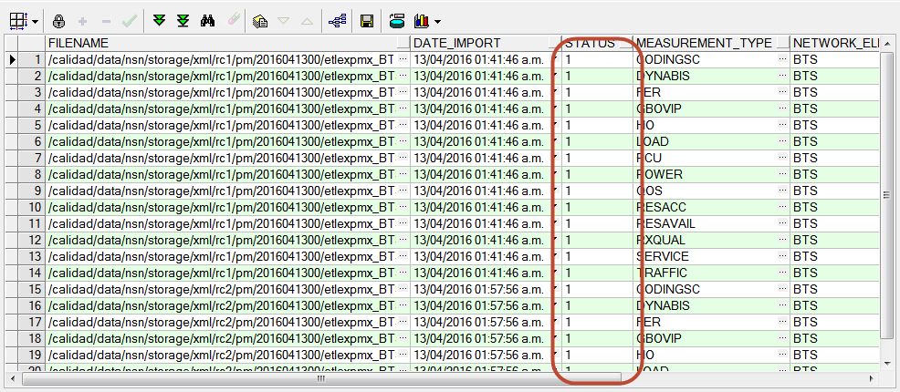

INSTRUCTIVO CONTROL Y REPROCESO DE TABLAS GSM/GPRS
==================================================

.. toctree::
   :maxdepth: 8

1.	OBJETIVO
------------

El presente instructivo busca explicar y detallar el control y reproceso de datos para las plataformas 2G (GSM/GPRS), para mantener la consistencia de datos de manera diaria.

2.	ALCANCE
----------- 

Áreas involucradas: performance y calidad de red, procesos de operaciones y mantenimiento.

3.	DEFINICIONES 
----------------

•	FD: Fecha desde, en formato DD.MM.YYYY
•	FH: Fecha hasta, en formato DD.MM.YYYY
•	HD: Hora desde, en formato HH24
•	HH: Hora hasta, en formato HH24
•	RC: Regional Cluster, también abreviado como OSSRC
•	Smart: Base de datos Oracle donde se encuentran las tablas de datos para la red de acceso, incluido GSM y GPRS
•	Perdido: Servidor UNIX en donde se importan los XML desde el proveedor, y en donde se encuentra Smart.

4.	INSTRUCCIONES OPERATIVAS
----------------------------

Para realizar este instructivo, se requiere acceso por SSH a Perdido, y el programa PL/SQL Developer con acceso a Smart.
Aquí se referenciarán las consultas presentes en los scripts: Control GSM/GPRS.sql y Controles adicionales GSM/GPRS.sql

Ingresar al programa PL/SQL Developer 	--> Ingresar Username
									  	--> Ingresa Password

.. image:: ../_static/images/instructivo-gsm/pag3.1.png
  :align: center

.. image:: ../_static/images/instructivo-gsm/pag3.2.png
  :align: center

4.1. CONTROLES
****************

1.  Procedimiento Controles RAW:
.............................

Control_GSM-GPRS_1.RAW.sql
~~~~~~~~~~~~~~~~~~~~~~~~~~~

Pasos para los controles necesarios en los datos de GSM y GPRS:

1.	Ejecutar la primera consulta en el archivo Control_GSM-GPRS_1.RAW.sql para verificar si están todos los datos provenientes desde los XML ya insertados en la base de datos.

.. _Control_GSM_GPRS_1_RAW.sql: ../_static/images/instructivo-gsm/Control_GSM-GPRS_1.RAW.sql

+ Control_GSM_GPRS_1_RAW.sql_

Esta consulta recibe los siguientes parámetros:

•	&1 : Fecha Desde, en formato DD.MM.YYYY (ej: 29.12.2015)
•	&2 : Hora Desde, en formato HH24, desde 00 hasta 23
•	&3 : Fecha Hasta, en formato DD.MM.YYYY (ej: 29.12.2015)
•	&4 : Hora Hasta, en formato HH24, desde 00 hasta 23

Luego de ejecutar la consulta, debe ingresar: 

•	Fecha Desde
•	Hora Desde
•	Fecha Hasta
•	Hora Hasta
•	Regional Clúster

La consulta muestra el siguiente resultado: 

.. image:: ../_static/images/instructivo-gsm/pag7.2.png
  :align: center

REPROCESO
~~~~~~~~~

En caso de faltante de datos, verificar si se encuentran los XML, y si estos ya han sido procesados o no. Para ello, se debe ejecutar la siguiente consulta (se encuentra en Controles adicionales GSM/GPRS.sql):

Aquí, ajustamos el FILENAME según el RC que nos interese, y la fecha/hora que nos importe.

Ejecutamos la consulta: 

SELECT * FROM  status_process_etl

WHERE network_element = 'BTS'

AND FILENAME LIKE '%rc2%201512817%.all'

La consulta ejecutada muestra el siguiente resultado: 

Los valores en Status pueden ser tres posibles:

•	0: Sin procesar, con lo cual está en cola de espera para ser procesado
•	1: Procesado
•	5: En procesamiento, con lo cual ese archivo está tratándose para insertar los datos a la BD.

También nótese que hay 14 elementos, que corresponden a las 14 mediciones diferentes, para el RC seleccionado, en la hora seleccionada.

En caso de que si, se pueden volver a solicitar para reprocesar, para ello ejecutar la siguiente sentencia, siempre ajustando el valor del RC y de la fecha/hora:

.. image:: ../_static/images/instructivo-gsm/pag8.2.png
  :align: center

Ingresamos la fecha y hora: 

.. image:: ../_static/images/instructivo-gsm/pag9.2.png
  :align: center

2.  Procedimiento Controles HOUR:
.............................

Control_GSM-GPRS_2.HOUR.sql
~~~~~~~~~~~~~~~~~~~~~~~~~~~

Ejecutar las consultas en las tablas hour de GSM y GPRS (presentes en Control GSM/GPRS.sql). 

.. _Control_GSM_GPRS_2_HOUR.sql: ../_static/images/instructivo-gsm/Control_GSM-GPRS_2.HOUR.sql

+ Control_GSM_GPRS_2_HOUR.sql_

Cuando se ejecutan ambas consultas, reciben los siguientes parámetros:

•	&1 : Fecha Desde, en formato DD.MM.YYYY (ej: 29.12.2015)
•	&2 : Fecha Hasta, en formato DD.MM.YYYY (ej: 29.12.2015) 

.. image:: ../_static/images/instructivo-gsm/pag11.2.png
  :align: center

La consulta nos muestra como resultado: 

REPROCESO
~~~~~~~~~

En caso de que haya faltante por regional, ejecutar en Perdido las siguientes instrucciones:

2.	a. Para GPRS: Ejecutar el siguiente comando en la consola:

cd /calidad/nokia/gsm/hourly/enqueuer

Luego se deben ejecutar los siguientes scripts:

.. image:: ../_static/images/instructivo-gsm/pag12.3.png
  :align: center

Se debe modificar:

•	Fecha Desde, en formato DD.MM.YYYY (ej: 29.12.2015)
•	Hora Desde, en formato HH24, desde 00 hasta 23
•	Fecha Hasta, en formato DD.MM.YYYY (ej: 29.12.2015)
•	Hora Hasta, en formato HH24, desde 00 hasta 23
•	Regional Clúster, cuyos valores válidos son OSSRC1, OSSRC2, OSSRC3

Nos muestra:  

.. image:: ../_static/images/instructivo-gsm/pag13.2.png
  :align: center

En caso de haber faltante por tipo de mercado, se corren las siguientes consultas en Perdido:

cd /calidad/multivendor/gsm/hourly

	sqlplus -S / @ gsm_nsn_hour.sql &1 &2 &3 &4  BSC

	sqlplus -S / @ gsm_nsn_hour.sql &1 &2 &3 &4  ALM

	sqlplus -S / @ gsm_nsn_hour.sql &1 &2 &3 &4  MERCADO

	sqlplus -S / @ gsm_nsn_hour.sql &1 &2 &3 &4  PAIS

Luego de completar las horas faltantes a nivel Hour, se debe recalcular los niveles superiores y tableros.

En consola, nos muestra el contenido de run2.sh: 

Luego ejecutamos run2.sh: 

Nos muestra como resultado: 

.. image:: ../_static/images/instructivo-gsm/pag18.png
  :align: center

3.  Procedimiento Controles DAY & DAYBH:
.............................

Control_GSM-GPRS_3.DAY-BH.sql
~~~~~~~~~~~~~~~~~~~~~~~~~~~

Ejecutar las consultas en las tablas DAY BH de GSM y GPRS (presentes en Control GSM/GPRS.sql). 

.. _Control_GSM_GPRS_3_DAYBH.sql: ../_static/images/instructivo-gsm/Control_GSM-GPRS_3.DAY-BH.sql

+ Control_GSM_GPRS_3_DAYBH.sql_

Cuando se ejecutan ambas consultas, reciben los siguientes parámetros:

• &1 : Fecha Desde, en formato DD.MM.YYYY (ej: 29.12.2015)
• &2 : Fecha Hasta, en formato DD.MM.YYYY (ej: 29.12.2015) 

.. image:: ../_static/images/instructivo-gsm/pag11.2.png
  :align: center

La consulta nos muestra como resultado: 

REPROCESO
~~~~~~~~~

En caso de que haya faltante por regional, Ejecutar el siguiente comando en la consola:

**GSM**

cd /calidad/multivendor/gsm/daily

Luego se deben ejecutar los siguientes scripts:

nohup multivendor_day_rec.sh 27.06.2017 27.06.2017 B &      (done)

**GPRS**

/calidad/multivendor/gprs/daily

Luego se deben ejecutar los siguientes scripts:

nohup multivendor_gprs_rec.sh 27.06.2017 27.06.2017 &     (done)

4.  Procedimiento Controles ISABHW:
.............................

Control_GSM-GPRS_5.ISABHW.sql
~~~~~~~~~~~~~~~~~~~~~~~~~~~

Ejecutar las consultas en las tablas ISABHW de GSM y GPRS (presentes en Control GSM/GPRS.sql). 

.. _Control_GSM_GPRS_5_ISABHW.sql: ../_static/images/instructivo-gsm/Control_GSM-GPRS_5.ISABHW.sql

+ Control_GSM_GPRS_5_ISABHW.sql_

Cuando se ejecutan ambas consultas, reciben los siguientes parámetros:

• &1 : Fecha Desde, en formato DD.MM.YYYY (ej: 29.12.2015)
• &2 : Fecha Hasta, en formato DD.MM.YYYY (ej: 29.12.2015) 

.. image:: ../_static/images/instructivo-gsm/pag11.2.png
  :align: center

La consulta nos muestra como resultado: 

.. image:: ../_static/images/instructivo-gsm/pag20.png
  :align: center

REPROCESO
~~~~~~~~~

En caso de que haya faltante por regional, Ejecutar el siguiente comando en la consola:

cd /calidad/multivendor/gsm/summary

Luego se deben ejecutar los siguientes scripts:

multivendor_week_rec.sh 1             (done)