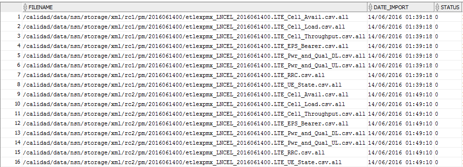

Instructivo Control y Reproceso de tablas NOKIA LTE 
====================================================

1.	OBJETIVO
------------

El presente instructivo busca explicar y detallar el control y reproceso de datos para las plataformas 4G (acceso), para mantener la consistencia de datos en situaciones en donde por algún motivo el proceso de recolección automático falla.

2.	ALCANCE
-----------

Áreas involucradas: performance y calidad de red, procesos de operaciones y mantenimiento.

3.	DEFINICIONES
--------------------

•	&FD : Fecha Desde, en formato DD.MM.YYYY (ej: 29.12.2015)
•	&HD : Hora Desde, en formato HH24, desde 00 hasta 23
•	&FH : Fecha Hasta, en formato DD.MM.YYYY (ej: 29.12.2015)
•	&HH : Hora Desde, en formato HH24, desde 00 hasta 23
•	&RC : Regional Cluster, cuyos valores válidos son RC2, RC3
•	&tabla: valores validos  

4.	INSTRUCCIONES OPERATIVAS
----------------------------

.. image:: ../_static/images/instructivo-lte/pag2.png
  :align: center

Ingresar al programa PL/SQL Developer --> Ingresar Username
									  --> Ingresa Password

.. image:: ../_static/images/instructivo-lte/pag3.png
  :align: center

.. image:: ../_static/images/instructivo-lte/pag3.2.png
  :align: center

4.1. CONTROLES
****************

1.  Procedimiento Controles RAW:
.............................

Control_LTE_1.RAW.sql
~~~~~~~~~~~~~~~~~~~~~

El especialista debe ejecutar la siguiente queries:

.. _Control_LTE_1.RAW.sql: ../_static/images/instructivo-lte/Control_LTE_1.RAW.sql

+ Control_LTE_1.RAW.sql_

Luego de ejecutar la queries se debe ingresar los siguientes datos:

	•	FD: Fecha Desde
	•	FH: Fecha Hasta 

.. image:: ../_static/images/instructivo-lte/pag6.png
  :align: center

Se muestra como resultado: 

Observación: de Esta consulta se podrá validar si para alguna tabla Raw  y para alguna hora no se registraron datos  o tenemos datos insuficientes. En promedio los valores normales de cantidad de registros por tabla son los que se muestran en las capturas de ejemplo.
En caso de faltantes de datos se debe reprocesar de la siguiente manera: 

Se debemos ejecutar la siguiente queries para verificar el estado  de los procesos del xml: 

.. image:: ../_static/images/instructivo-lte/pag7.png
  :align: center

Nos muestra como resultado: 

Luego se debe actualizar el estado del procesamiento de los .all (mediciones), ejecutando la siguiente queries:

.. image:: ../_static/images/instructivo-lte/pag7.3.png
  :align: center

2.  Procedimiento Controles HOUR:
.............................

Control_LTE_1.HOUR.sql
~~~~~~~~~~~~~~~~~~~~~

El especialista debe ejecutar la siguiente queries:

.. _Control_LTE_1.HOUR.sql: ../_static/images/instructivo-lte/Control_LTE_1.RAW.sql

+ Control_LTE_1.HOUR.sql_
	

El especialista debe ingresar: 

	•	Fecha_desde
	•	Fecha_hasta

.. image:: ../_static/images/instructivo-lte/pag14.png
  :align: center

La queries muestra como resultado:

En caso de que los datos sean incorrectos se debe reprocesar, existen dos tipos de reprocesos:

	•	Reproceso  sin replay
	•	Reproceso con replay 

REPROCESO DE DATOS
==================

REPROCESO  DE DATOS  SIN REPLAY
...............................

Si no existen faltantes de datos en las tablas RAW pero tenemos en Smart estadísticas erróneas (picos fuera de rango en el tráfico, la cantidad de fallas sean mayor a la cantidad de intentos, ect.) para alguna medición se deberá ejecutar según corresponda las siguientes funciones pl/sql.

.. image:: ../_static/images/instructivo-lte/pag15.jpg
  :align: center

La ejecución de las funciones de reproceso tiene dependencias de ejecución (Las funciones deben ejecutarse en el mismo orden que se encuentran listadas.), en un ciclo completo, cuando el error está a nivel de celda/hour, tendrá el siguiente orden:

Las siguientes funciones se ejecutan para recuperar datos que nos devuelve la base de datos.

.. image:: ../_static/images/instructivo-lte/pag16.png
  :align: center

Todas las funciones retornan un valor:

	•	0  El reproceso termino exitosamente.
	•  -1 El reproceso termino con error.
	•	1  El reproceso se está ejecutando.

.. image:: ../_static/images/instructivo-lte/pag17.jpg
  :align: center

.. image:: ../_static/images/instructivo-lte/pag17.2.png
  :align: center

.. image:: ../_static/images/instructivo-lte/pag18.png
  :align: center

En paralelo se puede ejecutar la siguiente queries: LTE_NSN_REWORK_STATUS, en esta queries se verifica que la función este siendo correctamente ejecutada.

.. image:: ../_static/images/instructivo-lte/pag19.png
  :align: center

Esta queries puede devolver dos valores: 

	•	WORKING : La función  está ejecutándose 
	•	STOPPED : La función termino de ejecutarse

Cuando ejecutamos la queries, nos devuelve el siguiente resultado: 

.. image:: ../_static/images/instructivo-lte/pag19.2.png
  :align: center

En caso de que la función se esté ejecutando y sea detenida manualmente ejecutar la siguiente queries para actualizar el estado de dicha función: 

.. image:: ../_static/images/instructivo-lte/pag19.3.png
  :align: center