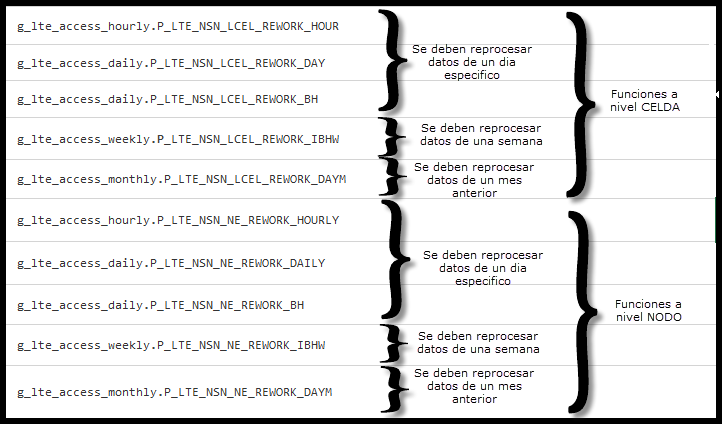

Instructivo Control y Reproceso de tablas NOKIA LTE 
====================================================

1.	OBJETIVO
------------

El presente instructivo busca explicar y detallar el control y reproceso de datos para las plataformas 4G (acceso), para mantener la consistencia de datos en situaciones en donde por algún motivo el proceso de recolección automático falla.

2.	ALCANCE
-----------

Áreas involucradas: performance y calidad de red, procesos de operaciones y mantenimiento.

3.	DEFINICIONES
--------------------

•	&FD : Fecha Desde, en formato DD.MM.YYYY (ej: 29.12.2015)
•	&HD : Hora Desde, en formato HH24, desde 00 hasta 23
•	&FH : Fecha Hasta, en formato DD.MM.YYYY (ej: 29.12.2015)
•	&HH : Hora Desde, en formato HH24, desde 00 hasta 23
•	&RC : Regional Cluster, cuyos valores válidos son RC2, RC3
•	&tabla: valores validos  

4.	INSTRUCCIONES OPERATIVAS
----------------------------

.. image:: ../_static/images/instructivo-lte/pag2.png
  :align: center

Ingresar al programa PL/SQL Developer --> Ingresar Username
									  --> Ingresa Password

.. image:: ../_static/images/instructivo-lte/pag3.png
  :align: center

.. image:: ../_static/images/instructivo-lte/pag3.2.png
  :align: center

4.1. CONTROLES
****************

Aquí se referenciarán las consultas presentes en los scripts:

+ LTE_Control_01.RAW.sql

+ LTE_Control_02.HOUR.sql

+ LTE_Control_03.DAY.sql

1.  Procedimiento Controles RAW:
.............................

LTE_Control_01.RAW.sql
~~~~~~~~~~~~~~~~~~~~~

El especialista debe ejecutar la siguiente queries:

.. _LTE_Control_01.RAW.sql: ../_static/images/instructivo-lte/LTE_Control_01.RAW.sql

+ LTE_Control_01.RAW.sql_

Luego de ejecutar la queries se debe ingresar los siguientes datos:

	•	FD: Fecha Desde
	•	FH: Fecha Hasta 

.. image:: ../_static/images/instructivo-lte/pag6.png
  :align: center

Se muestra como resultado: 

.. image:: ../_static/images/instructivo-lte/pag6.2.png
  :align: center

Observación: de Esta consulta se podrá validar si para alguna tabla Raw  y para alguna hora no se registraron datos  o tenemos datos insuficientes. En promedio los valores normales de cantidad de registros por tabla son los que se muestran en las capturas de ejemplo.
En caso de faltantes de datos se debe reprocesar de la siguiente manera: 

Se debemos ejecutar la siguiente queries para verificar el estado  de los procesos del xml: 

.. image:: ../_static/images/instructivo-lte/pag7.png
  :align: center

Nos muestra como resultado: 

.. image:: ../_static/images/instructivo-lte/pag7.2.png
  :align: center

Luego se debe actualizar el estado del procesamiento de los .all (mediciones), ejecutando la siguiente queries:

2.  Procedimiento Controles HOUR:
.............................

LTE_Control_02.HOUR.sql
~~~~~~~~~~~~~~~~~~~~~

El especialista debe ejecutar la siguiente queries:

.. _LTE_Control_02.HOUR.sql: ../_static/images/instructivo-lte/LTE_Control_02.HOUR.sql

+ LTE_Control_02.HOUR.sql_
	

El especialista debe ingresar: 

	•	Fecha_desde
	•	Fecha_hasta

.. image:: ../_static/images/instructivo-lte/pag14.png
  :align: center

La queries muestra el siguiente resultado donde se puede controlar a nivel celda(LCEL) o nivel de NETWORKELEMENT(NE):

**CELDA**

**NETWORKELEMENT**

2.  Procedimiento Controles DAY:
................................

LTE_Control_03.DAY.sql
~~~~~~~~~~~~~~~~~~~~~

El especialista debe ejecutar la siguiente queries:

.. _LTE_Control_03.DAY.sql: ../_static/images/instructivo-lte/LTE_Control_03.DAY.sql

+ LTE_Control_03.DAY.sql_
	

El especialista debe ingresar: 

	•	Fecha_desde
	•	Fecha_hasta

.. image:: ../_static/images/instructivo-lte/pag14.png
  :align: center

La queries muestra el siguiente resultado:

REPROCESO DE DATOS
==================

Si existe faltante de datos en las tablas RAW se debe ejecutar el siguiente paquete que contiene los procedimientos PL/SQL para el reroceso de las mismas, el reproceso se hace nivel a LCEL(celda) y NETWORKELEMENT(NE):

+ g_lte_access_* : Paquete PL/SQL.

+ P_LTE_NSN_LCEL_REWORK_* : Procedimiento PL/SQL a nicel LCEL(celda).

+ P_LTE_NSN_NE_REWORK_* : Procedimiento PL/SQL a nicel NE(NETWORKELEMENT).

* HOUR

::

	g_lte_access_hourly.P_LTE_NSN_LCEL_REWORK_HOUR(TO_CHAR('DD.MM.YYYY HH24', 'DD.MM.YYYY HH24'), TO_CHAR('DD.MM.YYYY HH24', 'DD.MM.YYYY HH24')); 
	g_lte_access_hourly.P_LTE_NSN_NE_REWORK_HOURLY(TO_CHAR('DD.MM.YYYY HH24', 'DD.MM.YYYY HH24'), TO_CHAR('DD.MM.YYYY HH24', 'DD.MM.YYYY HH24'));

Si no existen faltantes de datos en las tablas RAW pero tenemos en Smart estadísticas erróneas (picos fuera de rango en el tráfico, la cantidad de fallas sean mayor a la cantidad de intentos, ect.) para alguna medición, existen paquetes que contienen procedimientos pl/sql para cada sumarizacion: 

+ DAY

::

	g_lte_access_daily.P_LTE_NSN_LCEL_REWORK_DAY(TO_CHAR('DD.MM.YYYY HH24', 'DD.MM.YYYY'),TO_CHAR('DD.MM.YYYY HH24', 'DD.MM.YYYY'));  
	g_lte_access_daily.P_LTE_NSN_NE_REWORK_DAILY(TO_CHAR('DD.MM.YYYY HH24', 'DD.MM.YYYY'),TO_CHAR('DD.MM.YYYY HH24', 'DD.MM.YYYY'));

+ BH

::

	g_lte_access_daily.P_LTE_NSN_LCEL_REWORK_BH(TO_CHAR('DD.MM.YYYY', 'DD.MM.YYYY'),TO_CHAR('DD.MM.YYYY', 'DD.MM.YYYY'));  
	g_lte_access_daily.P_LTE_NSN_NE_REWORK_BH(TO_CHAR('DD.MM.YYYY', 'DD.MM.YYYY'),TO_CHAR('DD.MM.YYYY', 'DD.MM.YYYY'));

+ IBHW

::

	g_lte_access_weekly.p_lte_nsn_lcel_rework_ibhw(TO_CHAR('DD.MM.YYYY', 'DD.MM.YYYY'),TO_CHAR('DD.MM.YYYY', 'DD.MM.YYYY'));  
	g_lte_access_weekly.p_lte_nsn_ne_rework_ibhw(TO_CHAR('DD.MM.YYYY', 'DD.MM.YYYY'),TO_CHAR('DD.MM.YYYY', 'DD.MM.YYYY'));

+ DAYM

::

	g_lte_access_monthly.P_LTE_NSN_LCEL_REWORK_DAYM(TO_CHAR('DD.MM.YYYY', 'DD.MM.YYYY'),TO_CHAR('DD.MM.YYYY', 'DD.MM.YYYY')); 
	g_lte_access_monthly.P_LTE_NSN_NE_REWORK_DAYM(TO_CHAR('DD.MM.YYYY', 'DD.MM.YYYY'),TO_CHAR('DD.MM.YYYY', 'DD.MM.YYYY'));

**EJEMPLO DEL FORMATO**

+ DD.MM.YYYY HH24 

+ DD.MM.YYYY

La ejecución de las funciones de reproceso tiene dependencias de ejecución (Las funciones deben ejecutarse en el mismo orden que se encuentran listadas.), en un ciclo completo, cuando el error está a nivel de celda/hour, tendrá el siguiente orden:

Las siguientes funciones se ejecutan para recuperar datos que nos devuelve la base de datos.

