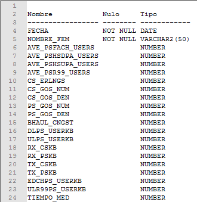
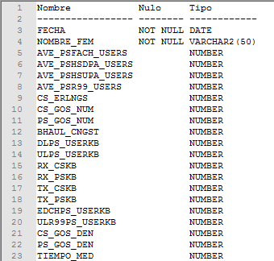
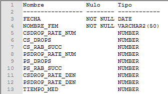
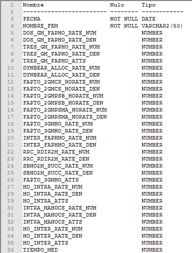
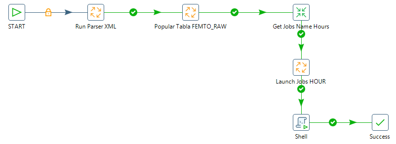

ALCATEL FEMTOCELL
=================

1.	OBJETIVO
------------

El presente documento buscar explicar y detallar el proceso que genera Alcatel Femtocell

2.	ALCANCE 
-----------

Áreas involucradas: Performance de Red

3.	DEFINICIONES
----------------

•	Cortado: Servidor LINUX en donde se importan los CSV desde el proveedor.
El nombre es cortado.claro.amx y la dirección IP física es 10.105.146.8

4.	DESCRIPCION GENERAL
-----------------------

Las radiobases Alcatel Femto Cell de tecnología 3G, son equipos que brindan acceso de voz y datos a la red celular, y están pensados para dar servicios de cobertura indoor a un número más limitado de usuarios.  Pensados para instalar en oficinas de clientes corporativos, oficinas de gobierno, u otros lugares donde la cobertura de la red celular macro no es suficiente.
 
La integración a Smart de esta plataforma consiste en recolectar los archivos CSV y XML del sistema de gestión SAM, y mostrarlos en Smart. 
 
Los KPIs son básicamente: accesibilidad, retenebilidad, movilidad (hand over), tráfico y disponibilidad. 
 
La información puede visualizarse en Smart hora x hora (hour), por hora pico del día (bh-busy hour), por hora pico de la semana (isa bh week), por hora pico del mes (isa bh month, por día (day), por semana (day week), por mes (day month).  Y según las agrupaciones de celda, nodo (conjunto de celdas), alm, mercado, país.

 .. _Medición_Plataforma_FEMTOCELLS_v1: ../_static/images/documentos/MediciónPlataformaFEMTOCELLS_v1.xlsx

Medición_Plataforma_FEMTOCELLS_v1_

5.	MACRO FLUJO DEL PROCESO 
---------------------------

6.	DESCRIPCION DETALLADA 
-------------------------

6.1.	Datos Origen
********************

•	Server Origen y Path: falda.claro.amx, /calidad/AlcatelFemtoCell/

•	Cantidad de archivos origen: Si

					o	femtoCellAll_fecha

•	Frecuencia actualización: Frecuencia diaria

•	Tipo de Archivo: csv

6.2.	Datos Destino
*********************

•	Server Destino: Cortado

•	Conversión de Archivos: Si

•	Tabla Files: Si 

•	Tabla Auxiliar: No

•	Frecuencia de corrida del proceso: 1 vez al día

•	Regionales: No

•	RAW Si/No: Si

•	Hour Si/No: Si

•	Day Si/No: Si

•	BH Si/No: Si

•	Isabhweek  Si/No: Si

•	Países: No

6.3.	Shell Copiar Archivos Origen a Destino y limpieza de los mismos
***********************************************************************

Los Scripts son los siguientes: 

+	scpAlcatel_

+	scpAlcatelDate_ 

+	scpAlcatelrework_

+	scpObjectAlcatelFC_

+	alc_fc_parser_

+	contadores_

+	deleteEmptyLogs_

+	Find_Counter_

+	generarCsvAll_

+	generarCsvAllrework_

+	obj_alc_fc_1_0_0_

+	objectFC_

+	PopulateTable_

+	PopulateTable_sh_

+	runAlcatelFCrework_ 

+	runAlcatelFemtoCell_

+	runObjectFC_

+	runObjparser_

+	runParse_

.. _scpAlcatel: ../_static/images/femtoAlcatel/scpAlcatel.sh
.. _scpAlcatelDate: ../_static/images/femtoAlcatel/scpAlcatelDate.sh 
.. _scpAlcatelrework: ../_static/images/femtoAlcatel/scpAlcatelrework.sh 
.. _scpObjectAlcatelFC: ../_static/images/femtoAlcatel/scpObjectAlcatelFC.sh
.. _alc_fc_parser: ../_static/images/femtoAlcatel/alc_fc_parser.jar
.. _contadores:  ../_static/images/femtoAlcatel/contadores.properties
.. _deleteEmptyLogs: ../_static/images/femtoAlcatel/deleteEmptyLogs.sh
.. _Find_Counter: ../_static/images/femtoAlcatel/Find_Counter.jar 
.. _generarCsvAll: ../_static/images/femtoAlcatel/generarCsvAll.sh
.. _generarCsvAllrework: ../_static/images/femtoAlcatel/generarCsvAllrework.sh
.. _obj_alc_fc_1_0_0: ../_static/images/femtoAlcatel/obj_alc_fc_1_0_0.jar
.. _objectFC: ../_static/images/femtoAlcatel/objectFC.sh
.. _PopulateTable: ../_static/images/femtoAlcatel/PopulateTable.jar
.. _PopulateTable_sh: ../_static/images/femtoAlcatel/PopulateTable.sh
.. _runAlcatelFCrework: ../_static/images/femtoAlcatel/runAlcatelFCrework.sh
.. _runAlcatelFemtoCell: ../_static/images/femtoAlcatel/runAlcatelFemtoCell.sh
.. _runObjectFC: ../_static/images/femtoAlcatel/runObjectFC.sh
.. _runObjparser: ../_static/images/femtoAlcatel/runObjparser.sh
.. _runParse: ../_static/images/femtoAlcatel/runParse.sh

6.4.	Listado de Tablas Utilizadas
************************************

Las tablas utilizadas son las siguientes: 

Los campos de las tablas son los siguientes: 

•	Tabla Files

.. image:: ../_static/images/femtoAlcatel/pag5.2.png
  :align: center

•	Tabla Error_log_new

.. image:: ../_static/images/femtoAlcatel/pag5.3.png
  :align: center

•	Tabla Error_log_new

•	Tabla Objects_alc_umts

•	Tabla  UMTS_ALC_ACCESSIBILITY_FC_BH

•	Tabla UMTS_ALC_ACCESSIBILITY_FC_HOUR

.. image:: ../_static/images/femtoAlcatel/pag8.png
  :align: center

•	Tabla UMTS_ALC_ACCESSIBILITY_FC_DAY

•	Tabla UMTS_ALC_ACCESSIBILITY_FC_IBHW

.. image:: ../_static/images/femtoAlcatel/pag10.png
  :align: center

•	Tabla UMTS_ALC_AVAILABILITY_FC_BH

•	Tabla UMTS_ALC_AVAILABILITY_FC_HOUR

•	Tabla UMTS_ALC_AVAILABILITY_FC_DAY

 .. image:: ../_static/images/femtoAlcatel/pag12.png
  :align: center

•	Tabla UMTS_ALC_AVAILABILITY_FC_IBHW

 .. image:: ../_static/images/femtoAlcatel/pag12.2.png
  :align: center

•	Tabla UMTS_ALC_CAPACITY_FC_BH

 .. image:: ../_static/images/femtoAlcatel/pag13.png
  :align: center

•	Tabla UMTS_ALC_CAPACITY_FC_HOUR

.. image:: ../_static/images/femtoAlcatel/pag14.png
  :align: center

•	Tabla UMTS_ALC_CAPACITY_FC_DAY

•	Tabla UMTS_ALC_CAPACITY_FC_IBHW

•	Tabla UMTS_ALC_DROP_FC_BH

•	UMTS_ALC_DROP_FC_HOUR

.. image:: ../_static/images/femtoAlcatel/pag17.2.png
  :align: center

•	UMTS_ALC_DROP_FC_DAY

•	UMTS_ALC_DROP_FC_IBHW

•	UMTS_ALC_MOBILITY_FC_BH

•	UMTS_ALC_MOBILITY_FC_HOUR

.. image:: ../_static/images/femtoAlcatel/pag20.png
  :align: center

•	UMTS_ALC_MOBILITY_FC_DAY

•	UMTS_ALC_MOBILITY_FC_IBHW

.. _UMTS_C_ALC_FC_RAW: ../_static/images/femtoAlcatel/UMTS_C_ALC_FC_RAW

*	UMTS_C_ALC_FC_RAW_

6.5.	Pentaho 
***************

Estructura del proyecto:

.. image:: ../_static/images/femtoAlcatel/pag23.png
  :align: center

•	Proceso Pentaho End to End 

.. image:: ../_static/images/femtoAlcatel/pag23.2.png
  :align: center

•	Proceso Run Parser XML

Este proceso se encarga de ejecutar el archivo .jar del paser para transformar los datos que se encuentran en el formato xml para crear los archivos con formato csv.

Los archivos csv son: 

	o	Femto_file0.csv

	o	Femto_file1.csv

	o	Femto_file2.csv

Estos archivos se generan solo cuando superan los 100 archivos de origen (archivos xml), en caso de que  los archivos sean menores de 100 se genera un único archivo csv. 
Luego de ejecutar Parser.jar se ejecuta el script generarCsvAll.sh que genera un único archivo de formato csv.

.. image:: ../_static/images/femtoAlcatel/pag24.png
  :align: center

•	Proceso Popular Tabla FEMTO_RAW

Este proceso se encarga de obtener el nombre del archivo  de formato csv (único archivo generado por el script) para llenar la tabla Raw.

7.	REPROCESO MANUAL
--------------------

1.	REPROCESO UNICO DIRECTORIO: 
*******************************

Para reprocesar manualmente se debe ejecutar el proceso Rework de Pentaho, ingresando los siguientes parámetros: 

	•	DIR_XML: Directorio donde se encuentran los archivos con formato xml
	•	FECHA_DESDE: Formato (DD.MM.AAAA)
	•	FECHA_HASTA: Formato (DD.MM.AAAA)

MACROFLUJO DE REPROCESO
;;;;;;;;;;;;;;;;;;;;;;;

2.	REPROCESO COMPLETO
**********************

Este reproceso se realiza para un directorio especifico pero trayendo los archivos de formato xml desde el servidor de origen.

El script que debe ejecutarse es el siguiente: 

	o	runAlcatelFCrework.sh 

Se deben ingresar los siguientes parámetros:

	•	DIR_XML: Directorio donde se encuentran los archivos con formato xml
	•	FECHA_DESDE: Formato (DD.MM.AAAA)
	•	FECHA_HASTA: Formato (DD.MM.AAAA)

8.	SMART
---------

9. CONTROL DE CAMBIOS
---------------------                         

.. raw:: html 

   

  <table border="3">
  <tr>
    <th>Fecha</th>
    <th>Responsable</th>
    <th>Ticket Jira</th>
    <th>Detalle</th>
    <th>Repositorio</th>
  </tr>
  <tr>
    <td> 28/12/2016 </td>
    <td> Marcelo Carrasco </td>
    <td> 
<a href="http://jira.harriague.com.ar/jira/browse/CL-670"> CL-670 </a>
  </td>
    <td> Se crearon las estructuras y los procesos necesarios para su ejecución diaria </td>
    <td> </td>
  </tr>
  <tr>
    <td> 17/01/2017 </td>
    <td> Martin Champarini </td>
    <td>  
<a href="http://jira.harriague.com.ar/jira/browse/CL-669"> CL-669 </a>
  </td>
    <td> Se corrigieron los campos de la tabla objetos  </td>
    <td></td>
    </tr>
  <tr>
    <td> 15/03/2017 </td>
    <td> Martin Champarini </td>
    <td>  
<a href="http://jira.harriague.com.ar/jira/browse/CL-953"> CL-953 </a>
  </td>
    <td> RFC I - Alcatel Femtocell - Elminar de las tablas de kpi (HOUR,BH,DAY,IBHW) todos los campos de la cabecera </td>
    <td></td>
  </tr>
  </table>

