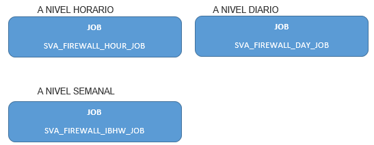
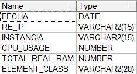
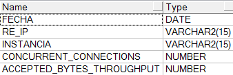
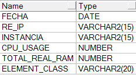
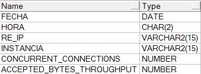
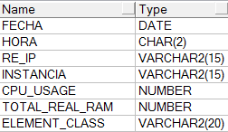
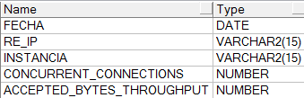
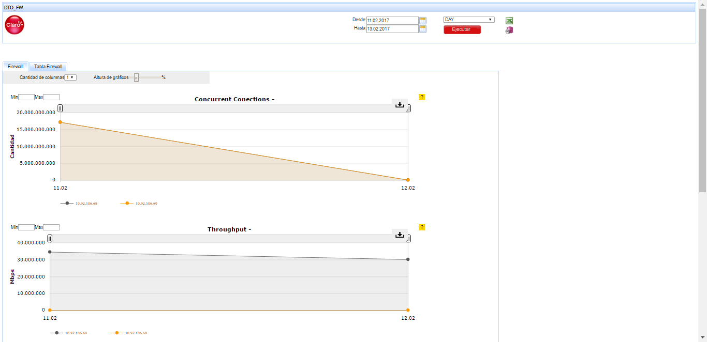
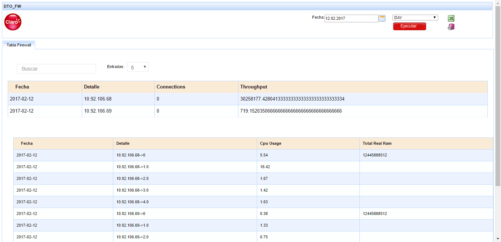

FIREWALL CHECKPOINT GRX BX
==========================

1. OBJETIVO
-----------

El presente documento buscar explicar y detallar el proceso que genera Firewall Checkpoint GRX BX

2. ALCANCE
----------

•	Áreas involucradas: Performance de Red

3. DEFINICIONES
---------------

•	Perdido: Servidor UNIX en donde se importan los XML desde el proveedor, y en donde se encuentra Smart.
•	Guerrero: Servidor LINUX en el cual el proveedor deposita los archivos csv.

4. DESCRIPCÓN GENERAL
---------------------

**Alcatel IPRAN**

Permite el  tráfico y conexiones de datos móviles entre usuarios de Roaming de otras Operadoras en la Red Claro y viceversa. Estas cajas están conectadas contra los Routers 7600 PE de DTO (TOR-PE-R01 y TOR-PE-R02) respectivamente.

5. MACRO FLUJO DEL PROCESO
--------------------------

6. DESCRIPCIÓN DETALLADA
------------------------

6.1.	Datos Origen
..................

•	Server Origen y Path: guerrero.claro.amx

•	Cantidad de archivos origen: No 

•	Frecuencia actualización: Se actualizan los datos cada 15 min, en caso de que no se	encuentren datos, trae como dato el valor “0”

•	Tipo de Archivo: No posse archivos

6.2.	Datos Destino
...................

•	Server Destino: perdido.claro.amx

•	Conversión de Archivos: Si 

•	Tabla Files: No

•	Tabla Auxiliar:No 

•	Frecuencia de corrida del proceso: 

	o	Se ejecuta cada una hora en el minuto 25(hour)

	o	Se ejecuta cada a las 6 a.m en el minuto 10 (Day)

	o	Se ejecuta cada Lunes a las 10 a.m en el minuto 10 (Semanal)

•	Regionales: No 

•	RAW Si/No: No

•	Hour Si/No: Si 

•	Day Si/No: Si 

•	BH Si/No: Si 

•	Paises: No 

•	Directorio Destino (File System): Se corre a través de los Jobs.

6.3.	Listado de Tablas Utilizadas
------------------------------------

•	SVA_FIREWALL_RECURSOS_HOUR

•	SVA_FIREWALL_FIREWALL_HOUR

.. image:: ../_static/images/firewall/pag4.2.png
  :align: center

•	SVA_FIREWALL_FIREWALL_DAY

•	SVA_FIREWALL_RECURSOS_DAY

•	SVA_FIREWALL_FIREWALL_BH

•	SVA_FIREWALL_RECURSOS_BH

•	SVA_FIREWALL_RECURSOS_IBHW

•	SVA_FIREWALL_FIREWALL_IBHW

7. REPROCESO MANUAL
-------------------

Reproceso a Nivel Horario:

	•	p_sva_firewall_rec_hour(p_fecha_desde => :p_fecha_desde,
                          p_fecha_hasta => :p_fecha_hasta);

dd.mm.yyyy hh24  = fecha_desde    dd.mm.yyyy hh24  = fecha_hasta

Reproceso a Nivel Diario: 

	•	 p_sva_firewall_rec_daily(p_fecha_desde => :p_fecha_desde,
                           p_fecha_hasta => :p_fecha_hasta);

fecha_desde = dd.mm.yyyy   fecha_hasta = dd.mm.yyyy

Reproceso a Nivel Semanal:

	•	 p_sva_firewall_rec_ibhw(p_fecha_desde => :p_fecha_desde,
                          p_fecha_hasta => :p_fecha_hasta);

fecha_desde = dd.mm.yyyy (domingo primer dia de la semana)  fecha_hasta = dd.mm.yyyy (sabado ultimo  dia de la semana)

8.  SMART
---------

En la herramienta Smart se muestra la información de la siguiente manera:

8. CONTROL DE CAMBIOS
---------------------

.. raw:: html 

   

  <table border="3">
  <tr>
    <th>Fecha</th>
    <th>Responsable</th>
    <th>Ticket Jira</th>
    <th>Detalle</th>
    <th>Repositorio</th>
  </tr>
  <tr>
    <td> 24/11/2016 </td>
    <td> Monica Pellegrini </td>
    <td> Se dieron de alta las tablas solicitadas </td>
    <td> 
<a href="http://jira.harriague.com.ar/jira/browse/CL-625"> CL-625 </a>
  </td>
    <td> </td>
  </tr>
  <tr>
    <td> 21/02/2017 </td>
    <td> Franco Rinaldi </td>
    <td> No devuelve el valor correcto en Throughput</td>
    <td> 
<a href="http://jira.harriague.com.ar/jira/browse/CL-712"> CL-712 </a>
  </td>
    <td> </td>
  </tr>

 </table>