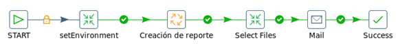
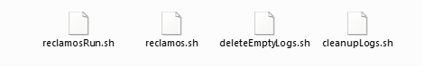
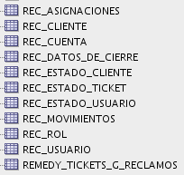
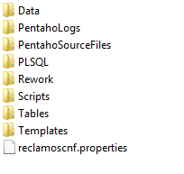
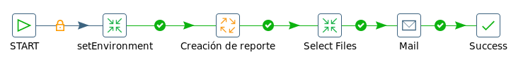
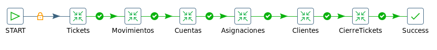
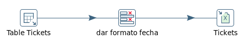

GESTION DE RECLAMOS - Reporte
=============================

1.	OBJETIVO
------------

El presente documento buscar explicar y detallar el proceso que genera el Reporte Reclamos.

2.	ALCANCE 
-----------

Áreas involucradas: Performance de Red

3.	DEFINICIONES
----------------

Falda: Servidor UNIX en donde se importan los XML desde el proveedor, y en donde se encuentra Smart. El nombre es falda.claro.amx.

Cortado: Servidor LINUX en donde se importan los CSV desde el proveedor.

El nombre es cortado.claro.amx y la dirección IP física es 10.105.146.8

4.	DESCRIPCION GENERAL 
-----------------------

Este reporte será actualizado de forma diaria para poder llevar una correcta gestión de los reclamos 

5.	MACRO FLUJO DEL PROCESO
---------------------------

6.	DESCRIPCIÓN DETALLADA
--------------------------

6.1.	Datos Origen
********************

• Server Origen y Path: falda.claro.amx /calidad/Reclamos/

• Frecuencia actualización: diaria

• Tipo de Archivo de Salida: .xlsx

6.2.	Datos Destino
*********************

• Server Destino: no aplica esta sub-seccion.

6.3.	Shell Copiar Archivos Origen a Destino y limpieza de los mismos
***********************************************************************

Los scripts son los siguientes:

6.4.	Listado de Tablas Utilizadas
************************************

Las tablas utilizadas son las siguientes:

6.5.	Pentaho
**************

Estructura del proyecto:

• Proceso Pentaho End to End

• Proceso Creación de reporte

  En este proceso se encarga de ejecutar las queries para generar el Excel de salida.

  En el Excel se muestra cada trabajo en una hoja diferente.

  Por ejemplo: una hoja de Tickets. 

• Proceso Tickets

  Este proceso se encarga de ejecutar la query en Table Tickets, en el siguiente paso se da formato a la fecha (dd/MM/yyyy) y para finalizar se genera la solapa de datos en la hoja de Excel. 

7.  CONTROLES
-------------

No aplica esta sub-seccion.

8.	REPROCESO MANUAL
--------------------

No aplica esta sub-seccion.

8.	SMART
---------

Se envía vía email un archivo Excel con el nombre: GestionDeReclamos_20170509

9. CONTROL DE CAMBIOS
---------------------

.. raw:: html 

   

  <table border="3">
  <tr>
    <th>Fecha</th>
    <th>Responsable</th>
    <th>Ticket Jira</th>
    <th>Detalle</th>
    <th>Repositorio</th>
  </tr>
  <tr>
    <td> 31/05/2017 </td>
    <td> Marcelo Olivera </td>
    <td> 
<a href="http://jira.harriague.com.ar/jira/browse/CL-607"> CL-607 </a>
  </td>
    <td> Creacion de documentación de Proyecto existente.
          Proyecto actual - Cortado. </td>
    <td> Servidor: CORTADO </td>
  </tr>
  </table>