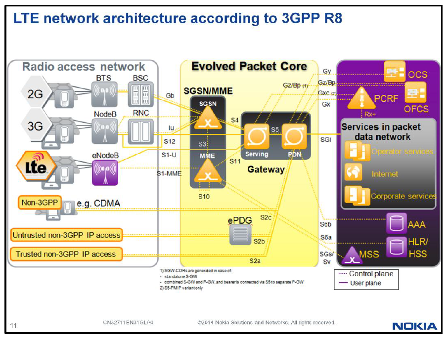
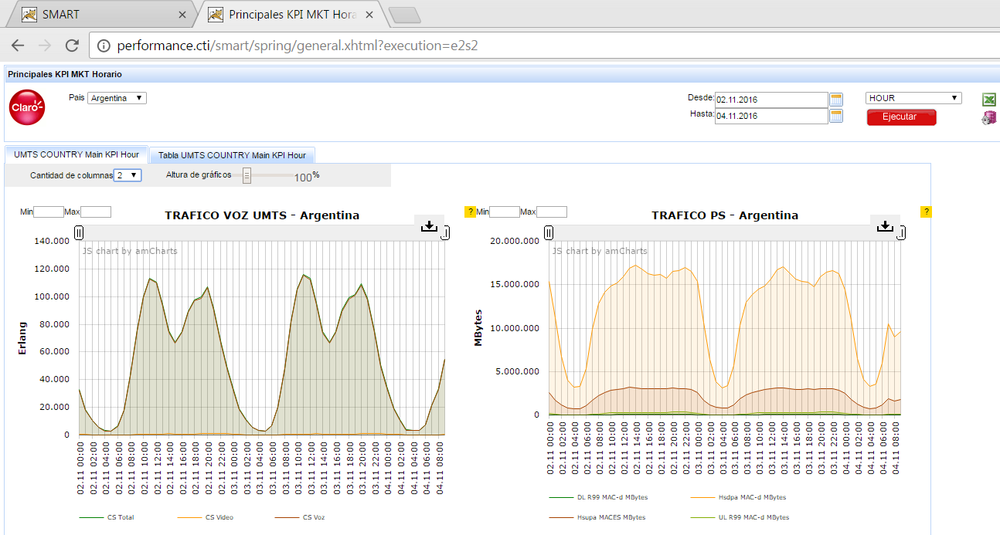
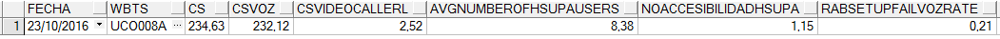
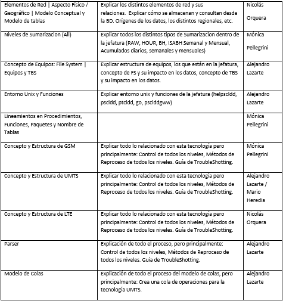

Introducción a Smart GSM UMTS LTE
=================================

Mediciones de Performance para la Red Móvil en Claro
----------------------------------------------------

Describiremos brevemente el proceso de generación de estadísticas de desempeño de la red móvil, su recolección centralizada y su procesamiento para monitoreo diario y presentación de informes y reportes.

OSS Propietario
...............

Todos y cada uno de los elementos de la red de telecomunicaciones móviles (radiobases y controladores, bts, bsc, nodeb, rnc, etc) son gerenciados por el sistema centralizado de gestión que brinda el proveedor de la tecnología (OSS-Operational Support System).  Este sistema brinda el control de inventario, control de configuración, provisión de servicios, monitoreo de fallas y el monitoreo de las estadísticas de desempeño; para una mejor administración de los numerosos elementos de red, los mismos son distribuidos entre diferentes OSS.

.. image:: ../_static/images/introSmart/pag3.png
  :align: center 

.. image:: ../_static/images/introSmart/pag4.png
  :align: center 

Sistema de Estadísticas Smart
.............................

Adicionalmente al mencionado sistema de gestión específico del proveedor de la tecnología, se utiliza un sistema de almacenamiento que toma la información del primero, el cual facilita y agiliza tanto el acceso vía web de uso diario como la confección de informes y reportes periódicos y estratégicos.  En este sistema la retención de información se realiza durante mucho mayor tiempo.  La información estadística se utiliza en diferentes procesos de calidad: monitoreo periódico y continuo de la calidad (horarios, diarios, semanales, mensuales, anuales), verificación de mejoras de calidad como consecuencia de tareas de optimización, verificación cumplimiento de calidad nuevos elementos de red incorporados, selección de zonas donde enfocar la optimización de elementos, reportes estratégicos de performance y capacidades a mediano y largo plazo, etc.

.. image:: ../_static/images/introSmart/pag7.png
  :align: center

.. image:: ../_static/images/introSmart/pag8.png
  :align: center

El almacenamiento de estadísticas y preparación de reportes es realizada por un equipo de profesionales ingenieros dedicados exclusivamente a esta tarea y la información es compartida apropiadamente a otros equipos: Optimización de Red, Control de Mejoras y Procesos, Ingeniería de Red Acceso, Ingeniería de Transmisión, Implantación de Red, Operaciones y Mantenimiento, etc.

Preguntas básicas sobre indicadores
...................................

¿Cómo se computan los indicadores (2G y 3G)?  Se utiliza el monitoreo de estadísticas de desempeño que brinda el proveedor de la tecnología mediante su sistema de gestión.

¿Cómo se computan los valores mensuales para los indicadores (2G y 3G)?  Estos valores representan la hora pico mensual promedio. 

¿Cómo se computa la “Inaccesibilidad 2G”?  Es el cociente entre la suma de llamadas denegadas por diferentes causas y el total de intentos.  

¿Cómo se computa la “No Retenibilidad 2G”?  Es el cociente entre la suma de llamadas finalizadas involuntariamente por diferentes causas y el total de llamadas (CSR=100-Drop).

¿Qué incluye y cómo se computa la “Capacidad” en 2G?  Esta capacidad es indicada por los elementos de red mediante un KPI específico.

¿Existe un concepto equivalente a la “Capacidad” de 2G en 3G?  En 3G no existe un concepto equivalente a la capacidad 2G que sea indicada para cada elemento de red como un KPI específico.

¿Cómo se computa la “Inaccesibilidad 3G?  Es el cociente entre la suma de llamadas denegadas por diferentes causas y el total de intentos.  

¿Cómo se computa la “No Retenibilidad” en 3G?  Es el cociente entre la suma de llamadas finalizadas involuntariamente y el total de llamadas.  Se computan como causas de llamadas que no finalizaron exitosamente todas las fallas involuntarias.

 
Parser de archivos XML
......................

En los OSS Regional Cluster los paths donde se encuentran los archivos de CM/PM son:

CM-Configuration Management: /var/opt/nokia/oss/global/racops/export

PM-Performance Management: /d/oss/global/var/mediation/north/pm/export/yyyymmddhh

+	Netact RC5 rc5vm5 10.105.39.12

+	Netact RC6 rc6vm5 10.105.39.140

+	Netact RC7 rc6vm5 10.105.44.142

+	Netact RC8 rc8vm5 10.105.44.140

El nombre genérico de un archivo de PM es: etlexpmx_<MEAS>yymmddhhmmss<SN>.xml.gz donde:

<MEAS> define el elemento de red e incluso la medición

<SN> es un número de serie del archivo, que no se repite

Nomenclatura de los Sitios y Radiobases
........................................
Nomenclatura actual
^^^^^^^^^^^^^^^^^^^
La nomenclatura actual de las radio bases está descripta en el documento Cell ID UMTS_V10.xls

Nueva Nomenclatura
^^^^^^^^^^^^^^^^^^

La NUEVA nomenclatura de las radiobases está explicada en el documento “Nomenclatura_Draft V1.2.xls”

.. image:: ../_static/images/introSmart/pag11.png
  :align: center

Agrupaciones Lógicas y Geográficas
..................................

+	BTS
+	BCF
+	BSC
+	WCEL
+	WBTS
+	RNC
+	LNCEL
+	LNBTS
+	ALM
+	Localidad
+	Mercado
+	País

Agrupaciones Geográficas
^^^^^^^^^^^^^^^^^^^^^^^^
Las ALM, Localidades, Mercados y Países son agrupaciones geográficas.

Agrupaciones lógicas de GSM
^^^^^^^^^^^^^^^^^^^^^^^^^^^
Para GSM las agrupaciones lógicas o de topología, relacionan varias BTS en una misma BCF, y varias BCF en una misma BSC.

Agrupaciones lógicas de UMTS
^^^^^^^^^^^^^^^^^^^^^^^^^^^^

Para UMTS las agrupaciones lógicas o de topología, relacionan varias WCELL en una misma WBTS, y varias WBTS en una misma RNC.

.. image:: ../_static/images/introSmart/pag12.2.png
  :align: center

Agrupaciones lógicas de LTE
^^^^^^^^^^^^^^^^^^^^^^^^^^^

Para LTE las agrupaciones lógicas o de topología, relacionan varias LNCEL en una misma LNBTS, y el concepto de BTS/RNC desaparece.

.. _Introducción_Smart_GSM_UMTS_LTE_Agrupaciones_Espaciales: ../_static/images/introSmart/Introducción_Smart_GSM_UMTS_LTE_Agrupaciones_Espaciales.sql

Introducción_Smart_GSM_UMTS_LTE_Agrupaciones_Espaciales_

Sumarizaciones de Tiempo: Hour, Busy Hour, Isabh Week, Isabh Month, Day Week, Day Month
---------------------------------------------------------------------------------------

Tablas HOUR
...........
Cada uno de las radio bases o celdas, generan estadísticas cada una hora.  Esta información es guardada en las tablas HOUR de la base de datos.  Así, para un elemento en particular, ej: UCO008A, tenemos 24 valores hour en un día en la tabla UMTS_NSN_SERVICE_WCEL_HOU2

Tablas DAY
..........
En la tabla DAY se suman los contadores del día, o sea los 24 valores hour.  Así, para un elemento en particular, ej: UCO008A, tenemos 1 valor por día en la tabla DAY.

Ejemplo: UMTS_NSN_SERVICE_WCEL_DAY 

.. image:: ../_static/images/introSmart/pag13.2.png
  :align: center

Tablas BH
.........

En la tabla Busy Hour cada elemento muestra 1 valor por día, específicamente el valor de la hora de mayor tráfico del día.

Ejemplo: UMTS_NSN_SERVICE_WCEL_BHC

.. image:: ../_static/images/introSmart/pag13.3.png
  :align: center

Tablas DAY WEEK
...............

Estas tablas suman los contadores de los 7 días de la semana.  El comienzo de semana es el día domingo, y el fin de la semana es el día sábado.

Ejemplo: UMTS_NSN_SERVICE_WCEL_DAYW.  

El 23/10/2016 es un día domingo, el inicio de la semana

Tablas DAY MONTH
................

Estas tablas suman los contadores de los 30 días del mes respectivamente.  

Tablas ISABH WEEK
.................

Se define como ISABH WEEK el “Individual Sector Average Busy Hour Week”.  O sea es el promedio de las horas pico de la semana, de los sectores individuales (celdas).  Se toman los 3 busy hour más altos de la semana, de una celda, y se los promedia.
El comienzo de semana es el día domingo, y el fin de la semana es el día sábado.

Tablas ISABH MONTH
..................

Se define como ISABH MONTH el “Individual Sector Average Busy Hour Month”.  O sea es el promedio de las horas pico del mes, de los sectores individuales (celdas).  Se toman los 7 busy hour más altos del mes, de una celda, y se los promedia.

Ejemplo de fórmulas de KPI
--------------------------

.. image:: ../_static/images/introSmart/pag15.png
  :align: center

.. image:: ../_static/images/introSmart/pag15.2.png
  :align: center

.. image:: ../_static/images/introSmart/pag16.png
  :align: center

Ejemplo de KPI en la documentación Nokia
----------------------------------------

.. image:: ../_static/images/introSmart/pag16.2.png
  :align: center

.. image:: ../_static/images/introSmart/pag17.png
  :align: center

Ejemplo de Counter en la documentación Nokia
--------------------------------------------

Ejemplo de Reporte de Smart y la consulta SQL correspondiente
-------------------------------------------------------------

.. _Consulta_Ejemplo_Smart: ../_static/images/introSmart/pag21y22.sql

Consulta_Ejemplo_Smart_ 

Referentes
----------

