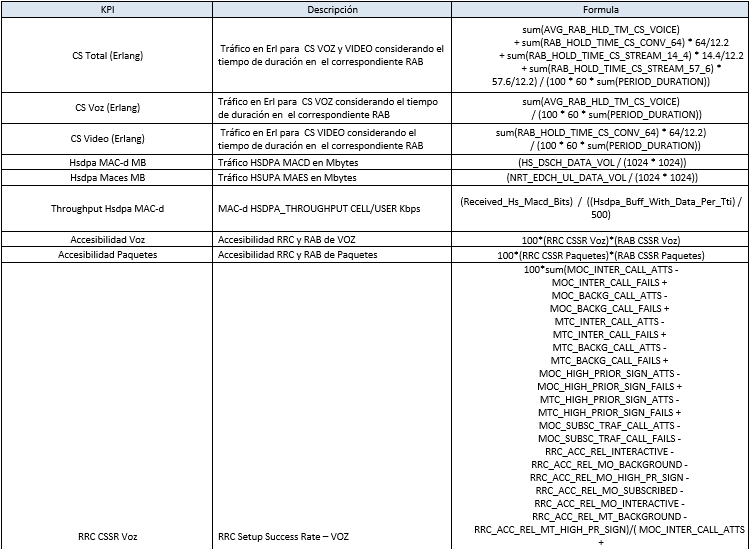

Introducción a Smart GSM UMTS LTE
=================================

Mediciones de Performance para la Red Móvil en Claro
----------------------------------------------------

Describiremos brevemente el proceso de generación de estadísticas de desempeño de la red móvil, su recolección centralizada y su procesamiento para monitoreo diario y presentación de informes y reportes.

OSS Propietario
...............

Todos y cada uno de los elementos de la red de telecomunicaciones móviles (radiobases y controladores, bts, bsc, nodeb, rnc, etc) son gerenciados por el sistema centralizado de gestión que brinda el proveedor de la tecnología (OSS-Operational Support System).  Este sistema brinda el control de inventario, control de configuración, provisión de servicios, monitoreo de fallas y el monitoreo de las estadísticas de desempeño; para una mejor administración de los numerosos elementos de red, los mismos son distribuidos entre diferentes OSS.

.. image:: ../_static/images/introSmart/pag3.png
  :align: center 

.. image:: ../_static/images/introSmart/pag5.png
  :align: center 

Sistema de Estadísticas Smart
.............................

Adicionalmente al mencionado sistema de gestión específico del proveedor de la tecnología, se utiliza un sistema de almacenamiento que toma la información del primero, el cual facilita y agiliza tanto el acceso vía web de uso diario como la confección de informes y reportes periódicos y estratégicos.  En este sistema la retención de información se realiza durante mucho mayor tiempo.  La información estadística se utiliza en diferentes procesos de calidad: monitoreo periódico y continuo de la calidad (horarios, diarios, semanales, mensuales, anuales), verificación de mejoras de calidad como consecuencia de tareas de optimización, verificación cumplimiento de calidad nuevos elementos de red incorporados, selección de zonas donde enfocar la optimización de elementos, reportes estratégicos de performance y capacidades a mediano y largo plazo, etc.

.. image:: ../_static/images/introSmart/pag8.png
  :align: center

.. image:: ../_static/images/introSmart/pag8.2.png
  :align: center

El almacenamiento de estadísticas y preparación de reportes es realizada por un equipo de profesionales ingenieros dedicados exclusivamente a esta tarea y la información es compartida apropiadamente a otros equipos: Optimización de Red, Control de Mejoras y Procesos, Ingeniería de Red Acceso, Ingeniería de Transmisión, Implantación de Red, Operaciones y Mantenimiento, etc.

Preguntas básicas sobre indicadores
...................................

¿Cómo se computan los indicadores (2G y 3G)?  Se utiliza el monitoreo de estadísticas de desempeño que brinda el proveedor de la tecnología mediante su sistema de gestión.

¿Cómo se computan los valores mensuales para los indicadores (2G y 3G)?  Estos valores representan la hora pico mensual promedio. 

¿Cómo se computa la “Inaccesibilidad 2G”?  Es el cociente entre la suma de llamadas denegadas por diferentes causas y el total de intentos.  

¿Cómo se computa la “No Retenibilidad 2G”?  Es el cociente entre la suma de llamadas finalizadas involuntariamente por diferentes causas y el total de llamadas (CSR=100-Drop).

¿Qué incluye y cómo se computa la “Capacidad” en 2G?  Esta capacidad es indicada por los elementos de red mediante un KPI específico.

¿Existe un concepto equivalente a la “Capacidad” de 2G en 3G?  En 3G no existe un concepto equivalente a la capacidad 2G que sea indicada para cada elemento de red como un KPI específico.

¿Cómo se computa la “Inaccesibilidad 3G?  Es el cociente entre la suma de llamadas denegadas por diferentes causas y el total de intentos.  

¿Cómo se computa la “No Retenibilidad” en 3G?  Es el cociente entre la suma de llamadas finalizadas involuntariamente y el total de llamadas.  Se computan como causas de llamadas que no finalizaron exitosamente todas las fallas involuntarias.

 
Parser de archivos XML
......................

En los OSS Regional Cluster los paths donde se encuentran los archivos de CM/PM son:

CM-Configuration Management: /var/opt/nokia/oss/global/racops/export

PM-Performance Management: /var/opt/nokia/oss/global/mediation/north/pm/export/yyyymmddhh

+	Netact RC5 rc6vm5.rc6.netact.claro.amx

+	Netact RC6 rc6vm5.rc6.netact.claro.amx

+	Netact RC7 rc7vm5.rc7.netact.claro.amx

+	Netact RC8 rc8vm5.rc8.netact.claro.amx

El nombre genérico de un archivo de PM es: etlexpmx_<MEAS>yymmddhhmmss<SN>.xml.gz donde:

<MEAS> define el elemento de red e incluso la medición

<SN> es un número de serie del archivo, que no se repite

Nomenclatura de los Sitios y Radiobases
........................................

Nomenclatura actual
^^^^^^^^^^^^^^^^^^^
La nomenclatura actual de las radio bases está descripta en el documento Cell ID UMTS_V10.xls

.. image:: ../_static/images/introSmart/pag10.png
  :align: center

Nueva Nomenclatura
^^^^^^^^^^^^^^^^^^

La NUEVA nomenclatura de las radiobases está explicada en el documento “Nomenclatura_Draft V1.2.xls”

.. image:: ../_static/images/introSmart/pag11.png
  :align: center

Agrupaciones Lógicas y Geográficas
..................................

+	BTS
+	BCF
+	BSC
+	WCEL
+	WBTS
+	RNC
+	LNCEL
+	LNBTS
+	ALM
+	Localidad
+	Mercado
+	País

Agrupaciones Geográficas
^^^^^^^^^^^^^^^^^^^^^^^^
Las ALM, Localidades, Mercados y Países son agrupaciones geográficas.

Agrupaciones lógicas de GSM
^^^^^^^^^^^^^^^^^^^^^^^^^^^
Para GSM las agrupaciones lógicas o de topología, relacionan varias BTS en una misma BCF, y varias BCF en una misma BSC.

.. image:: ../_static/images/introSmart/pag12.png
  :align: center

Agrupaciones lógicas de UMTS
^^^^^^^^^^^^^^^^^^^^^^^^^^^^

Para UMTS las agrupaciones lógicas o de topología, relacionan varias WCELL en una misma WBTS, y varias WBTS en una misma RNC.

Agrupaciones lógicas de LTE
^^^^^^^^^^^^^^^^^^^^^^^^^^^

Para LTE las agrupaciones lógicas o de topología, relacionan varias LNCEL en una misma LNBTS, y el concepto de BTS/RNC desaparece.

.. _Introducción_Smart_GSM_UMTS_LTE_Agrupaciones_Espaciales: ../_static/images/introSmart/Introducción_Smart_GSM_UMTS_LTE_Agrupaciones_Espaciales.sql

Introducción_Smart_GSM_UMTS_LTE_Agrupaciones_Espaciales_

Sumarizaciones de Tiempo: Hour, Busy Hour, Isabh Week, Isabh Month, Day Week, Day Month
---------------------------------------------------------------------------------------

Tablas HOUR
...........
Cada uno de las radio bases o celdas, generan estadísticas cada una hora.  Esta información es guardada en las tablas HOUR de la base de datos.  Así, para un elemento en particular, ej: UCO008A, tenemos 24 valores hour en un día en la tabla UMTS_NSN_SERVICE_WCEL_HOU2

.. image:: ../_static/images/introSmart/pag13.png
  :align: center

Tablas DAY
..........
En la tabla DAY se suman los contadores del día, o sea los 24 valores hour.  Así, para un elemento en particular, ej: UCO008A, tenemos 1 valor por día en la tabla DAY.

Ejemplo: UMTS_NSN_SERVICE_WCEL_DAY 

.. image:: ../_static/images/introSmart/pag13.2.png
  :align: center

Tablas BH
.........

En la tabla Busy Hour cada elemento muestra 1 valor por día, específicamente el valor de la hora de mayor tráfico del día.

Ejemplo: UMTS_NSN_SERVICE_WCEL_BHC

.. image:: ../_static/images/introSmart/pag13.3.png
  :align: center

Tablas DAY WEEK
...............

Estas tablas suman los contadores de los 7 días de la semana.  El comienzo de semana es el día domingo, y el fin de la semana es el día sábado.

Ejemplo: UMTS_NSN_SERVICE_WCEL_DAYW.  

El 23/10/2016 es un día domingo, el inicio de la semana

.. image:: ../_static/images/introSmart/pag13.4.png
  :align: center

Tablas DAY MONTH
................

Estas tablas suman los contadores de los 30 días del mes respectivamente.  

Tablas ISABH WEEK
.................

Se define como ISABH WEEK el “Individual Sector Average Busy Hour Week”.  O sea es el promedio de las horas pico de la semana, de los sectores individuales (celdas).  Se toman los 3 busy hour más altos de la semana, de una celda, y se los promedia.
El comienzo de semana es el día domingo, y el fin de la semana es el día sábado.

Tablas ISABH MONTH
..................

Criterio de ISABH MONTH
 
Este algoritmo se calcula Mensualmente partiendo de una muestra de 15 valores en orden descendente de los días con mayor tráfico.
Ahora se toman como muestra los primeros 15 valores se descartan los 2 más altos y los 13 restantes se promedian entre sí.
Una vez realizado el promedio de tráfico de los 13 valores se verifica que dicho promedio no sea 2.5 veces mayor al dato de tráfico del día 2. De no ser mayor el valor 2 se incluye en el promedio total. Se repite el proceso para el dato 1 y con esto se puede tener un promedio por célula de 13, 14 ó 15 días dependiendo el caso.

Tabla Objetos UMTS
------------------

Conceptualmente para qué se usa la tabla: la tabla es una vista materializada que se actualiza diariamente de manera dinámica según la información recolectada de archivos XML brindados por Nokia que contienen la configuración actual de la red, por esto se conoce el proceso como CM (Configuration Management). Está conformada a nivel de Celda (1 fila = 1 celda) y contiene toda la información relevante a cada uno de estos objetos por lo que se usa como interfaz en gran cantidad de consultas, reportes y a su vez en la mayoría de los reportes de la herramienta SMART y SMART Maps.

La misma contiene además de la configuración actual de las Celdas, el histórico de aquellas celdas que por distintos motivos ya no se encuentran en los archivos XML (se mudaron de OSSRC, se dio de baja el sitio, etc.), esto se logra mediante los campos WCELL_VALID_START_DATE y WCELL_VALID_FINISH_DATE los cuales definen el rango de tiempo en el que el objeto celda está vigente.

* Nombre: OBJECTS_SP_UMTS.

* Columnas: 91. 

* Cantidad de registros actual: 234.451 17/Nov/2016

Para concentrar la información relevante de cada celda, esta vista se alimenta de 9 tablas en la Base de Datos:

  * MULTIVENDOR_OBJECTS: Contiene la información histórica de CM (CELDAS, SITIOS, RNC)

  * MULTIVENDOR_OBJECT2: Tabla principal en la que se deposita la información de configuración de la RED de los archivos XML de Nokia diariamente, de aquí se obtiene la base de la información que provee la SP para cada Celda.

  * ALM_MERCADO: A nivel de ALM contiene toda la información de las diferentes agrupaciones geográficas. (ALM, LOCALIDAD, MERCADO, REGION, ZONA, PAIS)

  * CTI_CIUDAD_RF_FISICO: A nivel celda, se actualiza diariamente consultando tablas mediante DBlink a la base de datos LEDZITE y concentrar para las 3 tecnologías la información de los parámetros físicos de cada celda. (Coordenadas de ubicación, Azimuth, LAC, RAC).

  * CTI_CIUDAD, CTI_CIUDAD_CELLID, CTI_CIUDAD_APERTURAS: Contienen información de agrupación geográfica de la Celda.

  * MVENDOR_GESTION_CLUSTER: Identifica el Clúster al que pertenece la Celda.

  * OBJECTS_CNC_NEW: Identifica el área definida por ENACOM (Ex-CNC) al que pertenece la Celda.

La definición de estas vistas se encuentra en archivos .sql en una carpeta compartida, en los cuales se mantiene el histórico de cambios/actualizaciones que se realizan sobre la misma ya que al ser una vista esto no se guarda en la Base de Datos:

Z:\Engineer\Calidad\Performance\Desarrollo Smart\Base de datos\Scripts\Objetos

El proceso de CM se ejecuta automáticamente a las 5:01am cada día:

/calidad/harriague/processFtp># vcron nsnProcessEtlCMDataDaily.sh

01 05 * * * /calidad/harriague/processFtp/nsnProcessEtlCMDataDaily.sh > /dev/null 2>&1

Ejemplo de fórmulas de KPI
--------------------------

.. image:: ../_static/images/introSmart/pag15.2.png
  :align: center

Ejemplo de KPI en la documentación Nokia
----------------------------------------

.. image:: ../_static/images/introSmart/pag16.2.png
  :align: center

Ejemplo de Counter en la documentación Nokia
--------------------------------------------
.. image:: ../_static/images/introSmart/pag18.png
  :align: center

.. image:: ../_static/images/introSmart/pag19.png
  :align: center

Ejemplo de Reporte de Smart y la consulta SQL correspondiente
-------------------------------------------------------------

.. image:: ../_static/images/introSmart/pag20.png
  :align: center

.. image:: ../_static/images/introSmart/pag21.png
  :align: center

.. _Consulta_Ejemplo_Smart: ../_static/images/introSmart/pag21y22.sql

Consulta_Ejemplo_Smart_ 

Referentes
----------

.. image:: ../_static/images/introSmart/pag23.png
  :align: center
