ANTISPAMMING MOBILEUM
=====================

1.  OBJETIVO
------------ 

El presente documento buscar explicar y detallar el proceso que genera Antispamming Mobileum

2.  ALCANCE
-----------

Áreas involucradas: Performance de Red

3.  DEFINICIONES
----------------

• Cortado: Servidor UNIX en donde se importan los XML desde el proveedor, y en donde se encuentra Smart. El nombre es cortado.claro.amx y la dirección ip física es 10.105.146.8

4.  DESCRIPCIÓN GENERAL
-----------------------

La plataforma cumple con la siguiente descripción:
Es herramienta de control de llamadas entrantes a clientes de Claro sea desde el exterior, otro operador o interna de la propia red de Claro. Tiene como objetivo controlar acciones de Telemarketing no acordadas y acciones de fraude Hacia nuestros clientes y Red
La plataforma produce un bloqueo o degradación de servicio según corresponda por ello es un antispam de llamadas de voz.

5.  MACROFLUJO DEL PROCESO
--------------------------

.. image:: ../_static/images/mobileum/pag5.2.png
  :align: center 

6.  DESCRIPCIÓN DETALLADA
-------------------------

6.1.  Datos Origen
..................

    • Server Origen y Path: 10.104.28.59, /logs/hourly_stats

    • Cantidad de archivos origen: 3 archivos, (YYYYMMDD) 

        • ARG-20160217.csv,

        • PRY-20160301.csv, 

        • URY-20160421.csv 

    • Frecuencia actualización: Diaria

    • Tipo de Archivo: CSV

6.2.  Datos Destino
...................

    • Server Destino: Cortado

    • Conversión de Archivos: No

    • Tabla Files: Si 

    • Tabla Auxiliar: Si 

    • Frecuencia de corrida del proceso: 1 minuto

    • Regionales: No

    • RAW Si/No: No 

    • Hour Si/No: Si 

    • Day Si/No: Si

    • BH Si/No: Si

    • ISABH Si/No: Si 

    • Países: Argentina, Uruguay y Paraguay

    • Directorio Destino (File System): MobileumASP

6.3.  Shell Copiar Archivos Origen a Destino y limpieza de los mismos
.....................................................................

Scripts tienen las siguientes funciones:

  1- Copiar los archivos

  2- Limpieza

  3- Ejecutar Pentaho

El Script mobileumDiario.sh es la raíz de proceso

Los scripts son los siguientes:

.. _addHeader: ../_static/images/mobileum/addHeader.sh 

.. _mobileum_asp: ../_static/images/mobileum/mobileum_asp.sh

.. _mobileumDiario: ../_static/images/mobileum/mobileumDiario.sh

.. _scpMobileum: ../_static/images/mobileum/scpMobileum.sh

+ `addHeader`_ 

+ `mobileum_asp`_

+ `mobileumDiario`_

+ `scpMobileum`_

6.4.  Listado de tablas utilizadas
..................................

Las tablas utilizadas son las siguientes:

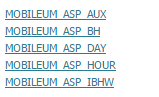

Campos de la tabla FILE:

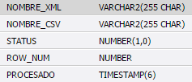

Campos de la tabla MOBILEUM_ASP_AUX:

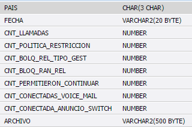

Campos de la tabla MOBILEUM_ASP_BH: 

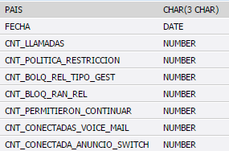

Campos de la tabla MOBILEUM_ASP_DAY:

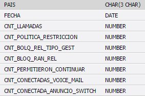

Campos de la tabla MOBILEUM_ASP_HOUR: 

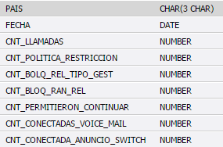

Campos de la tabla MOBILEUM_ASP_IBHW: 

6.5.  Pentaho
.............

• Proceso Pentaho End to End 

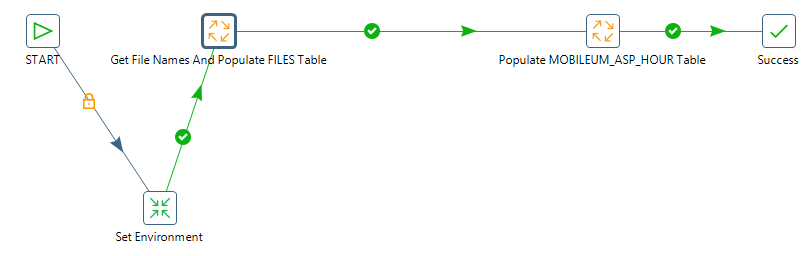

Tenemos el Shell `mobileumDiario`_  que trae datos para el servidor Cortado. Luego setea variables de entorno, directorios donde se encuentran los datos para procesar los archivos disponibles. 

En la Carpeta File se encuentran todos los archivos a procesar.

Los archivos a procesar dependen del status en que se encuentran:

  0: Se procesó correctamente

  1: Se procesó pero tuvo error

  5: Para procesar

• Pentaho Inserción tabla Files 

Get File Names And Populate FILES Table: se encarga de buscar los archivos del sistema operativo  y los envía  a Populate FILES table  para escribirlos en la tabla File.

Escribe los siguientes datos:

  + Nombre del archivo    

  + Status

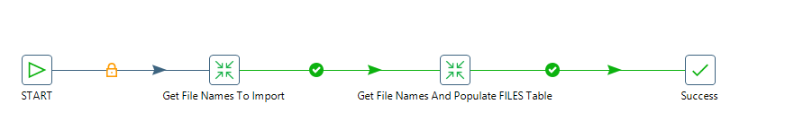

• Pentaho Inserción tabla auxiliar / raw / hour

Tabla auxiliar de la tabla MOBILEUM_ASP_AUX

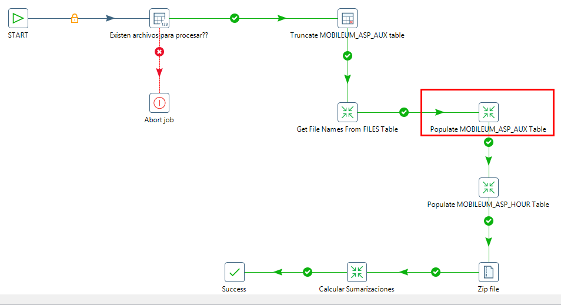

• Pentaho Calculo Sumarizaciones

Las sumarizaciones se calculan a día vencido (el día anterior al actual), para dicho cálculo se debe llamar al procedimiento Call DB Procedures.

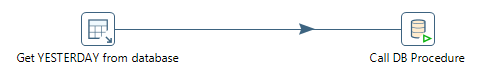

7.  REPROCESO MANUAL
--------------------

7.1 Administración de particiones
.................................

Antes de realizar el reproceso manual se debe realizar la administración de particiones, la cual se encarga de borrar los datos que serán reprocesados e insertados nuevamente a la tabla.

Para realizar este proceso se debe ejecutar la siguiente querie: 

Parámetros: 

• Nombre de la tabla
• Fecha desde (DD.MM.YYYY)
• Fecha hasta (DD.MM.YYYY)

Para todos los niveles se utilizan los mismos parámetros de ejecución. 

Por ejemplo: 

• G_PARTITION_MGMT.P_DROP_PARTITION_WEEK('CISCO_GGSN_EPDG_ISABHW','01.01.2017','07.01.2017');

.. _G_PARTITION_MGMT: ../_static/images/archivo/G_PARTITION_MGMT.sql 

7.2 Procedimiento de reproceso manual paso a paso:
...................................................

.. _scpMobileumDate: ../_static/images/mobileum/scpMobileumDate.sh
 
Se debe ejecutar el script `scpMobileumDate`_ , el cual debe recibir por parámetro la Fecha solicitada, para realizar la limpieza, para luego ejecutar el MobileumASPRework.kjb en Pentaho de manera manual.

Ubicación de los scripts en la carpeta /home/calidad/MabileumASP/Scripts

Ubicación del Rework de ejecución en Pentaho: /home/calidad/MabileumASP/Rework 

El Formato de la fecha es el siguiente:

  • YYYYMMDD

Por consola se utiliza de la siguiente manera:

  • ./Pentaho61/data-integration/kitchen.sh -file=/home/calidad/ MabileumASP-master/Rework.kjb –param:FECHA_PROC= YYYYMMDD

8.  SMART
---------

Los reportes en la herramienta Smart se muestran de la siguiente manera:

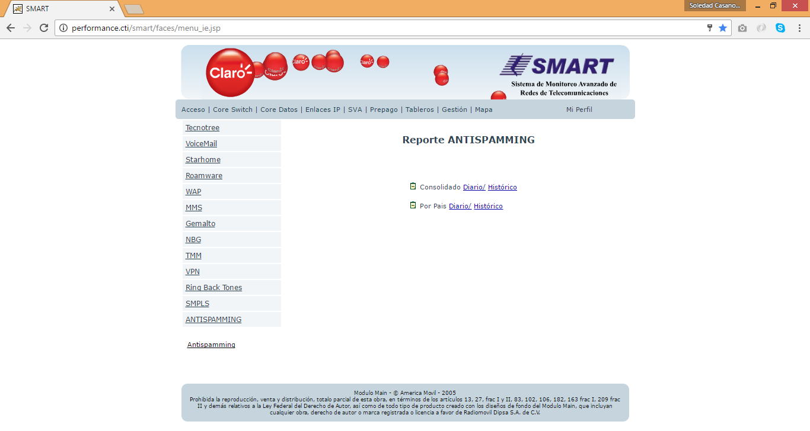

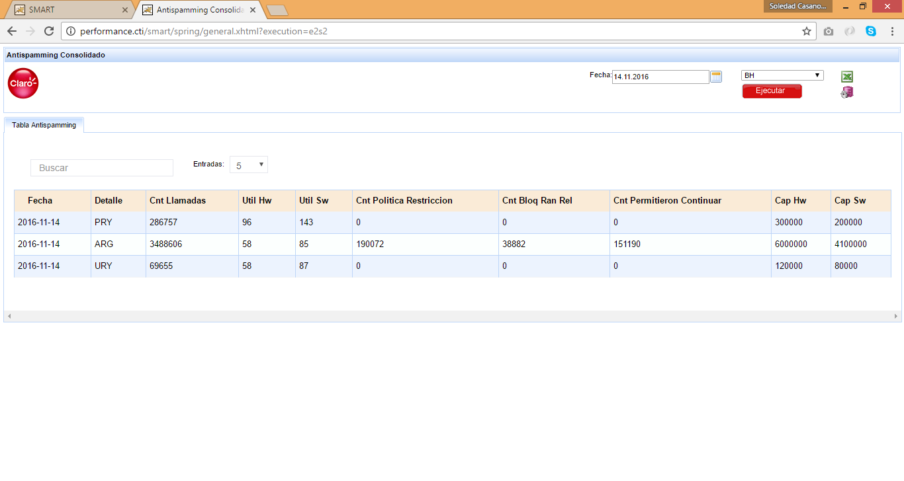

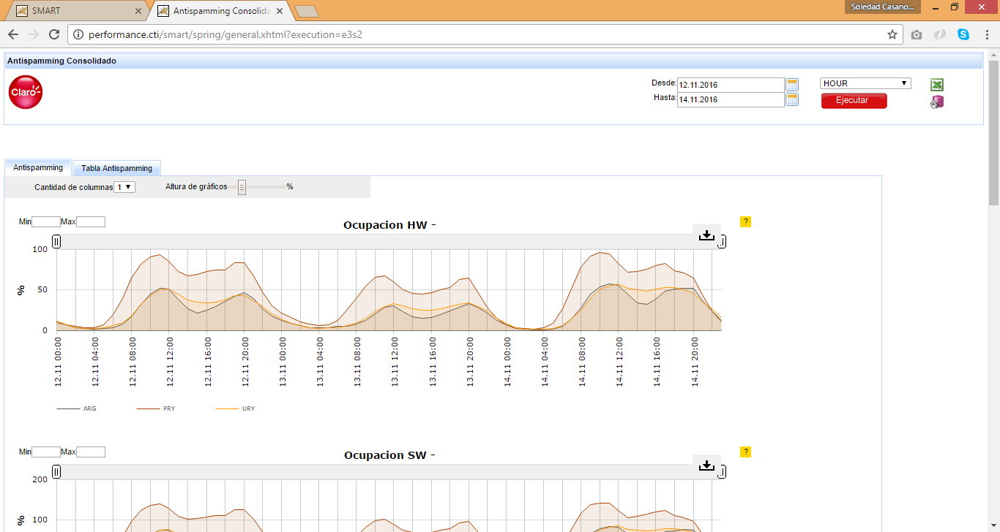

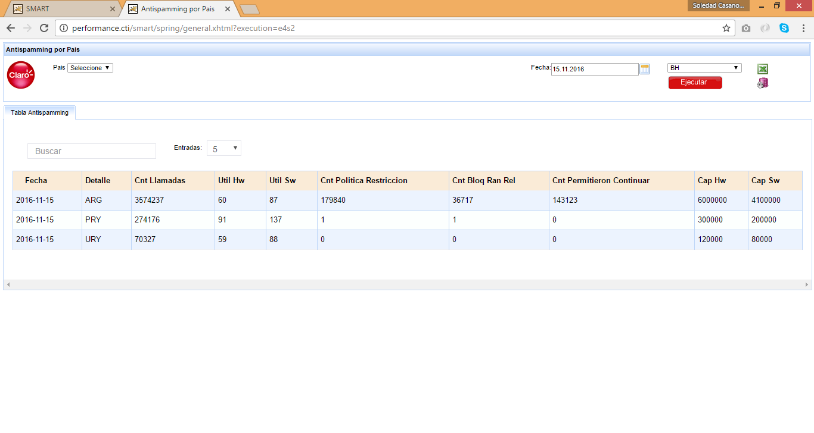

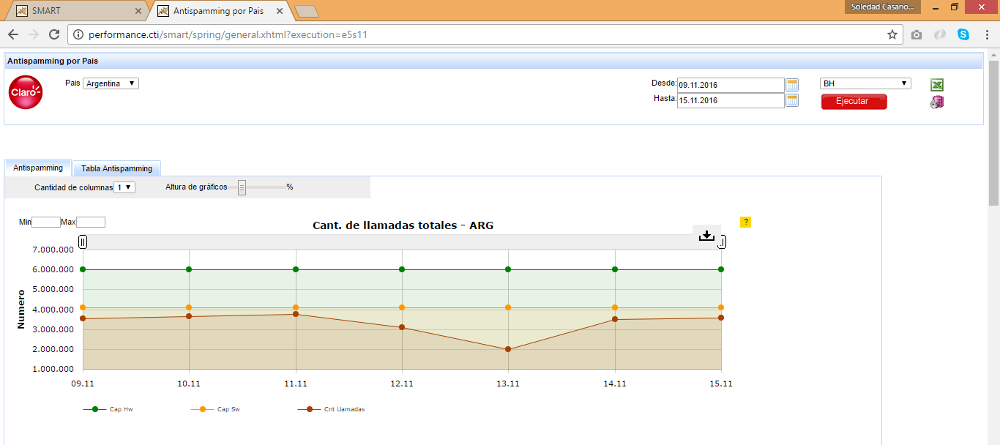

9. CONTROL DE CAMBIOS
.....................

.. raw:: html 

   

  <table border="3">
  <tr>
    <th>Fecha</th>
    <th>Responsable</th>
    <th>Ticket Jira</th>
    <th>Detalle</th>
    <th>Repositorio</th>
  </tr>
  <tr>
    <td>  </td>
    <td>  </td>
    <td> 

  </td>
    <td>  </td>
    <td> </td>
  </tr>
  <tr>
    <td>  </td>
    <td> </td>
    <td>  

  </td>
    <td>   </td>
    <td></td>
    
  </tr>
  </table>