Nokia IMS (AAA)
================

1. OBJETIVO
------------

El objetivo de este documento es describir el proceso de recolección de KPIs que realiza la herramienta Smart sobre la plataforma AAA de Nokia IMS, como se almacena la información en la base de datos, los controles, los reportes en Smart que utilizará el usuario final.

2. ALCANCE
-----------

Areas involucradas: Performance de Red.

3. DEFINICIONES
----------------

• Cortado: Servidor UNIX en donde se importan los XML desde el proveedor, y en donde se encuentra Smart. El nombre es cortado.claro.amx y la dirección ip física es 10.105.146.8.
• Subsistema Multimedia IP (IMS) o (IP Multimedia Subsystem) es un conjunto de especificaciones que describen la arquitectura de las redes de siguiente generación (Next Generation Network, NGN), para soportar telefonía y servicios multimedia a través de IP.

4. DESCRIPCION GENERAL
-----------------------

EL AAA (Authentication, Authorization and Accounting) es un equipo que pertenece al IMS(IP Multimedia Subsystem) ubicado en la red core o nucleo de LTE el cual se encarga de autenticar, autorizar y manejar la contabilidad de los usuarios de VOLTE y VOWIFI.

**ARQUITECTURA IMS**

1. ORGANICACIÓN DE LA ARQUITECTURA

El grupo 3GPP fue el desarrollador de la tecnología 3G basadas en el estándar GSM y GPRS, y definió IMS como parte de su arquitectura de red. El grupo 3GPP2 en tanto, se ha encargado de desarrollar dicha tecnología, basada en estándares CDMA2000 e IS-41, y a sí mismo desarrolla el sistema IMS en sus redes, en función de lo establecido por el grupo 3GPP. Por lo mismo existen dos arquitecturas IMS similares, cada una desarrollada por uno de estos grupos.

La arquitectura genérica del IMS soporta la comunicación entre equipos que utilizan SIP para la señalización y la administración de sesiones, además de los protocolos ‘Diameter’ y Megaco/H.248’ para operaciones y manejo de recursos multimedia respectivamente. Parte fundamental de la arquitectura IMS está compuesta por los servidores de aplicación, quienes se encargan de: invocar los servicios, identificar qué señalización es requerida y de qué forma los servicios interactúan ente sí.

Básicamente está organizada en tres capas:

+ Capa de aplicaciones: contiene las plataformas de servicios (ej.: PoC, SMSC, servicios de localización LBS, servicios de mensajería, servicios de video, etc.).
+ Capa de control: responsable del control de las sesiones, incluyendo su establecimiento. El Soft Switch es el elemento principal en esta capa.
+ Capa de acceso: es la que incluye los diversos medios de acceso a la red, incluyendo interfaces wireless (UMTS, WIFI, GPRS) y cableadas (xDSL, dialup).

En la figura que se presenta a continuación se representa el modelo de capas descrito arriba. Se intenta dejar claro las diferencias entre cada una de las capas mencionadas.

.. image:: ../_static/images/nokiaims/image42.png
  :align: center

2. COMPONENTES EN DETALLE DE LA ARQUITECTURA

A continuación se representa la arquitectura del IP Multimedia Subsystem tal y como se establece en el estándar del 3GPP. Se muestran las funciones e interfaces más importantes.

.. image:: ../_static/images/nokiaims/image43.png
  :align: center

2.1. Call Session Control Function (CSCF)

El elemento Serving CSCF gerencia las sesiones SIP y coordina con otros elementos de la red el control de las llamadas/sesiones. El S-CSCF es responsable por las seguientes funciones:

+ Registro SIP – procesa solicitaciones de registro SIP (SIP REGe de datos y condición de suscriptores durante la duración de la sesión de registro;
+ Control de la Sesión – ejecuta el establecimiento de la llamada/sesión, modificación y terminación;
+ Control de Servicio – interactúa con los Servidores de Aplicación (Application Server) para soporte de servicios y aplicaciones;
+ Monitoreo de la llamada y generación de registros de tarifación (billetes);
+ Provee seguridad para la sesión.

El Proxy CSCF es el primer contacto para que un móvil SIP obtenga acceso a la red IMS a partir de una red orientada a paquetes. El elemento P-CSCF:

+ Provee el roteamiento SIP entre los móviles SIP y la red IMS;
+ Ejecuta la política de control definida por la operadora de la red;
+ Coordina con la red de acceso, autorizando el control de recursos y calidad de las llamadas/sesiones (QoS);
+ Adicionalmente, operadores pueden ofrecer localmente servicios controlados por el PCSCF. Para servicios que son ofrecidos por la red IMS de origen ( Home Network ), el PCSCF repasa la señalización SIP para el servidor IMS en la red de origen.

El Interrogating-CSCF es el punto de contacto en la red de un operador para todas las conexiones destinadas a un suscriptor de la red de este operador, o para un suscriptor visitando su 
red.
Pueden existir múltiplos I-CSCF en una red. Las funciones ejecutadas por el I-CSCF son:

+ Designar un S-CSCF para un usuario ejecutando un registro SIP;
+ Rotear una requisición SIP recebida de otra red en dirección al S-CSCF;
+ Obtener del HSS (Home Subscriber Subsystem) la dirección del S-CSCF;
+ Encaminar la requisición SIP o respuesta al S-CSCF determinada en el estagio arriba;
+ Encaminar la requisición SIP o respuesta para la designación óptima del MGW ( Home Control of roamers).
+ Enviar requisiciones/respuestas SIP al I-CSCF en una red de otro operador para designación óptima de un Media Gateway (MGW), para terminación de una llamada en la red pública conmutada (STFC).

Al ejecutar estas funciones citadas arriba, el operador puede usar el I-CSCF u otras técnicas para ocultar la configuración, capacidad y topología de su propia red del mundo externo. Cuando el I-CSCF es escogido para ocultar la configuración de la red, entonces para sesiones cruzando diferentes redes, el I-CSCF puede enviar requisiciones/respuestas SIP para otro I-CSCF (permitiendo la independencia de configuración entre redes).

2.2. Breakout Gateway Control Function (BGCF)

El BGCF selecciona la red en la cual el acceso a la red pública conmutada (STFC) debe ocurrir. Si el BGCF determina que el acceso va a ocurrir en la misma red en donde el BGCF está localizado, entonces el BGCF selecciona un MGCF. El MGCF será responsable por el interfuncionamiento con la red STFC. Si el punto de acceso está en otra red, el BGCF enviará la señalización de esta sesión a un BGCF o MGCF (dependiendo de la configuración) en la otra red. El objetivo final es minimizar el recorrido de la llamada/sesión.

2.3. Multimedia Resource Function Controller (MRFC)

El MFRC controla los recursos de media del elemento MultiMedia Resource Function Processor (MRFP). Por ejemplo, recursos necesarios para proveer tonos, anuncios y conferencia.

5. MACROFLUJO DEL PROCESO
--------------------------

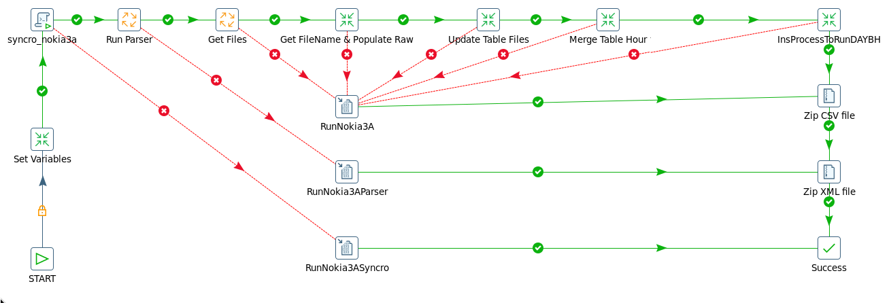

6. DESCRIPCION DETALLADA
-------------------------

6.1 Datos origen
****************

• Server Origen y Path: 10.105.39.140 , /d/oss/global/var/mediation/north/pm/export/
• Cantidad de archivos origen: 5 a 8 archivos

etlexpmx_AAAOAM_20170526091624_2000185.xml.gz

• Frecuencia actualización: Frecuencia Horaria
• Tipo de Archivo: XML

6.2 Datos destino
*****************

• Server Destino: cortado.claro.amx
• Conversión de Archivos: No
• Tabla Auxiliar: Si
• Frecuencia de corrida del proceso: 1 vez por hora
• Regionales: No
• RAW Si/No: Si
• Hour Si/No: Si
• Day Si/No: Si
• BH Si/No: Si
• IBHW Si/No: Si
• Países: No
• Directorio Destino (File System): /calidad/Nokia

6.3. Shell Copiar Archivos Origen a Destino y limpieza de los mismo
********************************************************************

Scripts tienen las siguientes funciones:

+ a) Copiar los archivos

+ b) Limpieza

+ c) Ejecutar Pentaho

Los scripts son los siguientes: runNokia3A.sh es la raíz del proceso.

Los Scrips a utilizar son: 

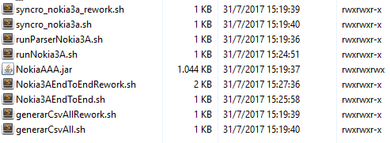

6.4 Listado de Tablas Utilizadas
********************************

Las tablas utilizadas son las siguientes:

+ IMS_C_NOKIA_3A_RAW

.. image:: ../_static/images/nokiaims/image5.png
  :align: center

+ IMS_C_NOKIA_3A_HOUR

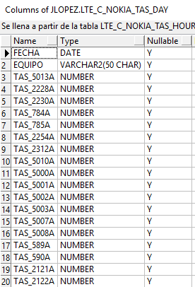

+ IMS_C_NOKIA_3A_BH

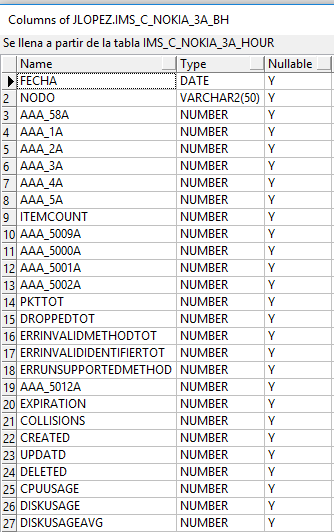

+ IMS_C_NOKIA_3A_DAY

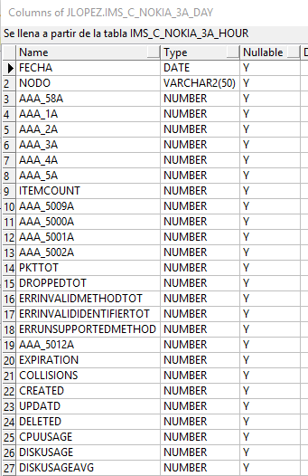

+ IMS_C_NOKIA_3A_IBHW

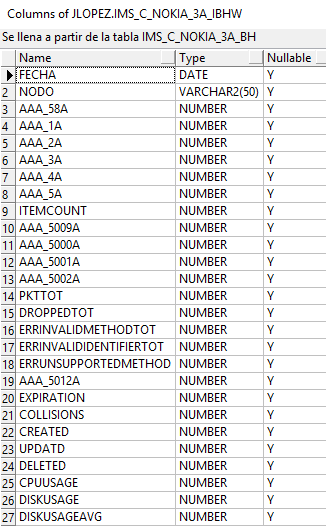

6.5. Pentaho
*************

+ Estructura del proyecto:

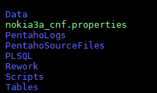

+ Proceso Pentaho End To End:

+ Pentaho RunParser

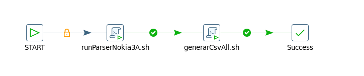

+ Pentaho Get Files

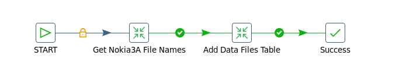

+ Pentaho Get FileName & Populate Raw

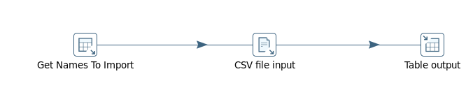

+ Pentaho Update Table Files

+ Pentaho Merge Table Hour

+ Pentaho InsProcessToRunDAYBH

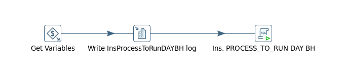

+ Pentaho Set Variables

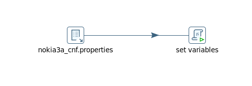

6.6. Controles 
***************

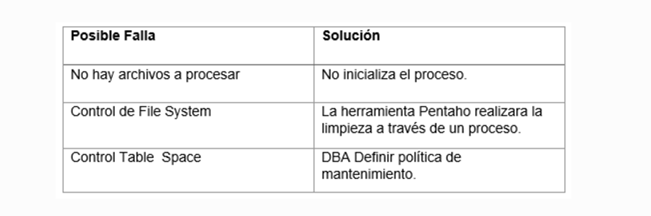

7. Reproceso Manual
*********************************

PROCESO DE REWORK END TO END

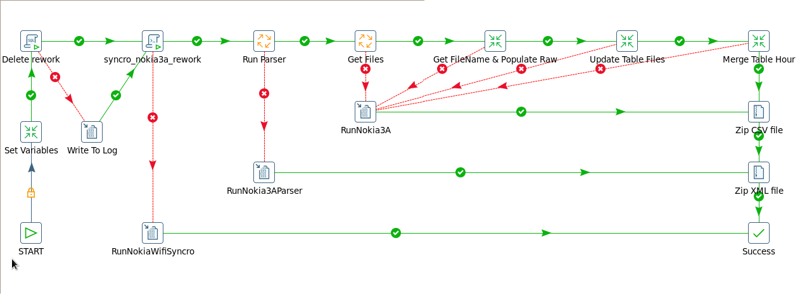

Ubicación de los scripts en la carpeta: /calidad/Nokia3A/Scripts

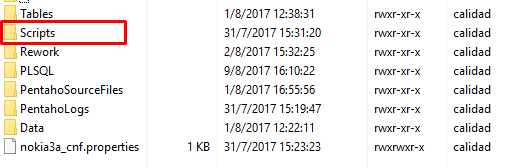

Ubicación del Rework de ejecución en Pentaho: /calidad/Nokia3A/Rework

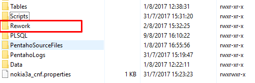

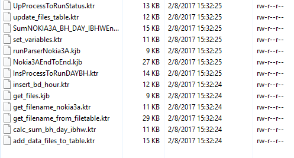

Por consola se utiliza de la siguiente manera:

sh Nokia3AEndToEndRework.sh RUTA FECHA_PROC HORA_PROC

Donde tenemos tres parámetros:

+ RUTA: /calidad/NokiaWIFI/Scripts/NokiaWIFIEndToEndRework.sh
+ FECHA_PROC: DDMMYYYYHH24
+ HORA_PROC: YYYYMMDDHH24+1

Ejemplo:

Si se quiere reprocesar la hora 10, tirar como parametro 1 hora mas. Para el dia 09/08/2017 hora 10 se ejecuta de ésta forma: 

+ sh Nokia3AEndToEndRework.sh /calidad/Nokia3A 0908201710 201708091

8. Reportes de Smart
*********************

Los reportes en la herramienta Smart se muestran de la siguiente manera:

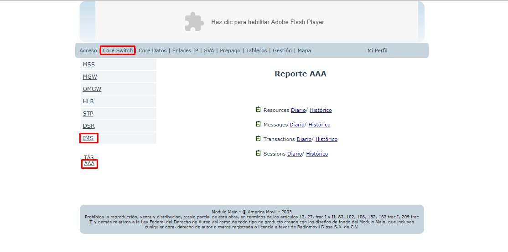

+ **Resources**

**DIARIO**

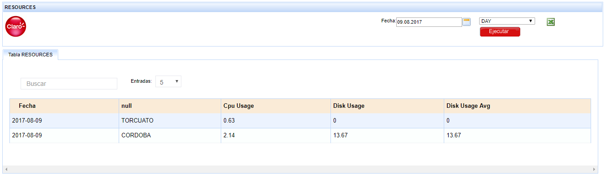

**HISTORICO**

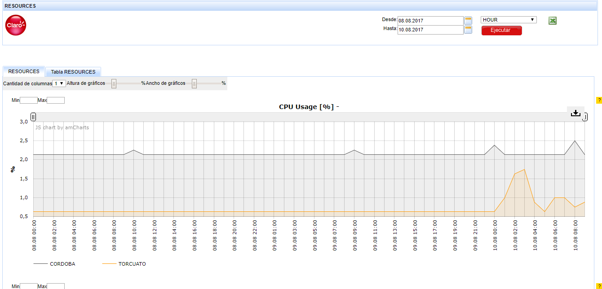

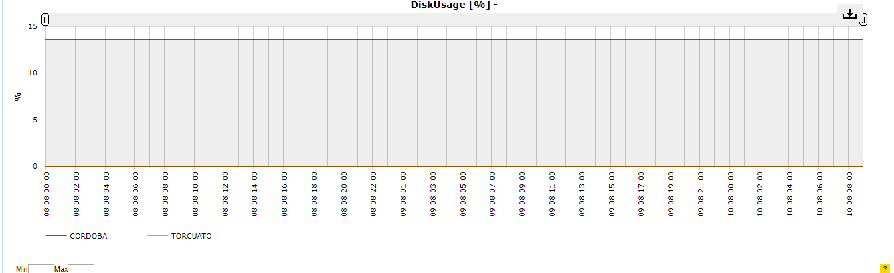

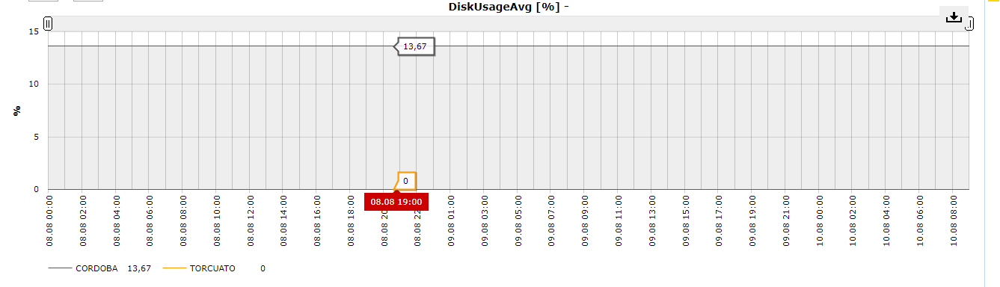

+ **Messages**

**DIARIO**

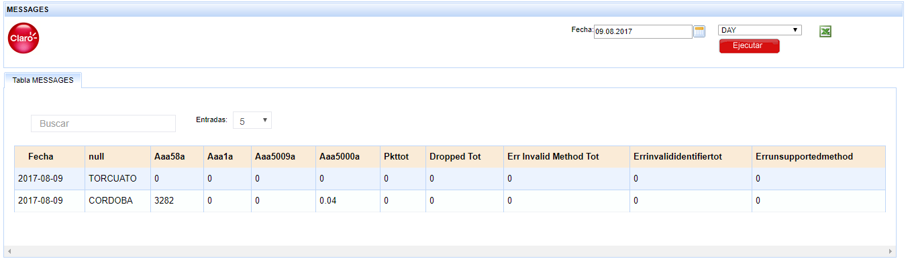

**HISTORICO**

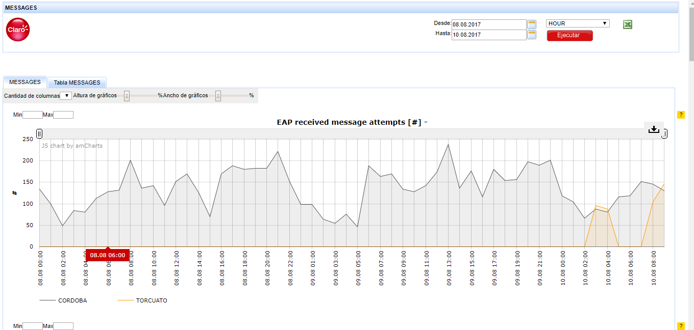

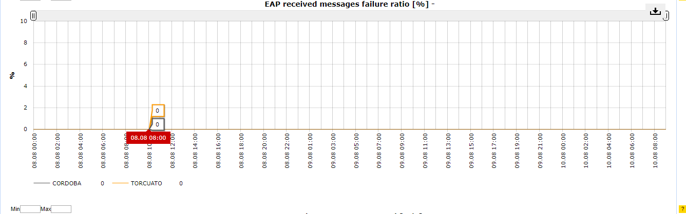

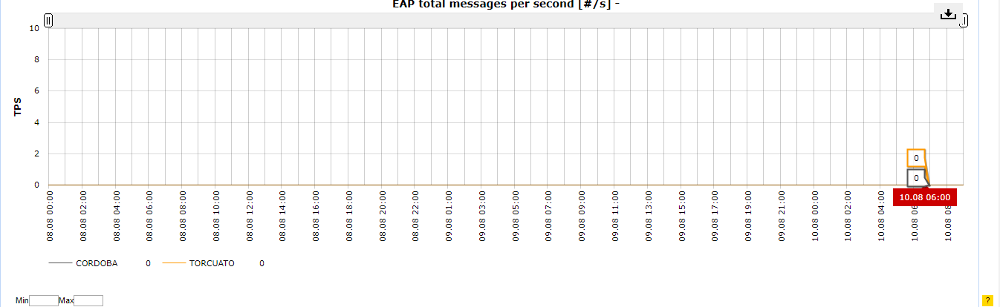

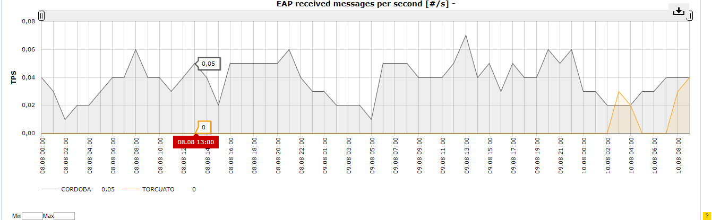

+ **Transactions**

**DIARIO**

.. image:: ../_static/images/nokiaims/image27.png
  :align: center

**HISTORICO**

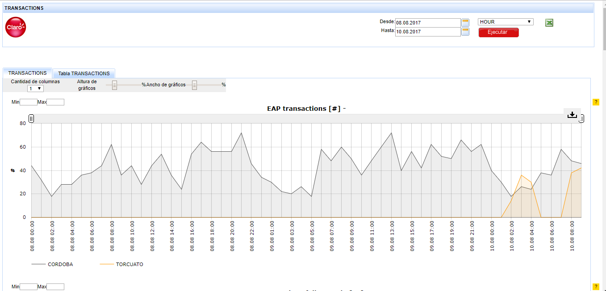

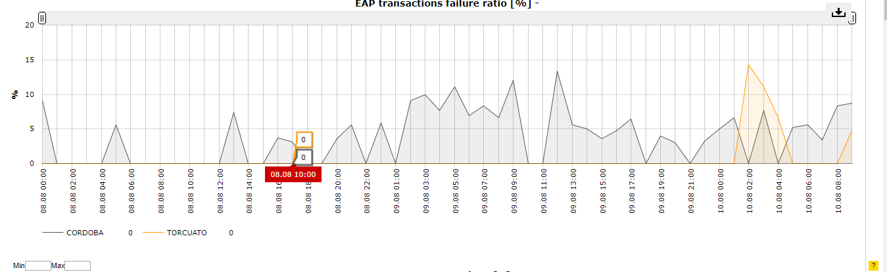

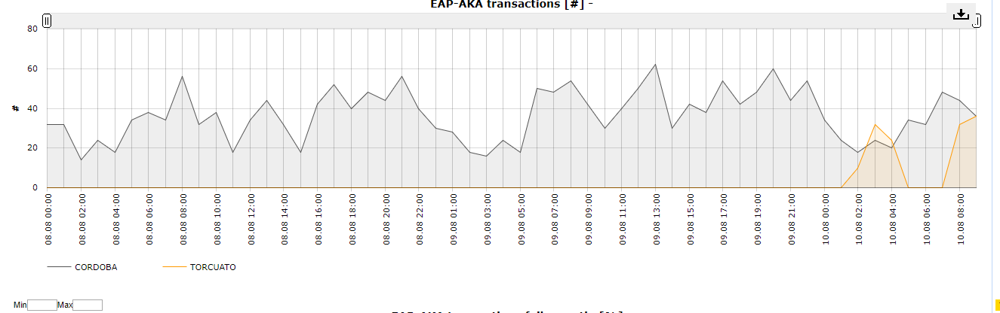

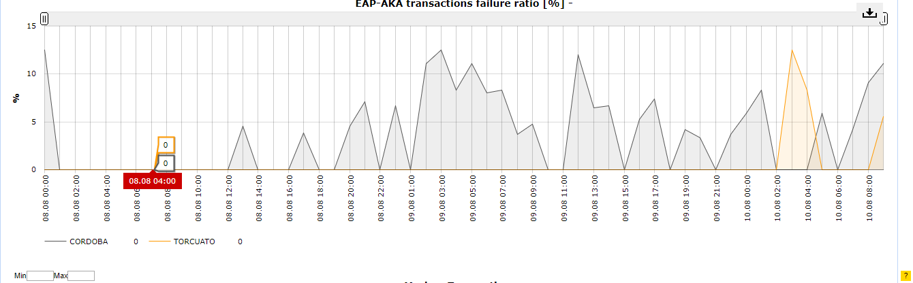

+ **Sessions**

**DIARIO**

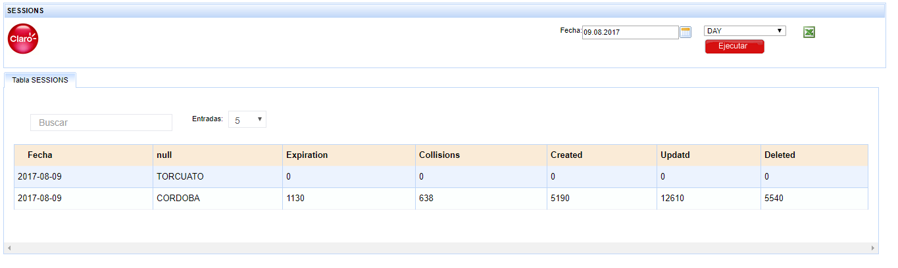

**HISTORICO**

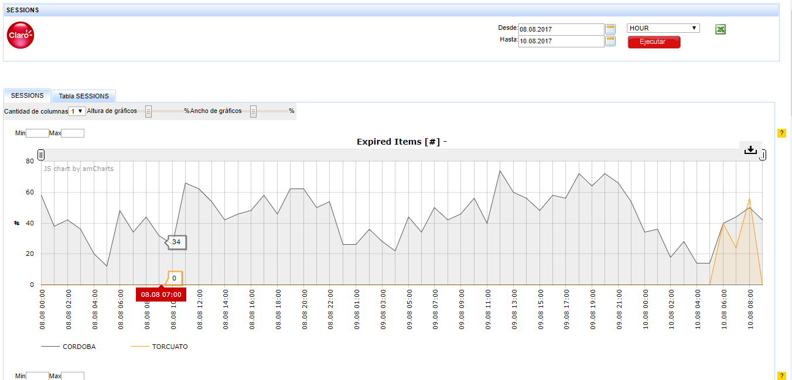

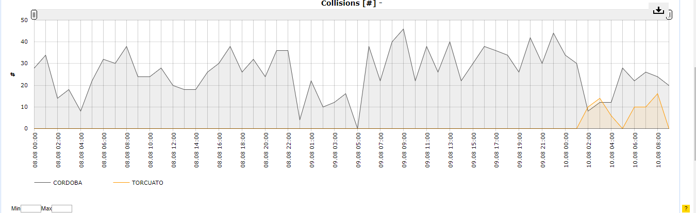

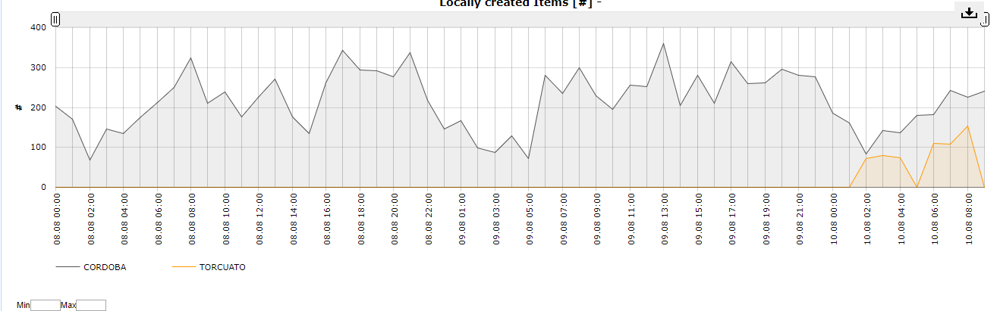

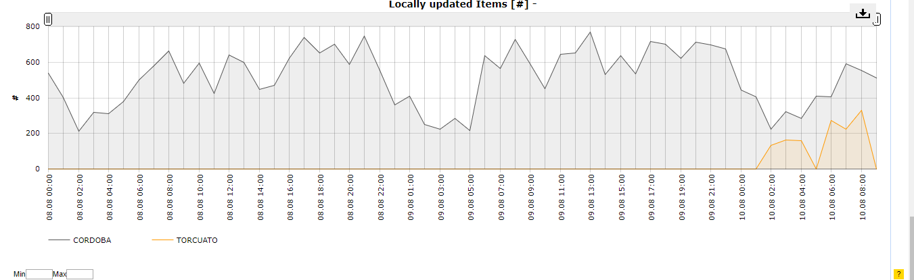