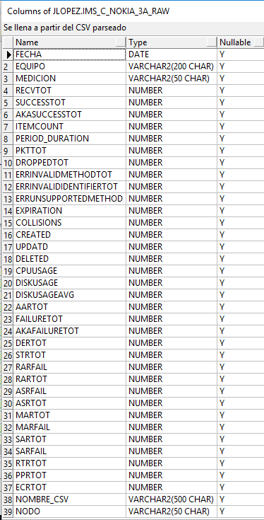
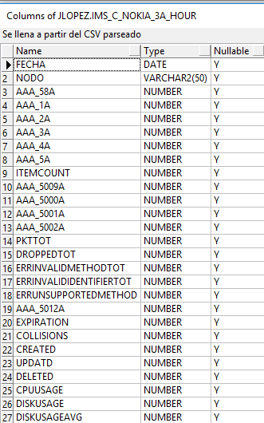
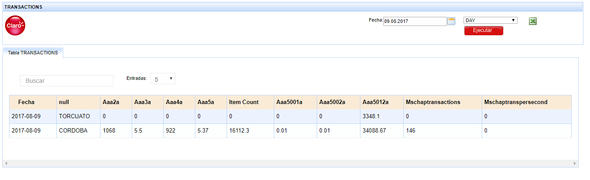

Nokia IMS (AAA)
================

1. OBJETIVO
------------

El objetivo de este documento es describir el proceso de recolección de KPIs que realiza la herramienta Smart sobre la plataforma AAA de Nokia IMS, como se almacena la información en la base de datos, los controles, los reportes en Smart que utilizará el usuario final.

2. ALCANCE
-----------

Areas involucradas: Performance de Red.

3. DEFINICIONES
----------------

• Cortado: Servidor UNIX en donde se importan los XML desde el proveedor, y en donde se encuentra Smart. El nombre es cortado.claro.amx y la dirección ip física es 10.105.146.8.

4. DESCRIPCION GENERAL
-----------------------

EL AAA (Authentication, Authorization and Accounting) es un equipo que pertenece al IMS(IP Multimedia Subsystem) ubicado en la red core o nucleo de LTE el cual se encarga de autenticar, autorizar y manejar la contabilidad de los usuarios de VOLTE y VOWIFI.

5. MACROFLUJO DEL PROCESO
--------------------------

6. DESCRIPCION DETALLADA
-------------------------

6.1 Datos origen
****************

• Server Origen y Path: 10.105.39.140 , /d/oss/global/var/mediation/north/pm/export/
• Cantidad de archivos origen: 5 a 8 archivos

etlexpmx_TAS_20170526091624_2000185.xml

.. image:: ../_static/images/nokiaims/image2.png
  :align: center

• Frecuencia actualización: Frecuencia Horaria
• Tipo de Archivo: CSV

6.2 Datos destino
*****************

• Server Destino: cortado.claro.amx
• Conversión de Archivos: No
• Tabla Auxiliar: Si
• Frecuencia de corrida del proceso: 1 vez por hora
• Regionales: No
• RAW Si/No: Si
• Hour Si/No: Si
• Day Si/No: Si
• BH Si/No: Si
• IBHW Si/No: Si
• Países: No
• Directorio Destino (File System): /calidad/NokiaWIFI

6.3. Shell Copiar Archivos Origen a Destino y limpieza de los mismo
********************************************************************

Scripts tienen las siguientes funciones:

+ a) Copiar los archivos

+ b) Limpieza

+ c) Ejecutar Pentaho

Los scripts son los siguientes: runNokia3A.sh es la raíz del proceso.

Los Scrips a utilizar son: 

6.4 Listado de Tablas Utilizadas
********************************

Las tablas utilizadas son las siguientes:

+ LTE_C_NOKIA_TAS_RAW

+ LTE_C_NOKIA_TAS_HOUR

.. image:: ../_static/images/nokiaims/image3.png
  :align: center

+ LTE_C_NOKIA_TAS_BH

.. image:: ../_static/images/nokiaims/image4.png
  :align: center

+ LTE_C_NOKIA_TAS_DAY

+ LTE_C_NOKIA_TAS_DAY

.. image:: ../_static/images/nokiaims/image7.png
  :align: center

6.5. Pentaho
*************

+ Estructura del proyecto:

+ Proceso Pentaho End To End:

+ Pentaho RunParser

+ Pentaho Get Files

6.6. Controles 
***************

7. Reproceso Manual
*********************************

PROCESO DE REWORK END TO END

Ubicación de los scripts en la carpeta: /calidad/Nokia3A/Scripts

Ubicación del Rework de ejecución en Pentaho: /calidad/Nokia3A/Rework

.. image:: ../_static/images/nokiaims/image15.png
  :align: center

Por consola se utiliza de la siguiente manera:

sh Nokia3AEndToEndRework.sh RUTA FECHA_PROC HORA_PROC

Donde tenemos tres parámetros:

+ RUTA: /calidad/NokiaWIFI/Scripts/NokiaWIFIEndToEndRework.sh
+ FECHA_PROC: DDMMYYYYHH24
+ HORA_PROC: YYYYMMDDHH24+1

Ejemplo:

Si se quiere reprocesar la hora 10, tirar como parametro 1 hora mas. Para el dia 09/08/2017 hora 10 se ejecuta de ésta forma: sh Nokia3AEndToEndRework.sh /calidad/Nokia3A 0908201710 201708091

8. Reportes de Smart
*********************

Los reportes en la herramienta Smart se muestran de la siguiente manera:

+ **Resources**

**DIARIO**

.. image:: ../_static/images/nokiaims/image18.png
  :align: center

**HISTORICO**

+ **Messages**

**DIARIO**

**HISTORICO**

+ **Transactions**

**DIARIO**

**HISTORICO**

+ **Sessions**

**DIARIO**

**HISTORICO**

.. image:: ../_static/images/nokiaims/image34.png
  :align: center

