NOKIA MME
===========

1.	OBJETIVO
------------

El presente documento busca explicar y detallar el proceso que genera MME.

2.	ALCANCE 
-----------

Áreas involucradas: Performance de Red

3.	DEFINICIONES
----------------

Servidor de desarrollo: falda.claro.amx.
Servidor productivo: cortado.claro.amx.
Tablas RAW: perdido.claro.amx con dblink al OSS.

4.	DESCRIPCION GENERAL 
-----------------------

No aplica esta sub-seccion.

5.	MACRO FLUJO DEL PROCESO
---------------------------

No aplica esta sub-seccion.

6.	DESCRIPCIÓN DETALLADA
--------------------------

El MME (Mobility Management Entity) es un equipo perteneciente al CORE o núcleo de la red LTE y se encarga principalmente de la movilidad y señalización y el procesamiento de las conexiones de usuarios LTE (HO, paso interMME, interacción con otras redes 3GPP, etc.). En Argentina hay actualmente 4 MME (Córdoba, Jonte, Mar del Plata y Bahía Blanca) y hay dos MME en Paraguay los cuales son del proveedor NOKIA.
Los datos mostrados en SMART se extraen de XML que se consultan en la plataforma Netact RC6.

6.1.	Datos Origen
********************

•	Server Origen y Path: 

    Perdido.claro.amx
    Las tablas RAW ya están creadas con dblink al OSS RC6 y son las siguientes:

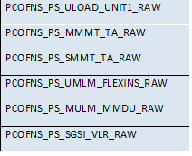

6.2.	Datos Destino
*********************

•	Server Destino: cortado.claro.amx
•	Conversión de Archivos: No.
•	Tabla Files: No
•	Tabla Auxiliar: No
•	Frecuencia de corrida del proceso: cada 1 hora
•	Regionales: Si
•	RAW Si/No: No
•	Hour Si/No: Si
•	Day Si/No: Si
•	BH Si/No: Si
•	ISABH Si/No: Si
•	Directorio Destino (File System): /calidad/LteMME

6.3.	Shell Copiar Archivos Origen a Destino y limpieza de los mismos
***********************************************************************

Los Scripts tienen las siguientes funciones: 

1-	Copiar los archivos

2-	Ejecutar Pentaho:

No aplica esta sub-seccion.

6.4.	Listado de Tablas Utilizadas
************************************

Las tablas utilizadas son las siguientes:

• Tablas Raw

    PCOFNS_PS_ULOAD_UNIT1_RAW

    PCOFNS_PS_MMMT_TA_RAW
    
    PCOFNS_PS_SMMT_TA_RAW
    
    PCOFNS_PS_UMLM_FLEXINS_RAW
    
    PCOFNS_PS_MULM_MMDU_RAW
    
    PCOFNS_PS_SGSI_VLR_RAW

• Tablas HOUR

    FNLS_MME_CPU_HOUR

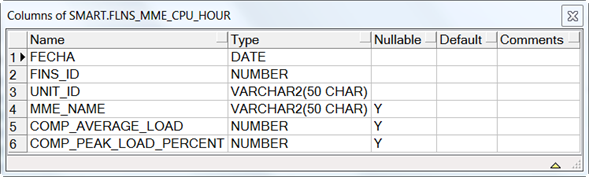

  FLNS_MME_MOVIL_HOUR

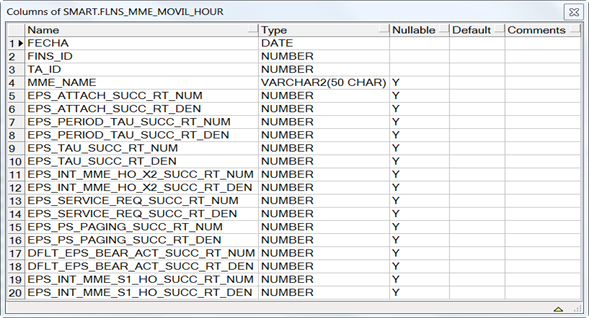

  FLNS_MME_TPS_HOUR

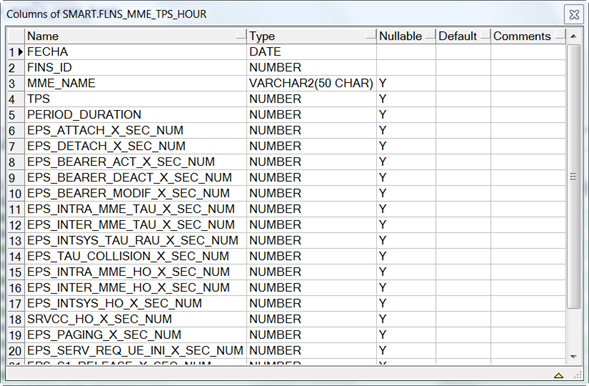

  FLNS_MME_USERS_HOUR

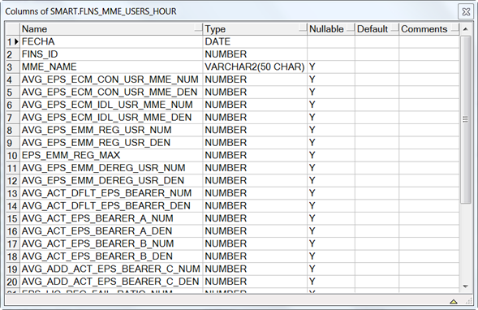

  FLNS_MME_MOVIL_CONS_HOUR

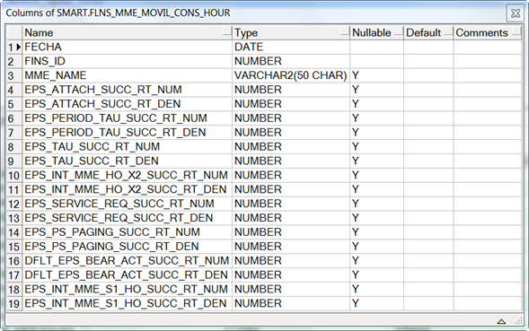
  

• Tablas DAY

    flns_mme_cpu_day;

    flns_mme_movil_day;
    
    flns_mme_tps_day;
    
    flns_mme_users_day;
    
    flns_mme_movil_cons_day

• Tablas BH

    flns_mme_cpu_bh;
    
    flns_mme_movil_bh;
    
    flns_mme_tps_bh;
    
    flns_mme_users_bh;
    
    flns_mme_movil_cons_bh

• Tablas ISABHWEEK

    flns_mme_cpu_ibh;
    
    flns_mme_movil_ibhw;
    
    flns_mme_tps_ibhw;
    
    flns_mme_users_ibhw;
    
    flns_mme_movil_cons¬_ibhw

6.5.	Pentaho
***************

No aplica esta sub-seccion.

7.	CONTROLES
-------------

•	El analista reporta los faltantes de datos.
•	Se revisa que los datos se estén generando en el origen
•	Se revisa los procedimientos y las horas faltantes que cargan las tablas.
•	Una vez detectado el problema se procede a reclamar al proveedor por los datos faltantes o se reprocesan las tablas en caso de ser un error de carga de las tablas.

8.	REPROCESO MANUAL
--------------------

PROCEDURE P_FLNS_MME_REWORK_HOUR(P_FECHA_DESDE IN CHAR, P_FECHA_HASTA IN CHAR);

PROCEDURE P_FLNS_MME_REWORK_DAY(P_FECHA_DESDE IN CHAR, P_FECHA_HASTA IN CHAR);

PROCEDURE P_FLNS_MME_REWORK_BH(P_FECHA_DESDE IN CHAR, P_FECHA_HASTA IN CHAR);

PROCEDURE P_FLNS_MME_REWORK_WEEK(P_FECHA_DESDE IN CHAR, P_FECHA_HASTA IN CHAR);

Formato fecha:

dd.mm.yyyy para todas las sumarizaciones menos la hour.
dd.mm.yyyy hh24 para hour.

9.	SMART
---------

Los reportes en la herramienta Smart se muestran de la siguiente manera: 

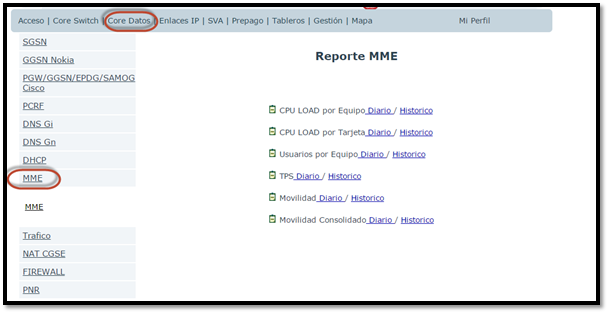

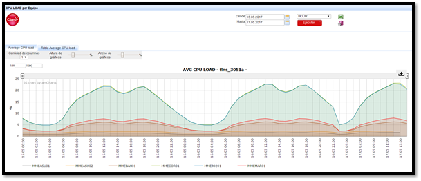

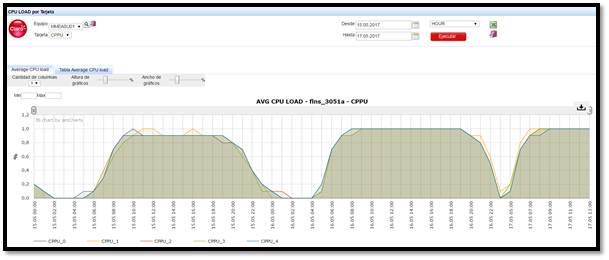

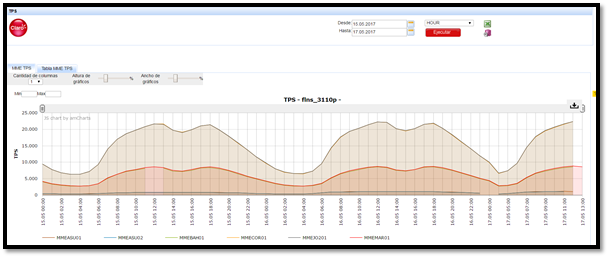

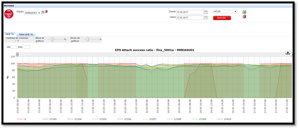

9. CONTROL DE CAMBIOS
---------------------
.. raw:: html 

   

  <table border="3">
  <tr>
    <th>Fecha</th>
    <th>Responsable</th>
    <th>Ticket Jira</th>
    <th>Detalle</th>
    <th>Repositorio</th>
  </tr>
  <tr>
    <td> 12/05/2017 </td>
    <td> Franco Rinaldi </td>
    <td> 
<a href="http://jira.harriague.com.ar/jira/browse/CL-38"> CL-38 </a>
  </td>
    <td> Creacion de documentación de Proyecto existente.
          Proyecto actual - Cortadp. </td>
    <td> Servidor: CORTADO </td>
  </tr>
  </table>