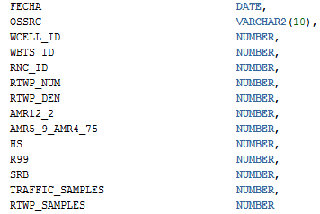
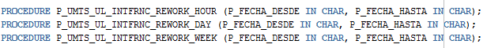
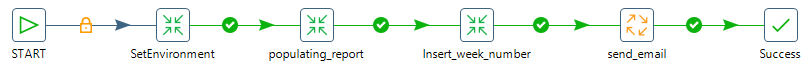
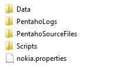
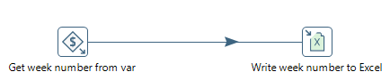
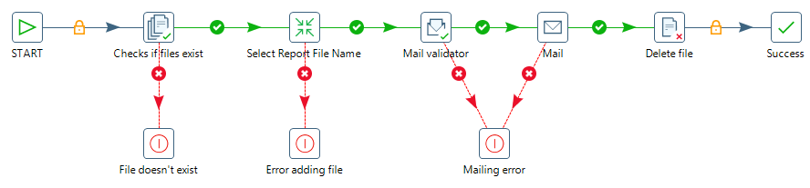
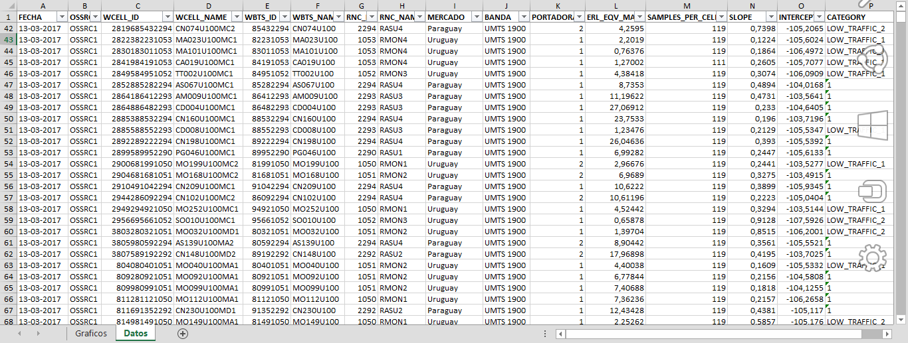

Uplink Interference (Nokia UMTS)
================================

1.  OBJETIVO 
------------

El presente documento buscar explicar y detallar el proceso que genera Uplink Interference (Nokia UMTS)

2.  ALCANCE
-----------

Áreas involucradas: Performance de Red

3.  DEFINICIONES
----------------

• Cortado: Servidor LINUX en donde se importan los CSV desde el proveedor.
El nombre es cortado.claro.amx y la dirección IP física es 10.105.146.8

4.  DESCRIPCIÓN GENERAL
-----------------------

**Nokia UMTS Uplink Interference**

Este desarrollo tiene la finalidad de detectar y clasificar la interferencia en las celdas UMTS tomando RTWP en función del tráfico de voz.
Al cruzar estos parámetros, obtenemos una nube de puntos la cual se modela con una regresión lineal, obteniendo así una pendiente y una ordenada al origen para cada celda. Esta información demuestra cómo evoluciona la interferencia según crece el tráfico. En función de estos valores se clasifica la celda dentro de 4 categorías que son indicadores de las acciones a tomar en cada caso.

.. image:: ../_static/images/nokiaumts/pag3.png
  :align: center

5.  MACRO FLUJO DEL PROCESO
---------------------------

.. image:: ../_static/images/nokiaumts/pag4.png
  :align: center

6.  DESCRIPCIÓN DETALLADA
-------------------------

6.1.  Datos de origen
*********************

Server Origen: perdido.claro.amx

6.2.  Datos Destino 
*******************

• Server Destino: cortado.claro.amx

• BD: Smart2

• Frecuencia de corrida del proceso: 1 minuto

• RAW Si/No: No

• Hour Si/No: Si 

• Day Si/No: No

• BH Si/No: Si

• ISABH Si/No: Si 

6.3. Listado de Tablas Utilizadas
*********************************

Las tablas utilizadas son:

• UMTS_UL_INTFRNC_WCEL_HOUR

• TABLERO_UMTS_ULINTFN_WCEL_DAY

.. image:: ../_static/images/nokiaumts/pag5.2bis.png
  :align: center

• TABLERO_UMTS_ULINTFN_WCEL_WEEK

.. image:: ../_static/images/nokiaumts/pag5.png
  :align: center

Las Tablas utilizadas desde Perdido son: 

• UMTS_C_NSN_CELLRES_MNC1_RAW@SMART.WORLD T1

• UMTS_C_NSN_TRAFFIC_MNC1_RAW@SMART.WORLD T2

• UMTS_C_NSN_SERVLEV_MNC1_RAW@SMART.WORLD T3

7.CONTROLES
-----------

.. _CONTROL_NIVEL_HOUR: ../_static/images/nokiaumts/control_nivel_hour.sql 

.. _CONTROL_NIVEL_DAY: ../_static/images/nokiaumts/control_nivel_day.sql

.. _CONTROL_NIVEL_SEMANAL: ../_static/images/nokiaumts/control_nivel_semanal.sql

Se debe controlar que los valores de las celdas respeten el rango 54000 a 55000, si la celda nos devuelve un valor menor se debe **REPROCESAR**.

* CONTROL_NIVEL_HOUR_

* CONTROL_NIVEL_DAY_

* CONTROL_NIVEL_SEMANAL_

8.  REPROCESO MANUAL
--------------------

El reproceso manual se lleva a cabo ejecutando los siguientes procedimientos, dependiendo si se necesita reprocesar datos tanto a nivel horario, día o semanal:

    + Formato fecha a nivel  horario: DD.MM.YYYY HH24 

    + Formato fecha a nivel día o semanal: DD.MM.YYYY

    + Para ejecutar a nivel semanal se debe tomar desde el lunes como comienzo de semana al día viernes. 

• P_UMTS_UL_INTFRNC_REWORK_HOUR

• P_UMTS_UL_INTFRNC_REWORK_DAY 

• P_UMTS_UL_INTFRNC_REWORK_WEEK 

Los procedimientos para ejecutarlos correctamente se ingresar por parámetro la fecha en la cual desea reprocesar los datos: 

La descripción detallada de cada procedimiento se encuentra en el paquete G_UMTS_UL_INTERFERENCE: 

.. _G_UMTS_UL_INTERFERENCE: ../_static/images/nokiaumts/G_UMTS_UL_INTERFERENCE.sql

+ G_UMTS_UL_INTERFERENCE_

9.	REPORTE
-----------

9.1.	Macroflujo del proceso
******************************

9.2.	Descripción Detallada
*****************************

9.2.1.	Datos de Origen
.......................

•	Server Origen y Path: falda.claro.amx , calidad/Nokia_UMTS_Uplink_Interference/
•	Frecuencia actualización: Frecuencia Semanal
•	Tipo de Archivo de Salida: xlsx

9.2.2.	Datos Destino 
.....................

•	Server Destino: Falda
•	Conversión de Archivos: No
•	Tabla Files: No
•	Tabla Auxiliar: No
•	Frecuencia de corrida del proceso: 1 vez al día, los días Lunes 
•	Regionales: No
•	RAW Si/No: No
•	Hour Si/No: No
•	Day Si/No: No
•	BH Si/No: No
•	Países: No
•	Directorio Destino (File System):

9.3. Shell Copiar Archivos Origen a Destino y limpieza de los mismos
********************************************************************

El script es el siguiente:

.. _nokiaRun: ../_static/images/nokiaumts/nokiaRun.sh
.. _nokiaRunLoad: ../_static/images/nokiaumts/nokiaRunLoad.sh 

+	nokiaRun_
+	nokiaRunLoad_

9.4. Listado de Tablas Utilizadas 	
*********************************

Las tablas son las siguientes:

•	TABLERO_UMTS_ULINTFN_WCEL_WEEK

9.5. Pentaho
************

Estructura del proyecto:

•	Proceso EndToEnd

.. image:: ../_static/images/nokiaumts/pag8.2.png
  :align: center
 
•	Proceso Insert_week_number

Este proceso se encarga de obtener el número de la semana del año para insertarlo en el excel y en el título del reporte.

•	Proceso  send_email
Este proceso se encarga de validar la existencia del archivo para luego validar que el email sea enviado correctamente.

El email muestra los archivos adjuntos en formato xlsx que contiene los datos mencionados anteriormente: 

.. image:: ../_static/images/nokiaumts/pag9.3.png
  :align: center

10. CONTROL DE CAMBIOS
----------------------

.. raw:: html 

   

  <table border="3">
  <tr>
    <th>Fecha</th>
    <th>Responsable</th>
    <th>Ticket Jira</th>
    <th>Detalle</th>
    <th>Repositorio</th>
  </tr>
  <tr>
    <td> 25/01/2017 </td>
    <td>  Matias Orquera</td>
    <td> 
<a href="http://jira.harriague.com.ar/jira/browse/CL-768"> CL-768 </a>
  </td>
    <td> RFC- Se creo el tablero day. </td>
    <td> </td>
  </tr>
  <tr>
    <td> 22/02/2017 </td>
    <td>  Marcelo Carrasco </td>
    <td> 
<a href="http://jira.harriague.com.ar/jira/browse/CL-811"> CL-811 </a>
  </td>
    <td> RFC- Implementación a producción</td>
    <td> </td>
  </tr>
  <tr>
    <td> 07/02/2017 </td>
    <td>  Marcelo Carrasco </td>
    <td> 
<a href="http://jira.harriague.com.ar/jira/browse/CL-920"> CL-920 </a>
  </td>
    <td> RFC 1- Implementar a producción mejoras</td>
    <td> </td>
  </tr>

  <tr>
    <td> 02/03/2017 </td>
    <td>  Ivan Leandro Ferreira </td>
    <td> 
<a href="http://jira.harriague.com.ar/jira/browse/CL-562"> CL-562 </a>
  </td>
    <td> RFC 3 - Nokia UMTS Uplink Interference Wnn - Reporte Semanal Automático por correo</td>
    <td> </td>
  </tr>

  </table>
