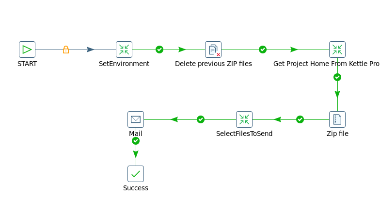

POLITICA DE LIMPIEZA DENTRO DEL PROCESO
========================================

1.	OBJETIVO
------------

El objetivo del proceso de limpieza de logs de archivos (.logs) es recorrer todos los proyectos sin importar como se llame, acceder a la carpeta /PentahoLogs y buscar todos los archivos que cumplan la condicion de antiguedad y borrarlos.

2.	ALCANCE
------------

Alcanza a todo el equipo de Performance de Red.

3.	DEFINICIONES
---------------

+ Falda: Servidor UNIX en donde se importan los XML desde el proveedor, y en donde se encuentra Smart. El nombre es falda.claro.amx.

4.	DESCRIPCION GENERAL
----------------------

Este proceso busca en limpia.properties donde estan declarados todos los proyectos activos que estan corriendo y se queda unicamente con los nombre de los proyectos. Arma una lista y genera dos archivos uno que contiene los archivos que se van a borrar (cumplen condicion) TRUE.csv y los que no FALSE.csv.
Este proceso corre todos los lunes alas 4 de la mañana.
Las tablas particionadas raw que tengan mas de 3 dias de antiguadad se borran.
Las tablas particionadas hour que tengan mas de 8 semanas (2 meses) de antiguedad se borran.
La informacion borrada sobre raw y hour, se pueden recomponer utilizando los archivos fuentes y con el reproceso para ese dia.
Las tablas DAY BH ISABHWEEK ISABHMONTH se mantiene eternamente hasta que se decida borrar una fecha determinada, si se decide eliminarse esta informacion se manda a un wherehouse.

Servidor: falda.claro.amx.

**Estructura de carpetas**

.. image:: ../_static/images/politicalimpieza/image3.png
  :align: center 

**Carpeta Data**

HOME-PROJECTS.txt: Listado de proyectos activos a los cuales hay que hacerles limpieza(no quiere decir que todos tengan logs).

NONE-HOME-PROJECTS.txt: Listado de todo lo que no se toma en cuenta para la limpieza de logs.

TRUE.csv : Todos los archivos que se van a borrar.

FALSE.csv: todos los archivos que no se van a borrar.

logs_borrados_20170130.zip : Se manda por correo al borrarse los logs.

5.	MACROFLUJO
---------------

6. CONTROL DE CAMBIOS
---------------------

.. raw:: html 

   

  <table border="3">
  <tr>
    <th>Fecha</th>
    <th>Responsable</th>
    <th>Ticket Jira</th>
    <th>Detalle</th>
    <th>Repositorio</th>
  </tr>
  <tr>
 
  </tr>
 </table>