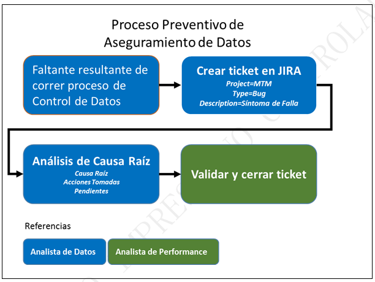
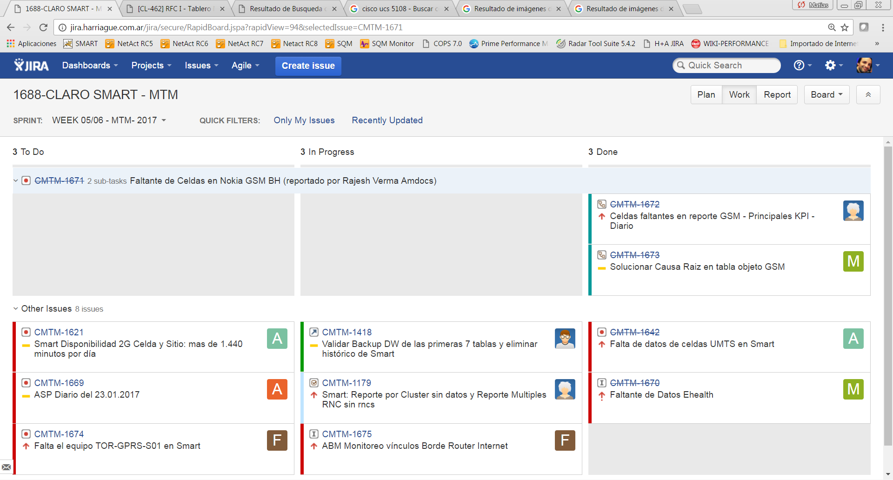
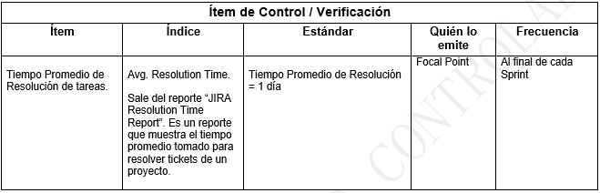
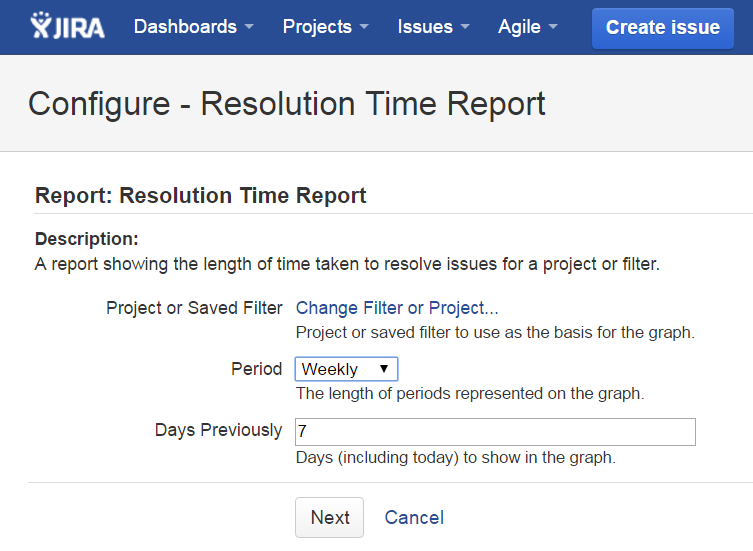
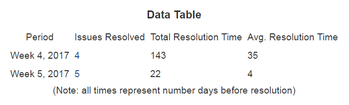

PROCESO PREVENTIVO
==================

1.	OBJETIVO
------------

El objetivo es “Asegurar la disponibilidad en 24 hs de los datos horarios, diarios, semanales y mensuales en la herramienta SMART” 
 
2.	ALCANCE
-----------

Alcanza al equipo de Performance de Red, sus analistas de Datos y analistas de Performance.

3.	DEFINICIONES
----------------

*	Smart: herramienta de performance de red, donde se almacenan datos históricos de las diferentes plataformas integradas.

*	JIRA: herramienta web para registrar y dar seguimiento a tareas.

*	Focal Point: es el Analista de Performance designado durante el Sprint para controlar la ejecución del proceso preventivo y correctivo de Aseguramiento de Datos.

*	Analista de Datos: es la persona designada en el Sprint para realizar los controles preventivos y los reprocesos durante el Sprint.  

		Los controles preventivos incluyen:

			•	Accesos: GSM/UMTS/LTE (procesos Raw, Hours, Days, Week, BH, IBHW)

			•	Tableros: Diarios, Semanales y Mensuales.

			•	Otros: Core Switch, Core Datos, SVA, Enlaces IP, Proyectos alojados en el Servidor Cortado, etc

*	Sprint: período de tiempo actual, normalmente el Sprint tiene 2 semanas de duración

 
4.	MACROFLUJO DEL PROCESO
--------------------------

5.	MICROFLUJO DEL PROCESO
--------------------------

6.	PRINCIPALES ACTIVIDADES Y RESPONSABILIDADES
-----------------------------------------------

1.	El Focal Point detecta un faltante de datos de alguna plataforma en Smart, debido a los Controles preventivos Definidos.

2.	El Focal Point ingresa a JIRA y se fija que no haya una incidencia ya levantada para el faltante en cuestión.

3.	Si el evento todavía no está registrado, entonces lo registra completando la siguiente plantilla:

	*	Project: **1688-CLARO SMART – MTM (CMTM)**

	*	Issue Type: **Bug**

	*	Summary: **Faltante de datos – Plataforma NN**

	*	Priority: **Major**

	*	Due Date: **para el día siguiente**

	*	Asignee: **el analista de datos adecuado** 

	*	Sprint: asignar al sprint actual

	*	Epica: asignar a la epica REPROCESOS

	*	Tag: Preventivo

Description:

*	**Nombre Plataforma:** Ej: Huawei LTE 

*	**Síntoma de Falla:** Ej: no se observan datos hour entre el día 16/01 y el 17/01

*	**Reporte Smart / SQL:** Ej: Acceso / Huawei / Principales KPI

*	**Servidor:** Ej: cortado.claro.amx

*	**Tablas:** Ej: huawei_interface_hour

*	**Sumarización:** Ej: HOUR

*	**Fecha Inicio:** Ej: 16/01/2017

*	**Fecha Fin:** Ej: 17/01/2018

4.	El Analista de Datos asignado a la incidencia realiza el análisis de causa raíz, y da una solución al problema, agregando el siguiente comentario:

	*	**Síntoma de Falla:** ej: no se observan datos hour entre el día 16/01 y el 17/01.

	*	**Causa Raíz:** ej: falla del proceso de recolección de datos debido a una falta de espacio en file system, ya que la gente de sistemas utilizó erróneamente el mismo.

	*	**Acciones Tomadas:** ej: se dio aviso a la gente de Sistemas para que deje de escribir por error en el file system, se realizó una depuración del file system, se verificó que los archivos origen se pueden recolectar normalmente

	*	**Pendientes:** ej: crear un correo automático para la utilización del file system que sirva como alerta temprana, registrado mediante ticket jira CMTM-9875

 
5.	El Analista de Datos valida si la solución fue definitiva o paliativa; en ambos casos debe avisar al Focal Point que el tema está solucionado y asignar el ticket para validación.

6.	El Focal Point debe verificar que los datos estén completos y correctos y cerrar el ticket.  En caso que detecte algún impacto o posible impacto sobre otras funcionalidades, debe advertir al analista de datos para su revisión (Ej: algún Tablero)

7.	Si la solución fue paliativa (hay pendientes y no se solucionó la causa raíz) además se debe indicar el nuevo ticket de mejora, el cual deberá ser creado como un requerimiento de mejora:

	*	Project: **1688-CLARO SMART – MTM (CMTM)**

	*	Issue Type: **Requirement**

	*	Summary: **Requerimiento de Mejora – Plataforma NN**

	*	Priority: **Major**

	*	Asignee: **al jefe del área**

	*	Sprint: asignar al **sprint actual**

	*	Epica: asignar a la epica **MEJORAS**

	*	Description: indicar toda la información con la que se cuente para solucionar la causa raíz

8.	El tablero de comandos para este proceso es el siguiente dashboard de jira: **JIRA / Agile / Project 1688-CLARO SMART-MTM / Work.**  Donde se observan las tareas: Para Hacer (To Do), en progreso (In Progress) y Finalizadas (Done):

7.	INDICADORES
---------------

Se utiliza el indicador “Avg. Resolution Time” para controlar el tiempo promedio de resolución de cada tarea.  El objetivo es resolver cada tarea en el plazo de 1 día.

8. CONTROL DE CAMBIOS
---------------------

.. raw:: html 

   

  <table border="3">
  <tr>
    <th>Fecha</th>
    <th>Responsable</th>
    <th>Ticket Jira</th>
    <th>Detalle</th>
    <th>Repositorio</th>
  </tr>
  <tr>
    <td> 31/01/2017 </td>
    <td> Marcela Medrano, Matias Stuyck </td>
    <td> - </td>
    <td> Se creo el documento del proceso preventivo detallando los pasos a seguir. </td>
    <td> -</td>
  </tr>

 </table>