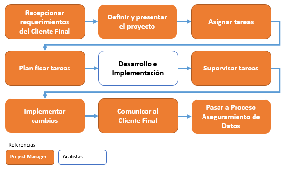
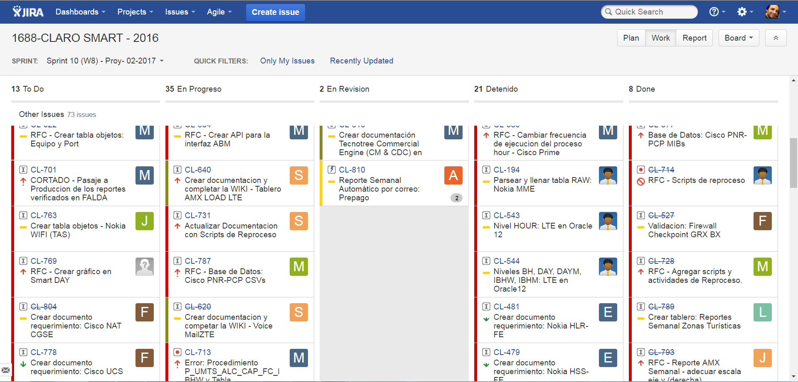
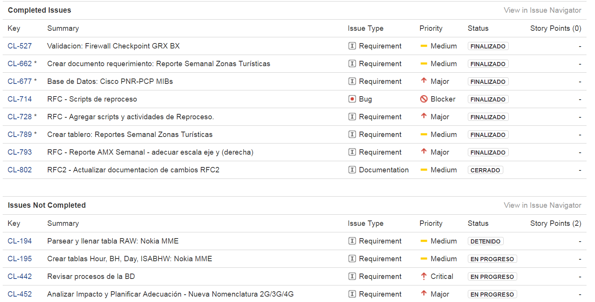

PROCESO DE DESARROLLO E IMPLEMENTACIÓN
======================================

1.	OBJETIVO
------------

El objetivo de este proceso es definir los pasos para desarrollar e implementar las nuevas plataformas en la herramienta Smart.  Como así también definir los roles dentro del equipo de trabajo.
 
2.	ALCANCE
-----------

Alcanza a todo el equipo de Performance de Red.

3.	DEFINICIONES
--------------------

+	Smart: herramienta de performance de red, donde se almacenan datos históricos de las diferentes plataformas integradas.

+	JIRA: herramienta web para registrar y dar seguimiento a tareas.

+	Project Manager: es la persona designada para dirigir el proyecto.  Sus responsabilidades son:

		+	Definir el proyecto y presentarlo al equipo.
		+	Planificar las tareas y asignarlas al equipo.
		+	Supervisar las tareas del equipo.
		+	Asignar prioridades al equipo.
		+	Implementar cambios en el proyecto.

+	Analista de Performance: es la persona designada para construir los requerimientos técnicos según la necesidad del cliente final y validar lo construido.

+	Analista de Desarrollo: es la persona designada para crear las diferentes partes de una plataforma siguiendo una metodología estándar.

+	Analista de Negocio: es la persona designada para validar que el desarrollo es estándar, escalable y mantenible.  Utiliza el check list de validación.

+	Analista de Producción: es la persona designada para implementar en el ambiente de producción todo el material del ambiente de desarrollo.

+	Check list de validación: es un listado de condiciones estándar para todos los desarrollos e implementaciones.  Asegura que se utilizan ambientes de desarrollo y producción virtualizados, sistema operativo Linux, base de datos Oracle 12, parser estándar, pentaho data integrator, tablas raw y sumarizaciones, depuraciones automáticas, controles automáticos, funciones de reprocesos, etc.
 
+	Sprint: período de tiempo, normalmente el Sprint tiene 2 semanas de duración.

+	Epica: conjunto de tareas, su duración es de 2, 3 o más sprints.

+	Tarea: es una activida a realizar, de baja complejidad, debe durar 2 o 3 días. 
 

4.	MACROFLUJO DEL PROCESO
--------------------------

5.	MICROFLUJO DEL PROCESO
--------------------------

.. image:: ../_static/images/procesodedesarrollo/pag3.png
  :align: center 

6.	PRINCIPALES ACTIVIDADES Y RESPONSABILIDADES
-----------------------------------------------

El proceso de desarrollo debe tener el siguiente formato:

.. raw:: html 

	

.. raw:: html

	<table width="972">
	<tbody>
	<tr>
	<td width="80">1</td>
	<td width="39">EPICA</td>
	<td width="451">Crear Proyecto en Jira y generar los requerimientos definidos en el apartado 2</td>
	<td width="160">Jefe Area, Manager Desa.</td>
	<td width="615">El Proceso de Desarrollo inicia con la creacion de la epica y de todas las actividades en estado abierto.&nbsp;</td>
	<td width="255">&nbsp;</td>
	</tr>
	<tr>
	<td rowspan="15">2</td>
	<td>&nbsp;</td>
	<td>Nombre de las actividad dentro de la EPICA (PROYECTO)</td>
	<td>Asignado en Jira</td>
	<td>Detalle</td>
	<td>Estandar</td>
	</tr>
	<tr>
	<td>REQ</td>
	<td>&nbsp;Nombre de Proyecto + Crear documento requerimientos:</td>
	<td>Analista</td>
	<td width="615">Se debera completar el template de requerimientos definido con los datos del proyecto. Debera incluir la definicion de la tabla Objetos y los graficos que se deben Implementar en SMART.</td>
	<td><a class="reference external" href="../_static/images/procesodedesarrollo/Requerimientos_para_integrar_Smart.xlsx">Template de Requerimientos</a>
	</td>
	</tr>
	<tr>
	<td>REQ</td>
	<td>&nbsp;Nombre de Proyecto +Parsear y llenar tabla RAW&nbsp;</td>
	<td>Desarrollador</td>
	<td width="615">Se debera implementar el Parseador JAVA con la estructura definida.   Puede ocurrir que los datos de origen sean a nivel horario en cuyo caso no se debera realizar Parser. La tarea debera ser finalizada, agregando el detalle correspondiente.</td>
	<td><a class="reference external" href="../_static/images/procesodedesarrollo/metodosgenericos.java"> Metodo Generico</a></td>
	</tr>
	<tr>
	<td>REQ</td>
	<td>&nbsp;Nombre de Proyecto + Crear Sumarizaciones:&nbsp;</td>
	<td>Desarrollador</td>
	<td width="615">Las particularidades a tener en cuenta para las sumarizaciones deben estar especificadas en el documento de requerimientos, como por ejemplo, para el calculo de la BH, que columna/s, se deben tomar en cuenta para esto.  La IBHW es el promedio de los tres picos de la BH. (la fecha corresponde al 1er dia de la semana involucrada - domingo)</td>
	<td>&nbsp;</td>
	</tr>
	<tr>
	<td>REQ</td>
	<td>&nbsp;Nombre de Proyecto + Crear tabla objetos</td>
	<td>Desarrollador</td>
	<td width="615">El desarrollador debera ejecutar esta tarea siempre que el requerimiento est&eacute; especificado en el documento de requerimientos.  Si el requerimiento no esta especificado por el analista, el desarrollador debera cancelar esta tarea con la descripcion correspondiente.</td>
	<td>&nbsp;</td>
	</tr>
	<tr>
	<td>REQ</td>
	<td>&nbsp;Nombre de Proyecto + Implementar actividades de limpieza de Datos Ad-hoc</td>
	<td>Desarrollador</td>
	<td width="615">El desarrollador debera Verificar si la politica general de limpieza de datos implementada cubre las necesidades del proyecto.  El desarrollador debera Verificar que toda la configuracion necesaria para la inclusion del proyecto en la politica general esta completa y funcionando adecuadamente.  Solo debera implementarse este requerimiento en caso que, por las caracteristicas del proyecto (volumen de datos, etc.), se requiera un borrado ad-hoc.   En caso de no ser necesario un proceso Ad-hoc, se debe cancelar la tarea, con la descripcion correspondiente.</td>
	<td width="255">Link a la politica general</td>
	</tr>
	<tr>
	<td>REQ</td>
	<td width="451">&nbsp;Nombre de Proyecto + Implementar&nbsp; Controles Basicos (RAW-HOUR-BH - DAY -IBHW)  &nbsp;* Sub-task: Nombre del Proyecto + Actualizar el Tablero de Performance de red.</td>
	<td>Desarrollador</td>
	<td width="615">En este apartado se deberan crear los procesos de control basicos del Proyecto. Por el momento se definen como niveles basicos los siguientes:  - Raw: El sistema actualmente utiliza la tabla File para controlar que el total de filas por archivo a copiar sea igual a la cantidad de filas insertadas.  Existe una columna Status que puede tener valor&nbsp; 0 (Ok), 1 (Error) , o 5 (listo para porcesar).   El control a realizar, es: Verificar para cada archivo del proyecto que los valores sean = 0.   Si el valor es distinto de 0, indica que hay un error.  - HOUR:&nbsp; Valor referencia: cantidad de objetos ACTIVOS en la tabla Objects, por hora.  El control a realizar consiste en: verificar que la cantidad de objetos que tengo en la tabla Hour por hora coincide con el valor de referencia, con un margen del +/- 10%. (salvo que se defina lo contrario por el Negocio)  - BH: La BH se controla siempre a dia vencido. Metrica: Pico o valor mas alto que muestra un objeto determinado para el dia de referencia.  La BH debe tener tantas filas como equipos ACTIVOS tengo en la Objects para el dia en cuestion.  - DAY: Debo tener tantas filas como objetos ACTIVOS en la tabla Objects existan para el dia en cuestion.  - IBHW: Debo tener tantas filas como objetos ACTIVOS en la tabla Objects existan para la semana en cuestion.    RESULTADO:  ** RAW: Debera mostrar el valor "ERROR -AA:MM:DD:HH:MM" y guardarlo en un historico durante 3 meses, y ademas debera permitir ver el detalle de la falla.  ** HOUR:&nbsp; Debera mostrar el valor "ERROR -AA:MM:DD:HH:MM" y guardarlo en un historico durante 3 meses, y ademas debera permitir ver el detalle de la falla.  ** BH:&nbsp; Debera mostrar el valor "ERROR -AA:MM:DD:HH:MM" y guardarlo en un historico durante 3 meses, y ademas debera permitir ver el detalle de la falla.  ** DAY:&nbsp; Debera mostrar el valor "ERROR -AA:MM:DD:HH:MM" y guardarlo en un historico durante 3 meses, y ademas debera permitir ver el detalle de la falla.  ** IBHW:&nbsp; Debera mostrar el valor "ERROR -AA:MM:DD:HH:MM" y guardarlo en un historico durante 3 meses, y ademas debera permitir ver el detalle de la falla.    SUB-TASK: Nombre del Proyecto + Tablero Performance de red.  El desarrollador debera actualizar la aplicacion "Tablero Performance de Red" con los cotroles correspondientes al nuevo proyecto.</td>
	<td width="255">Esta info podra ser mostrada en el TABLERO PERFORMANCE DE RED.</td>
	</tr>
	<tr>
	<td>REQ</td>
	<td width="451">&nbsp;Nombre de Proyecto + Definir e Implementar&nbsp; de Controles Ad-hoc  *&nbsp; Sub-task: Nombre del Proyecto + Actualizar el Tablero de Performance de red</td>
	<td>Analista/Desarrollador</td>
	<td width="615">Para implementar controles Ad-hoc en los proyectos, el analista debera identificar los elementos a controlar, como asi tambien los umbrales. Esta definicion debe ser agregada en el documento de requerimientos y luego el desarrollador debera implementarlas.    SUB-TASK: Nombre del Proyecto + Tablero Performance de red.  El desarrollador debera actualizar la aplicacion "Tablero Performance de Red" con los cotroles correspondientes al nuevo proyecto.</td>
	<td>&nbsp;</td>
	</tr>
	<tr>
	<td>REQ</td>
	<td width="451">&nbsp;Nombre de Proyecto + Crear proceso recupero de datos (Reproceso):  &nbsp;* Sub-task: Nombre del Proyecto + Actualizar el Tablero de Performance de red.</td>
	<td>Desarrollador</td>
	<td width="615">En todos los casos, el desarrollador debera desarrollar, implementar y especificar cual es el metodo de reproceso o recupero de datos para el caso de fallas del proceso original y/&uacute; otras fallas que impliquen que los datos origen ya sean crudos o de sumarizaciones no se encuentren completos.    SUB-TASK: Nombre del Proyecto + Tablero Performance de red.  El desarrollador debera actualizar la aplicacion "Tablero Performance de Red" con los cotroles correspondientes al nuevo proyecto.</td>
	<td>&nbsp;</td>
	</tr>
	</tr>
	<tr>
	<td>REQ</td>
	<td>&nbsp;Nombre de Proyecto + Armar paquete de Instalacion&nbsp;</td>
	<td>Desarrollador</td>
	<td width="615">El responsable de desarrollo debera armar el paquete de instalacion de acuerdo a la template definida y Deployar el proyecto en Falda, notificando al DEV SMART para que apunte SMART a FALDA y luego al analista responsable de PERFORMANCE DE RED para su validación. </td>
	<td>Link al template del paquete de instalacion.<a class="reference internal" href="http://10.111.249.17/wiki-performance/instructivosperformance/build/html/_sections/procesodesarrollo.html#anexo-iv-paquete-deploy">(Anexo IV)</a> </td>
	</tr>
	<tr>
	<td>REQ</td>
	<td>&nbsp;Nombre de Proyecto + Graficos en Smart:</td>
	<td>Desarrollador SMART</td>
	<td width="615">Los graficos de Smart se desarrollan en el unico entorno web actual. Se apuntan a Falda para la etapa de validacion y luego cuando el proyecto se deploya en Produccion, se deberan apuntar los graficos al entorno productivo.</td>
	<td>&nbsp;</td>
	</tr>
	<tr>
	<td>REQ</td>
	<td>&nbsp;Nombre de Proyecto + Validaci&oacute;n KPIs:&nbsp;</td>
	<td>Analista</td>
	<td width="615">El referente de Performance de red sera el responsable de validar los valores&nbsp; mostrados en SMART y/o la herramienta de visualizacion correspondiente.</td>
	<td>&nbsp;</td>
	
	<tr>
	<td>REQ.&nbsp;</td>
	<td width="451">&nbsp;Nombre de Proyecto + Implementar en Produccion:  &nbsp;* Sub-task: Nombre del Proyecto + Implementar en Produccion CORTADO.  &nbsp;* Sub-task: Nombre del Proyecto + Implementar en Produccion Smart.</td>
	<td width="160">Referente de Produccion /Referente SMART</td>
	<td width="615">El responsable del pasaje a Producci&oacute;n deber&aacute; realizar el pasaje a Producci&oacute;n previo correr el check list de validacion de Pasaje a Produccion:  Una vez finalizado el mismo, deber&aacute;:  Si es check list esta completo:  a. Realizar el pasaje a Produccion.   b. Adjuntar el check-list de validaci&oacute;n completo en el ticket de requerimiento.  b. Agregar detalle del resultado del Proceso en el campo comentarios del ticket de requerimiento.  c. Notificar al Documentador la finalizaci&oacute;n del pasaje a Producci&oacute;n. (tag en la descripcion del requerimiento).  d. Debera ademas colocar un backup en el directorio publico: \\corpsaba-usr\SHARE\Engineer\ProyectosBackup creando dentro de esta estructura una carpeta con el nombre del proyecto. (Si es la Version 1.0)  &nbsp;&nbsp;&nbsp; d.1 Dentro de esta carpeta se creara otra con la version Deployada&nbsp; y se colocara el mismo.  &nbsp;&nbsp;&nbsp;&nbsp;&nbsp;&nbsp;&nbsp;&nbsp;&nbsp;&nbsp;&nbsp; d.1.1 Si es el primer Deploy se coloca Nombre del Proyecto_ v1  &nbsp;&nbsp;&nbsp;&nbsp;&nbsp;&nbsp;&nbsp;&nbsp;&nbsp;&nbsp;&nbsp; d.1.2 Si es RFC, se colocara: Nombre del Proyecto_RFC_Numero  &nbsp;&nbsp;&nbsp;&nbsp;&nbsp;&nbsp;&nbsp;&nbsp;&nbsp;&nbsp; d.1.3 Si son mas de un RFC, se colocar&aacute;:&nbsp; Nombre del Proyecto_RFC_Numero_Numero_Numero  e. Finalizar su sub-task, colocando un link al repositorio, y asignar el requerimiento al referente SMART.  &nbsp;&nbsp;&nbsp;   f. El referente SMART, una vez que recibe el requerimiento, debera realizar/corroborar que los graficos SMART esten apuntando al entorno productivo (CORTADO).  g.&nbsp; Notificar al Documentador la finalizaci&oacute;n del pasaje a Producci&oacute;n. (tag en la descripcion del requerimiento)  h. Asignar la &Eacute;pica al Analista de PERFORMANCE referente y colocar la &Eacute;pica en estado &ldquo;CORTADO&rdquo;.    Si el check list esta incompleto, deber&aacute; re-abrir la tarea "armar paquete de inslacion" asignando la misma al desarrollador referente y solicitar la informacion correspondiente, debiendo colocar en "Detenido" el Requerimiento de implementacion a Produccion.</td>
	<td width="255">Link al template de validacion de Pasaje a Produccion - Anexo IV</td>
	</tr>
	<tr>
	<td width="80">DOC&nbsp;</td>
	<td width="163">&nbsp;Nombre de Proyecto + Documentacion en Proyecto</td>
	<td width="80">DEV</td>
	<td width="477">Cada Proyecto debe ser documentado en la wiki, en la seccion PROYECTOS, para lo cual el desarrollador debera documentar el proyecto con la siguiente template del Jira. (Luego esta info sera subida a la WIKI por parte de un documentador)  1. OBJETIVO  2. ALCANCE  3. DEFINICIONES  4. DESCRIPCION GENERAL  5. MACRO FLUJO DEL PROCESO  6. DESCRIPCION DETALLADA  6.1. Datos Origen  6.2. Datos Destino  6.3. Shell Copiar Archivos Origen a Destino y limpieza de los mismos  6.4. Listado de Tablas Utilizadas  6.5. Pentaho  6.6. Controles (aqui especificar detalle de los controles que se realizan)  7. REPROCESO MANUAL  8. SMART  Debera existir una version de documentos por cada version de deploy existente.</td>
	<td><a class="reference external" href="../_static/images/procesodedesarrollo/TemplateDocumentacion.docx">Template de Documentación</a>
	</td>
	</tr>
	<tr>
	<td>DOC</td>
	<td>&nbsp;Nombre de Proyecto + Documentacion en Wiki:&nbsp;</td>
	<td>Analista Documentador</td>
	<td width="615"> Cada Proyecto debe ser documentado en la wiki, en la seccion PROYECTOS, y debe contar con los siguientes apartados:  &nbsp;&nbsp;&nbsp; 1. OBJETIVO  &nbsp;&nbsp;&nbsp; 2. ALCANCE  &nbsp;&nbsp;&nbsp; 3. DEFINICIONES  &nbsp;&nbsp;&nbsp; 4. DESCRIPCION GENERAL  &nbsp;&nbsp;&nbsp; 5. MACRO FLUJO DEL PROCESO  &nbsp;&nbsp;&nbsp; 6. DESCRIPCION DETALLADA  &nbsp;&nbsp;&nbsp;&nbsp;&nbsp;&nbsp;&nbsp; 6.1. Datos Origen  &nbsp;&nbsp;&nbsp;&nbsp;&nbsp;&nbsp;&nbsp; 6.2. Datos Destino  &nbsp;&nbsp;&nbsp;&nbsp;&nbsp;&nbsp;&nbsp; 6.3. Shell Copiar Archivos Origen a Destino y limpieza de los mismos  &nbsp;&nbsp;&nbsp;&nbsp;&nbsp;&nbsp;&nbsp; 6.4. Listado de Tablas Utilizadas  &nbsp;&nbsp;&nbsp;&nbsp;&nbsp;&nbsp;&nbsp; 6.5. Pentaho  &nbsp;&nbsp;&nbsp;&nbsp;&nbsp;&nbsp;&nbsp; 6.6. Controles (aqui especificar detalle de los controles que se realizan)  &nbsp;&nbsp;&nbsp; 7. REPROCESO MANUAL  &nbsp;&nbsp;&nbsp; 8. SMART  &nbsp;&nbsp;&nbsp; 9. CONTROL DE CAMBIOS  Una vez puesto e Produccion, se debera crear el link a la seccion de la Wiki que corresponde: Ej Accesos, Tablero, etc.    Debera existir una version de documentos por cada version de deploy existente. El analista documentador debera agregar los cambios que surjan de los RFC.  1. Para ello agregara una linea en el control de cambios de la documentacion del proyecto en la WIKI.  2. Para el primer deploy, colocara fecha, en el detalle debera colocar "Version Origen" y un link a la carpeta en el repositorio publico.  3. En as sucesivas actualizaciones debera agregar una linea por cada deploy con la fecha, en el detale los RFC incluidos y el link a la carpeta del repositorio correspondiente.</td>
	<td width="255"><a href="http://10.111.249.17/wiki-performance/instructivosperformance/build/html/proyectos.html">´Wiki Performance</a></td>
	</tr>
	</tbody>
	</table>

	<td>&nbsp</td>

	<h6>&nbsp; Para el caso que sean RFC sobre proyectos ya existentes, se debera crear un ticket (tipo Requerimiento) de RFC, con numeracion correlativa (verificar en la Epica) y dentro del mismo deberan crearse las siguientes Sub-tasks:</h6>
	

	<table width="972">
	<tbody>
	<tr>
	<td width="451">&nbsp;RFC Nro - Nombre de Proyecto + Crear documento requerimientos</td>
	<td width="160">Analista&nbsp;</td>
	<td width="615">Detallar los cambios a realizar.</td>
	</tr>
	<tr>
	<td>RFC Nro - Nombre de Proyecto +Parsear y llenar tabla RAW&nbsp;</td>
	<td>Desarrollador</td>
	<td>Se creara solo en caso de que el RFC implique modificar el Parser o la/s tablas RAW</td>
	</tr>
	<tr>
	<td>RFC Nro - Nombre de Proyecto + Crear Sumarizaciones:&nbsp;</td>
	<td>Desarrollador</td>
	<td>Se creara solo en caso de que el RFC implique modificar la/s sumarizaciones</td>
	</tr>
	<tr>
	<td>RFC Nro - Nombre de Proyecto + Crear tabla objetos</td>
	<td>Desarrollador</td>
	<td>Se creara solo en caso de que el RFC implique modificar o crear la tabla Objetos</td>
	</tr>
	<tr>
	<td width="451">RFC Nro - Nombre de Proyecto + Implementar&nbsp; Controles Basicos (RAW-HOUR-BH - DAY -IBHW)  &nbsp;* Sub-task: Nombre del Proyecto + Actualizar el Tablero de Performance de red.</td>
	<td>Desarrollador</td>
	<td width="615">Se creara solo en caso de que el RFC implique modificar el proceso de control de datos. En este caso el desarrollador cancelara la tarea si no aplica.</td>
	</tr>
	<tr>
	<td>&nbsp;RFC Nro - Nombre de Proyecto + Implementar actividades de limpieza de Datos Ad-hoc</td>
	<td>Desarrollador</td>
	<td width="615">Se creara solo en caso de que el RFC implique modificar el proceso de limpieza de datos. En este caso el desarrollador cancelara la tarea si no aplica.</td>
	</tr>
	<tr>
	<td width="451">RFC Nro - Nombre de Proyecto + Definir e Implementar&nbsp; de Controles Ad-hoc  *&nbsp; Sub-task:&nbsp;&nbsp;Nombre del Proyecto + RFC Nro - Actualizar el Tablero de Performance de red</td>
	<td>Desarrollador</td>
	<td width="615">Se creara solo en caso de que el RFC implique modificar/crear el proceso de control de datos Ad-hoc. En este caso el desarrollador cancelara la tarea si no aplica.</td>
	</tr>
	<tr>
	<td width="451">RFC Nro - Nombre de Proyecto + Crear proceso recupero de datos (Reproceso):  &nbsp;* Sub-task: Nombre del Proyecto + Actualizar el Tablero de Performance de red.</td>
	<td>Desarrollador</td>
	<td>Se creara solo en caso de que el RFC implique modificar el proceso de recupero de datos.</td>
	</tr>
	<tr>
	<td>&nbsp;RFC Nro -&nbsp; Nombre de Proyecto + Graficos en Smart:</td>
	<td>Desarrollador</td>
	<td>Se creara solo en caso de que el RFC implique modificar/ crear graficos en SMART.</td>
	</tr>
	<tr>
	<td>&nbsp;RFC Nro -&nbsp; Nombre de Proyecto + Validaci&oacute;n KPIs:&nbsp;</td>
	<td>Analista</td>
	<td>Se creara solo en caso de que el RFC implique modificar o crear KPIs.</td>
	</tr>
	<tr>
	<td>&nbsp;RFC Nro - Nombre de Proyecto + Armar paquete de Instalacion&nbsp;</td>
	<td>Desarrollador</td>
	<td>&nbsp;</td>
	</tr>
	<tr>
	<td>&nbsp;RFC Nro -Nombre de Proyecto + Validaci&oacute;n de Negocio:&nbsp; (opcional)</td>
	<td>Tecnico Referente</td>
	<td>&nbsp;</td>
	</tr>
	<tr>
	<td width="451">&nbsp;RFC Nro - Nombre de Proyecto + Implementar en Produccion:  &nbsp;* Sub-task:&nbsp;&nbsp; Nombre del Proyecto + RFC Nro - Implementar en Produccion CORTADO.  &nbsp;* Sub-task:&nbsp;&nbsp; RFC Nro - Implementar en Produccion Smart.</td>
	<td width="160">Referente de Produccion /Referente SMART</td>
	<td width="615">El responsable del pasaje a Producci&oacute;n deber&aacute; realizar el pasaje a Producci&oacute;n previo correr el check list de validacion de Pasaje a Produccion:  Una vez finalizado el mismo, deber&aacute;:  Si es check list esta completo:  a. Realizar el pasaje a Produccion.   b. Adjuntar el check-list de validaci&oacute;n completo en el ticket de requerimiento.  b. Agregar detalle del resultado del Proceso en el campo comentarios del ticket de requerimiento.  c. Notificar al Documentador la finalizaci&oacute;n del pasaje a Producci&oacute;n. (tag en la descripcion del requerimiento).  d. Debera ademas colocar un backup en el directorio publico: \\corpsaba-usr\SHARE\Engineer\ProyectosBackup creando dentro de esta estructura una carpeta con el nombre del proyecto. (Si es la Version 1.0)  &nbsp;&nbsp;&nbsp; d.1 Dentro de esta carpeta se creara otra con la version Deployada&nbsp; y se colocara el mismo.  &nbsp;&nbsp;&nbsp;&nbsp;&nbsp;&nbsp;&nbsp;&nbsp;&nbsp;&nbsp;&nbsp; d.1.1 Si es el primer Deploy se coloca Nombre del Proyecto_ v1  &nbsp;&nbsp;&nbsp;&nbsp;&nbsp;&nbsp;&nbsp;&nbsp;&nbsp;&nbsp;&nbsp; d.1.2 Si es RFC, se colocara: Nombre del Proyecto_RFC_Numero  &nbsp;&nbsp;&nbsp;&nbsp;&nbsp;&nbsp;&nbsp;&nbsp;&nbsp;&nbsp; d.1.3 Si son mas de un RFC, se colocar&aacute;:&nbsp; Nombre del Proyecto_RFC_Numero_Numero_Numero  e. Finalizar su sub-task, colocando un link al repositorio, y asignar el requerimiento al referente SMART.  &nbsp;&nbsp;&nbsp;   f. El referente SMART, una vez que recibe el requerimiento, debera realizar/corroborar que los graficos SMART esten apuntando al entorno productivo (CORTADO).  g.&nbsp; Notificar al Documentador la finalizaci&oacute;n del pasaje a Producci&oacute;n. (tag en la descripcion del requerimiento)  h. Asignar la &Eacute;pica al Analista de PERFORMANCE referente y colocar la &Eacute;pica en estado &ldquo;CORTADO&rdquo;.    Si el check list esta incompleto, deber&aacute; re-abrir la tarea "armar paquete de inslacion" asignando la misma al desarrollador referente y solicitar la informacion correspondiente, debiendo colocar en "Detenido" el Requerimiento de implementacion a Produccion.</td>
	</tr>
	<tr>
	<td>&nbsp; RFC Nro - Nombre de Proyecto + Documentacion en Wiki:&nbsp;</td>
	<td>Analista de Documentacion</td>
	<td width="615">Debera existir una version de documentos por cada version de deploy existente. El analista documentador debera agregar los cambios que surjan de los RFC.  1. Para ello agregara una linea en el control de cambios de la documentacion del proyecto en la WIKI.  2. Para el primer deploy, colocara fecha, en el detalle debera colocar "Version Origen" y un link a la carpeta en el repositorio publico.  3. En as sucesivas actualizaciones debera agregar una linea por cada deploy con la fecha, en el detale los RFC incluidos y el link a la carpeta del repositorio correspondiente.&nbsp;</td>
	</tr>
	</tbody>
	</table>

	

Los tickets tipor requerimiento poseen el siguiente FLOW:

.. image:: ../_static/images/procesodedesarrollo/workflow1.png
  :align: center

Los tickets tipo Documentacion poseen el siguiente FLOW:

.. image:: ../_static/images/procesodedesarrollo/workflow2.png
  :align: center

Los tickets tipo Epica tienen el siguiente FLOW:

.. image:: ../_static/images/procesodedesarrollo/workflow3.png
  :align: center

1.	El tablero de comandos para este proceso es el siguiente dashboard de jira: JIRA / Agile / Project 1688-CLARO SMART - 2016 / Work.  

7.	INDICADORES 
---------------

Se utiliza el indicador “Porcentaje de Tareas Completadas” para controlar la cantidad de tareas completadas en cada Sprint.  

El listado de tareas se obtiene de JIRA: JIRA / Agile / Project 1688-CLARO SMART - 2016 / Report / Sprint Report.  

El objetivo es completar el 80% de las tareas planificadas en cada Sprint.

.. raw:: html

	<table width="900">
	<tbody>
	<tr>
	<td colspan="5" width="605">
	
<strong>&nbsp; &nbsp; &nbsp; &nbsp; &nbsp; &nbsp; &nbsp; &nbsp; &nbsp; &nbsp; &nbsp; &nbsp; &nbsp; &nbsp; &nbsp; &nbsp; &nbsp; &nbsp; &nbsp; &nbsp; &nbsp; &nbsp; &nbsp; &nbsp; &nbsp; &nbsp; &nbsp; &nbsp; &nbsp; &nbsp; &nbsp; &nbsp; &nbsp; &Iacute;tem de Control / Verificaci&oacute;n</strong>

	</td>
	</tr>
	<tr>
	<td width="123">
	
<strong>&Iacute;tem</strong>

	</td>
	<td width="123">
	
<strong>&Iacute;ndice</strong>

	</td>
	<td width="170">
	
<strong>Est&aacute;ndar</strong>

	</td>
	<td width="85">
	
<strong>Qui&eacute;n lo emite</strong>

	</td>
	<td width="104">
	
<strong>Frecuencia</strong>

	</td>
	</tr>
	<tr>
	<td width="123">
	
<strong>Porcentaje de Tareas Completadas</strong>

	</td>
	<td width="500">
	
Porcentaje de Tareas Completadas = Tareas Completadas / (Tareas Completadas + Tareas No Completadas)

	
&nbsp;

	</td>
	<td width="170">
	
<em>&nbsp;</em>

	
<strong>80%</strong>

	</td>
	<td width="85">
	
<strong>Project Manager</strong>

	</td>
	<td width="104">
	
<strong>Al final de cada Sprint</strong>

	</td>
	</tr>
	</tbody>
	</table>

ANEXO II-Desarrollo de Proyectos
--------------------------------

Los proyectos de desarrollo deberan ser implementados acorde a lo definido en el siguiente apartado:

.. raw:: html

	<table width="972">
	<tbody>
	<tr>
	<td width="37">1</td>
	<td width="870">El desarrollo se debera realizar en entorno local con las versiones de SO, Software y BD: (la VM posee el software y las versiones adecuadas)  * Sistema Operativo: Linux   * Java 1.8  * Pentaho: 6.1  * Base de Datos Oracle 12</td>
	<td width="241">LA VM se podra bajar del siguiente Link</td>
	</tr>
	<tr>
	<td>2</td>
	<td>Cada Proyecto debera tener la siguiente estructura de directorio.</td>
	<td>Link al script de generacion de directorio</td>
	</tr>
	<tr>
	<td>3</td>
	<td width="870">El parser debera ser desarrollado en tecnologia JAVA, utilizado como base el parser generico adaptado a los requerimientos del Proyecto, salvo que exista alguna razon que justifique un desarrollo completo nuevo.</td>
	<td>Link al parser generico.</td>
	</tr>
	<tr>
	<td>4</td>
	<td width="870">El "end to end" de Pentaho deber&aacute; tener la siguiente estructura como base, salvo que las caracteridsticas del Proyecto justifiquen un cambio radical en el mismo, en cualquier otro caso se respetara la estructura y se adaptara a las necesidades del proyecto en desarrollo.  * El nombre del end to end debera tener la siguiente estructura: NombreProyecto_EndToEnd.kjb</td>
	<td>&nbsp;</td>
	</tr>
	<tr>
	<td>5</td>
	<td width="870">Los procesos de la BD deberan ser organizados en paquetes con la estructura definida por Oracle.   * No deberan existir procedimientos y/o funciones que no esten contenidos en ningun paquete.   * Es obligatorio el manejo de excepciones utilizando el paquete G_ERROR_LOG_NEW.</td>
	<td>&nbsp;</td>
	</tr>
	<tr>
	<td>6</td>
	<td>Armar el paquete de desarrollo seg&uacute;n el anexo IV</td>
	<td>&nbsp;</td>
	</tr>
	<tr>
	<td>7</td>
	<td width="870">Mover el proyecto al server de desarrollo/pruebas (falda) para validacion.  * Tener en cuenta que se deben actualizar el NombreProyecto.properties las estructuras de directorio para que concuerden con la estructura de Falda.  * Ej: En la VM, la ruta es: /home/oracle/NombreProyecto y en el server de desarrollo (Falda) la ruta es: /calidad/NombreProyecto</td>
	<td>&nbsp;</td>
	</tr>
	</tbody>
	</table>

	<td>&nbsp</td>

	<table width="694">
	<tbody>
	<tr>
	<td width="694">EPICA: Reporte/Tablero + (frecuancia) + nombre reporte/tablero</td>
	</tr>
	<tr>
	<td width="694">Tareas:   &nbsp;* Nombre del reporte/ tablero + Crear requerimiento (debera contener el detalle para armar la consulta o el script que se debe utilizar en el armado)  &nbsp;* Nombre del reporte/ tablero +&nbsp; Desarrollar el Reporte/Tablero:Se debera armar la estructura definida para los desarrollos nuevos.  &nbsp;* Nombre del reporte/ tablero + Creacion de sripts de reproceso: Esta tarea solo se debera realizar cuando el reporte/tablero utilice tablas fisicas.  &nbsp;* Nombre del reporte/ tablero + Controles basicos: Incluye la creacion de los controles basicos mas la inclusion en el "Tablero Performance de Red"  &nbsp;* Nombre del reporte/ tablero + Desarrollo de reportes en SMART  &nbsp;* Nombre del reporte/ tablero +&nbsp; Implementar&nbsp; Controles Basicos (RAW-HOUR-BH - DAY -IBHW)  &nbsp;&nbsp;&nbsp; * Sub-task: Nombre del Proyecto + Actualizar el Tablero de Performance de red.  &nbsp;* Nombre del reporte/ tablero + Armar paquete de Instalacion   &nbsp; * Nombre del reporte/ tablero + Implementar en Produccion:  &nbsp;&nbsp;&nbsp;&nbsp; * Sub-task: Nombre del Proyecto + Implementar en Produccion CORTADO.  &nbsp;&nbsp;&nbsp;&nbsp; * Sub-task: Nombre del Proyecto + Implementar en Produccion Smart.  &nbsp; * Nombre del reporte/ tablero +&nbsp; Documentacion en Wiki:&nbsp;</td>
	</tr>
	</tbody>
	</table>

ANEXO III -Desarrollo de Tableros
---------------------------------

Los tableros deberan ser implementados acorde a lo definido en el siguiente apartado:

.. raw:: html

	<table width="972">
	<tbody>
	<tr>
	<td width="37">1</td>
	<td width="694">El desarrollo se debera realizar en entorno local con las versiones de SO, Software y BD: &hellip;. (definir cuales..)  * Sistema Operativo: Linux...  * Java:&hellip;.  * Pentaho: &hellip;..  * Base de Datos Oracle 12</td>
	<td width="241">LA VM se podra bajar del siguiente Link</td>
	</tr>
	<tr>
	<td>2</td>
	<td>Se debera crear la estructura de directorio definida. Para ello se debera ejecutar el script: proMkdirs.sh</td>
	<td>Link al script de generacion de directorio</td>
	</tr>
	<tr>
	<td>3</td>
	<td width="694">De ser factible no se deberan crear tablas fisicas, sino queries que se ejecutan en el momento de calculo del tablero.  - Si se crean tablas, deberan:  &nbsp;&nbsp;&nbsp;&nbsp;&nbsp;&nbsp; a) Crearse los procesos de recupero de datos.  &nbsp;&nbsp;&nbsp;&nbsp;&nbsp;&nbsp; b) Crearse el proceso de control basico.  &nbsp;&nbsp;&nbsp;&nbsp;&nbsp;&nbsp; c) Incorporarse en el "Tablero Performance de Red"</td>
	<td>&nbsp;</td>
	</tr>
	<tr>
	<td>4</td>
	<td width="694">El "end to end" de Pentaho se creara con la ejecucion del scrip proMkdirs.sh</td>
	<td>Link al script de generacion de directorio</td>
	</tr>
	<tr>
	<td>5</td>
	<td width="694">Los procesos de la BD deberan ser organizados en paquetes con la siguiente logica/estructura.</td>
	<td>Link a los citerios de armado de paquetes</td>
	</tr>
	<tr>
	<td>8</td>
	<td width="694">Los archivos de Logs. de los proyectos/tableros deberan ser almacenados la ruta &hellip;&hellip;&hellip;. del directorio del proyecto y deberan tener la extension &hellip;&hellip;&hellip;.. (cuando existan)</td>
	<td>&nbsp;</td>
	</tr>
	</tbody>
	</table>

ANEXO IV - Paquete Deploy
-------------------------

.. raw:: html

	
El desarrollador debera armar un paquete para el deploy que debera respetar la siguiente estructura y &nbsp;contenido como minimo. &nbsp;Esta informcion debera estar conenida en e ticket de Jira (Nombre de Proyecto + Armar paquete de Instalacion )

	
&nbsp;

	<table style= width="972">
	<tbody>
	<tr>
	<td>&nbsp;</td>
	<td>Ejemplo:&nbsp;</td>
	</tr>
	<tr>
	<td>
	
Contenido del paquete:

	
&nbsp;

	</td>
	<td>&nbsp;Contenido del paquete:</td>
	</tr>
	<tr>
	<td width="694">
	
0. Copiar el proyecto <strong>NOMBRE_DEL_PROYECTO</strong> completo al directorio /calidad (Server FALDA.CLARO.AMX)

	</td>
	<td>&nbsp;0. Copiar el proyecto NokiaAluIPRAN completo al directorio /calidad</td>
	</tr>
	<tr>
	<td width="694">
	
1. Crear las tablas XML_* con los siguientes scripts ubicados en /calidad/<strong>NOMBRE_DEL_PROYECTO</strong> /Tables/:

	<ul>
	<li>XML_XXXX_YYYY.sql (ejemplo)</li>
	<li>XML_XXYY_AAAA.sql (ejemplo)</li>
	</ul>
	</td>
	<td>
	
1. Crear las tablas XML_* con los siguientes scripts ubicados en /calidad/NokiaAluIPRAN/Tables/:

	<ul>
	<li>XML_CARD_STATUS.sql</li>
	<li>XML_MEDIA_INDEPEND_STATS_1.sql</li>
	<li>XML_MEDIA_INDEPEND_STATS.sql</li>
	<li>XML_NTWQOS_1.sql</li>
	<li>XML_NTWQOS.sql</li>
	<li>XML_SYSTEM_STATS_1.sql</li>
	<li>XML_SYSTEM_STATS_2.sql</li>
	<li>XML_SYSTEM_STATS_3.sql</li>
	<li>XML_SYSTEM_STATS.sql</li>
	</ul>
	</td>
	</tr>
	<tr>
	<td width="694">
	
2. Crear las tablas ejecutando los siguientes scripts ubicados en /calidad/<strong>NOMBRE_DEL_PROYECTO</strong> /Tables/:

	<ul>
	<li>ALC_XXXXX_YYY_AAA.sql (ejemplo)</li>
	<li>ALC_YYY_BBB.sql (ejemplo)</li>
	</ul>
	</td>
	<td>
	
2. Crear las tablas ejecutando los siguientes scripts ubicados en /calidad/NokiaAluIPRAN/Tables/:

	<ul>
	<li>ALC_CARDSLOT_IPRAN_OBJ.sql</li>
	<li>ALC_IPRAN_LINKS.sql</li>
	<li>ALC_LAGS_IPRAN_SCNEOLR_RAW.sql</li>
	<li>ALC_LAGS_IPRAN_SCNIOLR_RAW.sql</li>
	<li>ALC_MEDIA_INDP_STATS_IPRAN_RAW.sql</li>
	<li>ALC_PHYSICALPORT_IPRAN_OBJ.sql</li>
	<li>ALC_SYSTEMCPUSTATS_IPRAN_RAW.sql</li>
	<li>ALC_SYSTEM_MEM_STATS_IPRAN_RAW.sql</li>
	<li>PROCESS_TO_RUN.sql</li>
	</ul>
	</td>
	</tr>
	<tr>
	<td width="694">
	
3. Crear las tablas ejecutando los siguientes scripts ubicados en /calidad/<strong>NOMBRE_DEL_PROYECTO</strong>/Tables/:

	<ul>
	<li>ALC_XXXX_YYYY_BH.sql (ejemplo)</li>
	<li>ALC_AAAA_BBBB_DAY.sql (ejemplo)</li>
	</ul>
	</td>
	<td>
	
3. Crear las tablas ejecutando los siguientes scripts ubicados en /calidad/NokiaAluIPRAN/Tables/:

	<ul>
	<li>ALC_STATS_CPUMEM_BH.sql</li>
	<li>ALC_STATS_CPUMEM_DAY.sql</li>
	<li>ALC_STATS_CPUMEM_HOUR.sql</li>
	<li>ALC_STATS_CPUMEM_IBHW.sql</li>
	<li>ALC_STATS_IPRAN_BH.sql</li>
	<li>ALC_STATS_IPRAN_DAY.sql</li>
	<li>ALC_STATS_IPRAN_HOUR.sql</li>
	<li>ALC_STATS_IPRAN_IBHW.sql</li>
	</ul>
	</td>
	</tr>
	<tr>
	<td width="694">
	
4. Crear la secuencia utilizando el siguiente script ubicados en /calidad/<strong>NOMBRE_DEL_PROYECTO</strong>/PLSQL/:

	<ul>
	<li>ALC_XXXX_SSSS_SEQ.sql (ejemplo)</li>
	</ul>
	</td>
	<td>
	
4. Crear la secuencia utilizando el siguiente script ubicados en /calidad/NokiaAluIPRAN/PLSQL/:

	<ul>
	<li>ALC_IPRAN_LINKS_SEQ.sql</li>
	</ul>
	</td>
	</tr>
	<tr>
	<td width="694">
	
5. Crear los types utilizando el siguiente script ubicados en /calidad/<strong>NOMBRE_DEL_PROYECTO</strong>/PLSQL/:

	<ul>
	<li>ALC_YYYY_TYPES.sql (ejemplo)</li>
	</ul>
	</td>
	<td>
	
5. Crear los types utilizando el siguiente script ubicados en /calidad/NokiaAluIPRAN/PLSQL/:

	<ul>
	<li>ALC_IPRAN_TYPES.sql</li>
	</ul>
	</td>
	</tr>
	<tr>
	<td width="694">
	
6. Crear el paquete con los procedimientos necesarios utilizando los siguientes scripts ubicados en /calidad/<strong>NOMBRE_DEL_PROYECTO</strong>/PLSQL/ en el orden que aparecen:

	<ul>
	<li>G_ALC_YYYY.sql (ejemplo)</li>
	<li>G_ALC_XXXXX_PACKAGE_BODY.sql (ejemplo)</li>
	</ul>
	</td>
	<td>
	
6. Crear el paquete con los procedimientos necesarios utilizando los siguientes scripts ubicados en /calidad/NokiaAluIPRAN/PLSQL/ en el orden que aparecen:

	<ul>
	<li>G_ALC_IPRAN.sql</li>
	<li>G_ALC_IPRAN_PACKAGE_BODY.sql</li>
	</ul>
	</td>
	</tr>
	<tr>
	<td width="694">
	
7. Reemplazar los datos necesarios en el archivo:

	<ul>
	<li><strong>proyecto_config.properties</strong></li>
	</ul>
	</td>
	<td>
	
7. Reemplazar los datos necesarios en el archivo:

	<ul>
	<li>ipran_config.properties</li>
	</ul>
	</td>
	</tr>
	<tr>
	<td width="694">
	
8. Incluir la entrada PROYECTO-HOME=/calidad/<strong>NOMBRE_DEL_PROYECTO </strong>en /calidad/.kettle/kettle.properties

	</td>
	<td>
	
8. Incluir la entrada NOKIAALUIPRAN-HOME=/calidad/NokiaAluIPRAN en /calidad/.kettle/kettle.properties

	</td>
	</tr>
	<tr>
	<td width="694">
	
9. Verificar que coincidan los path en los archivos /calidad/<strong>NOMBRE_DEL_PROYECTO</strong>/Scripts/syncro.sh y /calidad/<strong>NOMBRE_DEL_PROYECTO</strong>/Scripts/ipranSyncroXML.sh

	</td>
	<td>
	
9. Verificar que coincidan los path en los archivos /calidad/NokiaAluIPRAN/Scripts/syncro.sh y /calidad/NokiaAluIPRAN/Scripts/ipranSyncroXML.sh

	</td>
	</tr>
	<tr>
	<td width="694">
	
10. Agregar las entradas:

	<ul>
	<li>*/5 * * * * /calidad/NokiaAluIPRAN/Scripts/syncro.sh '/calidad/NokiaAluIPRAN' &gt; testSyncro.log</li>
	</ul>
	</td>
	<td width="694">
	
10. Agregar las entradas:

	<ul>
	<li>*/5 * * * * /calidad/NokiaAluIPRAN/Scripts/syncro.sh '/calidad/NokiaAluIPRAN' &gt; testSyncro.log</li>
	</ul>
	</td>
	</tr>
	<tr>
	<td width="694">
	
11. Verificar que las variables de entorno que referencian a la base de datos mencionadas en los scripts apunten a SMART2

	</td>
	<td>
	
11. Verificar que las variables de entorno que referencian a la base de datos mencionadas en los scripts apunten a SMART2

	</td>
	</tr>
	</tbody>
	</table>