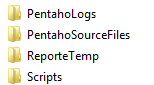
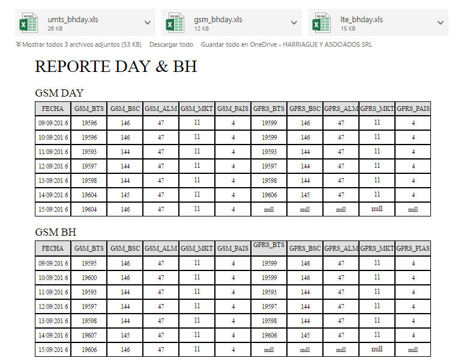

Reporte Bh Day
==============

1.	OBJETIVO
------------

El presente documento buscar explicar y detallar el proceso que genera el Reporte a Nivel Bh Day.

2.	ALCANCE
-----------

Áreas involucradas: Performance de Red

3.	DEFINICIONES
----------------

•	Falda: Servidor UNIX en donde se importan los XML desde el proveedor, y en donde se encuentra Smart. El nombre es falda.claro.amx.

4.	DESCRIPCIÓN GENERAL
-----------------------

**REPORTE A NIVEL BH DAY**

Este reporte se utiliza para obtener los datos de las 3 tecnologías (GSM, UMTS, LTE) enviando un email que contiene 3 archivos excel con los datos y en el cuerpo del mensaje contiene los reportes de las diferentes tecnologías.

5.	MACRO FLUJO DEL PROCESO
---------------------------

.. image:: ../_static/images/reportebhday/pag4.png
  :align: center 

6.	DESCRIPCIÓN DETALLADA
-------------------------

6.1. Datos de origen
********************

•	Server Origen y Path: falda.claro.amx  , /calidad/Reportes/

•	Frecuencia actualización: Frecuencia diaria

•	Tipo de Archivo de Salida: xlsx

6.2. Datos Destino
******************

•	Server Destino: Falda 

•	Conversión de Archivos: No

•	Tabla Files: No

•	Tabla Auxiliar: No 

•	Frecuencia de corrida del proceso: 1 vez al día

•	Regionales: No

•	RAW Si/No: No

•	Hour Si/No: No

•	Day Si/No: Si

•	BH Si/No: Si

•	Países: No

•	Directorio Destino (File System): /calidad/Reportes 

6.3. Shell Copiar Archivos Origen a Destino y limpieza de los mismos
********************************************************************

El script es el siguiente:

.. _report: ../_static/images/reportebhday/report.sh 

+	report_

6.3.	Listado de Tablas Utilizadas
************************************

Las tablas son las siguientes: 

•	CALIDAD_STATUS_REFERENCES

•	UMTSC_NSN_HO_WCEL_DAY

•	UMTSC_NSN_HO_RNC_DAY

•	UMTSC_NSN_HO_ALM_DAY

•	UMTSC_NSN_HO_MKT_DAY

•	UMTSC_NSN_HO_PAIS_DAY

•	UMTS_NSN_HO_WCEL_DAY

•	UMTS_NSN_HO_RNC_DAY

•	UMTS_NSN_HO_ALM_DAY

•	UMTS_NSN_HO_MKT_DAY

•	UMTS_NSN_HO_PAIS_DAY

•	MULTIVENDOR_BTS_BH 

•	MULTIVENDOR_BSC_BH 

•	MULTIVENDOR_ALM_BH 

•	MULTIVENDOR_MARKET_BH 

•	MULTIVENDOR_PAIS_BH 

•	MULTIVENDOR_GPRS_BH 

•	MULTIVENDOR_GPRS_BSC_BH 

•	MULTIVENDOR_GPRS_ALM_BH 

•	MULTIVENDOR_GPRS_MKT_BH 

•	MULTIVENDOR_GPRS_PAIS_BH 

•	 MULTIVENDOR_BTS_DAY 

•	MULTIVENDOR_BSC_DAY 

•	MULTIVENDOR_ALM_DAY 

•	MULTIVENDOR_MARKET_DAY 

•	MULTIVENDOR_PAIS_DAY 

•	MULTIVENDOR_GPRS_DAY 

•	MULTIVENDOR_GPRS_BSC_DAY 

•	MULTIVENDOR_GPRS_ALM_DAY 

•	MULTIVENDOR_GPRS_MKT_DAY

•	MULTIVENDOR_GPRS_PAIS_DAY

•	LTE_NSN_AVAIL_LCEL_BH

•	LTE_NSN_PAQ_LCEL_BH

•	LTE_NSN_SERVICE_LCEL_BH

•	LTE_NSN_AVAIL_LCEL_DAY

•	LTE_NSN_PAQ_LCEL_DAY

•	LTE_NSN_SERVICE_LCEL_DAY

•	LTE_NSN_AVAIL_NE_BH

•	LTE_NSN_PAQ_NE_BH

•	LTE_NSN_SERVICE_NE_BH

•	LTE_NSN_AVAIL_NE_DAY

•	LTE_NSN_PAQ_NE_DAY

•	LTE_NSN_SERVICE_NE_DAY

•	UMTSC_NSN_HO_WCEL_BH

•	UMTSC_NSN_HO_RNC_BH

•	UMTSC_NSN_HO_ALM_BH

•	UMTSC_NSN_HO_MKT_BH

•	UMTSC_NSN_HO_PAIS_BH

•	UMTS_NSN_HO_WCEL_BH

•	UMTS_NSN_HO_RNC_BH

•	UMTS_NSN_HO_ALM_BH

•	UMTS_NSN_HO_MKT_BH

•	UMTS_NSN_HO_PAIS_BH

•	UMTSC_NSN_HSDPA_WCEL_BH

•	UMTSC_NSN_HSDPA_RNC_BH

•	UMTSC_NSN_HSDPA_ALM_BH

•	UMTSC_NSN_HSDPA_MKT_BH

•	UMTSC_NSN_HSDPA_PAIS_BH

•	UMTS_NSN_HSDPA_WCEL_BH

•	UMTS_NSN_HSDPA_RNC_BH

•	UMTS_NSN_HSDPA_ALM_BH

•	UMTS_NSN_HSDPA_MKT_BH

•	UMTS_NSN_HSDPA_PAIS_BH

•	UMTSC_NSN_HSDPA_WCEL_DAY

•	UMTSC_NSN_HSDPA_RNC_DAY

•	UMTSC_NSN_HSDPA_ALM_DAY

•	UMTSC_NSN_HSDPA_MKT_DAY

•	UMTSC_NSN_HSDPA_PAIS_DAY

•	UMTS_NSN_HSDPA_WCEL_DAY

•	UMTS_NSN_HSDPA_RNC_DAY

•	UMTS_NSN_HSDPA_ALM_DAY

•	UMTS_NSN_HSDPA_MKT_DAY

•	UMTS_NSN_HSDPA_PAIS_DAY

•	UMTSC_NSN_MACD_WCEL_BH

•	UMTSC_NSN_MACD_RNC_BH

•	UMTSC_NSN_MACD_ALM_BH

•	UMTSC_NSN_MACD_MKT_BH

•	UMTSC_NSN_MACD_PAIS_BH

•	UMTSC_NSN_MACD_WCEL_DAY

•	UMTSC_NSN_MACD_RNC_DAY

•	UMTSC_NSN_MACD_ALM_DAY

•	UMTSC_NSN_MACD_MKT_DAY 

•	UMTSC_NSN_MACD_PAIS_DAY

•	UMTSC_NSN_SERVICE_WCEL_BHC

•	UMTSC_NSN_SERVICE_RNC_BHC

•	UMTSC_NSN_SERVICE_ALM_BHC

•	UMTSC_NSN_SERVICE_MKT_BHC

•	UMTSC_NSN_SERVICE_PAIS_BHC

•	UMTS_NSN_SERVICE_WCEL_BHC

•	UMTS_NSN_SERVICE_RNC_BHC

•	UMTS_NSN_SERVICE_ALM_BHC

•	UMTS_NSN_SERVICE_MKT_BHC

•	UMTS_NSN_SERVICE_PAIS_BHC

•	UMTSC_NSN_SERVICE_WCEL_BHP

•	UMTSC_NSN_SERVICE_RNC_BHP

•	UMTSC_NSN_SERVICE_ALM_BHP

•	UMTSC_NSN_SERVICE_MKT_BHP

•	UMTSC_NSN_SERVICE_PAIS_BHP

•	UMTS_NSN_SERVICE_WCEL_BHP

•	UMTS_NSN_SERVICE_RNC_BHP

•	UMTS_NSN_SERVICE_ALM_BHP

•	UMTS_NSN_SERVICE_MKT_BHP

•	UMTS_NSN_SERVICE_PAIS_BHP

•	UMTSC_NSN_SERVICE_WCEL_DAY

•	UMTSC_NSN_SERVICE_RNC_DAY

•	UMTSC_NSN_SERVICE_ALM_DAY

•	UMTSC_NSN_SERVICE_MKT_DAY

•	UMTSC_NSN_SERVICE_PAIS_DAY

•	UMTS_NSN_SERVICE_WCEL_DAY

•	UMTS_NSN_SERVICE_RNC_DAY

•	UMTS_NSN_SERVICE_ALM_DAY

•	UMTS_NSN_SERVICE_MKT_DAY

•	UMTS_NSN_SERVICE_PAIS_DAY

6.4. Pentaho
************

Estructura del proyecto:

•	Proceso Pentaho End to End

.. image:: ../_static/images/reportebhday/pag7.2.png
  :align: center 

Se crean un archivo Excel para cada tecnología que incluirá todas las consultas realizadas en las siguientes transformaciones: 

•	Proceso Pentaho GSM

.. image:: ../_static/images/reportebhday/pag8.png
  :align: center 

•	Proceso Pentaho UMTS

•	Proceso Pentaho LTE

.. image:: ../_static/images/reportebhday/pag8.2.png
  :align: center 

7.	REPROCESO MANUAL
--------------------

Para reprocesar se debe ejecutar por consola el script report.sh, los datos obtenidos serán de la semana completa: 

El email muestra los archivos adjuntos en formato xlsx que contiene los datos mencionados anteriormente:

.. image:: ../_static/images/reportebhday/pag10.png
  :align: center 