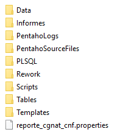

Reporte CGNAT
=============

1.	OBJETIVO
------------

El presente documento buscar explicar y detallar el proceso que genera el Reporte CGNAT

2.	ALCANCE 
-----------

Áreas involucradas: Performance de Red

3.	DEFINICIONES
----------------

•	Falda: Servidor UNIX en donde se importan los XML desde el proveedor, y en donde se encuentra Smart. El nombre es falda.claro.amx.
•	Cortado: Servidor LINUX en donde se importan los CSV desde el proveedor.
El nombre es cortado.claro.amx y la dirección IP física es 10.105.146.8

4.	DESCRIPCIÓN GENERAL
-----------------------
**CGNAT**

Las direcciones IP públicas con las que cuenta Claro son limitadas, no es posible asignarle una a cada usuario de la red móvil, por ese motivo c/u debe ser reutilizada varias veces (nateo).
En la compañía contamos con 2 equipos Cisco encargados de realizar el nateo de direcciones IP públicas.  Los equipos están ubicados en Don Torcuato (CF223) y Jonte 2 (C1900) y cada uno tiene 3 tarjetas para realizar la tarea.  Dado que cada tarjeta tiene una capacidad limitada, debe estar correctamente balanceada la carga entre todas las tarjetas, y este reporte ayuda a visualizar hora x hora la cantidad de subscribers que maneja c/u.

5.	MACROFLUJO 
---------------

.. image:: ../_static/images/reportecgnat/pag3.png
  :align: center 

6. DESCRIPCIÓN DETALLADA
------------------------

6.1. Datos de origen y datos destino
************************************

•	Server Origen y Path: falda.claro.amx, /calidad/ReporteCGNAT/
•	Frecuencia actualización:  Semanal (Los domingos a las 7 a.m)
•	Tipo de Archivo de Salida: .xlsx

6.2. Shell Copiar Archivos Origen a Destino y limpieza de los mismos
********************************************************************
Los scripts son los siguientes:

.. _cleanupLogs: ../_static/images/reportecgnat/cleanupLogs.sh
.. _deleteEmptyLogs: ../_static/images/reportecgnat/deleteEmptyLogs.sh 

+	cleanupLogs_

+	deleteEmptyLogs_

6.3. Listado de Tablas Utilizadas
*********************************

La tabla utilizada es:

•	CSCO_CGN_STATS_HOUR

6.4. Pentaho
************

Estructura del proyecto:

•	Proceso Pentaho End to End

•	Proceso Generar Reporte 

Este proceso se encarga de ejecutar la query en CGNAT, en el siguiente paso se da formato a la fecha (DD/MM/YYYY) y para finalizar se cargan los datos en el template de Excel

7.	CONTROLES
-------------

**No contiene controles**

8. REPROCESO MANUAL
-------------------

**No tiene reproceso.**

Se envía vía email un archivo Excel con el nombre:  REPORTE_CGNAT 02-04-2017

.. image:: ../_static/images/reportecgnat/pag6.png
  :align: center