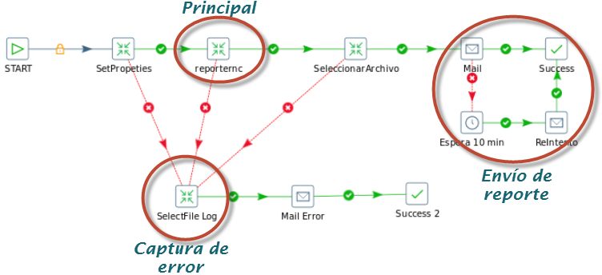
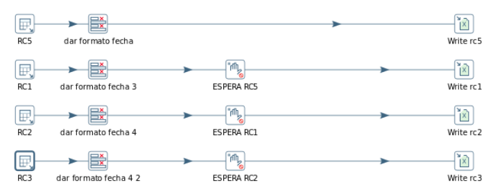

REPORTE RNC
===========

1.OBJETIVO
--------

-Tener un reporte semanal con el tráfico por RNC por hora de manera automatica
ALCANCE

-Áreas involucradas: Gerencia de calidad y performance

**DEFINICIONES**

•	OSSRC: Un regional cluster es el controlador de NETAC

•	Un RNC es el controlador de las celdas UMTS

2.DESCRIPCIÓN GENERAL
---------------------

Se muestra el tráfico por RNC hora por hora diferenciados por OSSRC
El informe está dirigido al equipo de calidad y performance a fin de optimizar los tiempos de análisis del comportamiento de la red.

En el reporte figuran cuatro gráficos detallando el tráfico de cada RNC separado por OSSRC 

3.ORIGEN DE DATOS
----------------- 

**Reporte OSSRC 5 DD.MM.YYYY**

**Tablas**:

		OBJECTS_SP_UMTS_NE
		UMTS_NSN_SERVICE_NE_HOUR

**Base de datos**: Willy en perdido.claro.amx

**Reporte OSSRC 6 DD.MM.YYYY**

**Tablas**:

		OBJECTS_SP_UMTS_NE
		UMTS_NSN_SERVICE_NE_HOUR

	**Base de datos**: Willy en perdido.claro.amx

**Reporte OSSRC 7 DD.MM.YYYY**

**Tablas**:

		OBJECTS_SP_UMTS_NE
		UMTS_NSN_SERVICE_NE_HOUR

	**Base de datos**: Willy en perdido.claro.amx

**Reporte OSSRC 8 DD.MM.YYYY**

**Tablas**:

		OBJECTS_SP_UMTS_NE
		UMTS_NSN_SERVICE_NE_HOUR

	**Base de datos**: Willy en perdido.claro.amx

CONSULTAS SQL
..............

Reporte OSSRC 5 DD.MM.YYYY

.. _ReporteOSSRC5:  ../_static/images/reporternc/ReporteOSSRC5.txt

* ReporteOSSRC5_ 
 
Reporte OSSRC 6 DD.MM.YYYY

.. _ReporteOSSRC6:  ../_static/images/reporternc/ReporteOSSRC6.txt

* ReporteOSSRC6_
 
Reporte OSSRC 7 DD.MM.YYYY

.. _ReporteOSSRC7:  ../_static/images/reporternc/ReporteOSSRC7.txt

* ReporteOSSRC7_
                                                    
Reporte OSSRC 8 DD.MM.YYYY

.. _ReporteOSSRC8:  ../_static/images/reporternc/ReporteOSSRC8.txt

* ReporteOSSRC8_
 

4.PROCESO PENTAHO 
---------------

**Reporte RNC DD:MM:YYYY**

**Variable HOME**: REPORTERNC-HOME
**Parámetros de entrada:**

FECHA (DD.MM.YYYY): Fecha tomada por la consulta SQL para filtrar los datos a un rango de tiempo. FECHA se Trunca dentro de la consulta al día Domingo 
  	FECHA_REPORTE (DD-MM-YYYY): fecha se usa para título del 

Principal
.................

Se divide en cuatro secciones similares en cuanto a la estructura cada uno específico para cada OSSRC

-	En caso de existir un error en alguna de las transformaciones se guarda en el log una marca de error y luego se envía por email 

**Envió de Informe**

En este proceso se realiza el envío del informe en Excel adjunto, se implementó un control por si falla el envío del email esperando 10 minutos y volviéndolo a intentar

**Captura de errores**

En esta sección se captura cualquier error que haya ocurrido en los JOB y transformaciones principales y se informa por email adjuntado el log

5.PRESENTACION
------------

Se envía por Email 

El "Reporte Reporte RNC Week YYYY" se envía los domingos a las 7 am por email.

Adjunto:

.. _ReporteRNC:  ../_static/images/reporternc/ReporteRNC.xlsx

* ReporteRNC_