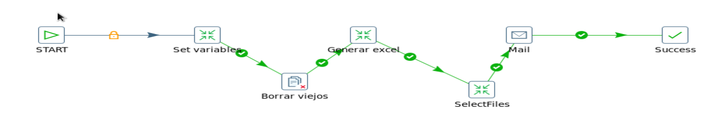

Reporte Automatico VLR
======================

1.	OBJETIVO
------------

El objetivo del documento será el de presentar y explicar los procesos que genera Reporte Automatico VLR

2.	ALCANCE
-----------

Áreas involucradas: Performance de red

3.	DEFINICIONES
----------------

Cortado: Servidor UNIX en donde se importan los archivos desde el proveedor. El nombre del servidor es cortado.claro.amx y la dirección IP física es 10.105.146.8.
Falda: Servidor de desarrollo en donde se desarrollan todos los proyectos antes de su pasaje a producción.

4.	DESCRIPCION GENERAL
-----------------------

En este documento el objetivo será mostrar el proceso que genera el envío automático del reporte semanal VLR (Visitor Location Register). 
El VLR es un equipo que tiene todos los datos referidos a los usuarios visitantes que pasan por la red móvil. 
El VLR es una base de datos de la estación móvil que se introduce en la jurisdicción del MSC. Cada estación base principal en la red es servida por un VLR por lo tanto un usuario no puede estar presente en más de un VLR a la vez.

4.1	MACROFLUJO DEL PROCESO
**************************

5.	Descripción Detallada
-------------------------

5.1.	Datos Origen
********************

•	Server Origen: falda.claro.amx
•	Path Origen: /calidad/ReporteVLR-BHCA
•	Usuario: calidad		
•	Password: Calidad2016

5.2.	Datos Destino
*********************

•	Server Destino: cortado.claro.amx
•	Tabla Files: No
•	Tabla Auxiliar: No
•	Frecuencia de corrida del proceso: Se envía por mail una vez por semana los días Lunes a las 3 de la tarde
•	Regionales: Si
•	RAW Si/No: No
•	Hour Si/No: No
•	Day Si/No: No
•	BH Si/No: Si
•	ISABH Si/No: No
•	Países: Argentina, Uruguay y Paraguay
•	Directorio Destino (File System): /calidad/ReporteVLR-BHCA

5.3.	Shell Copiar Archivos Origen a Destino y limpieza de los mismos
***********************************************************************

Scripts tienen las siguientes funciones:

1- Copiar los archivos
2- Limpieza
3- Ejecutar Pentaho
Los scripts son los siguientes:
El Script NokiaWIFIEndToEnd.sh es la raíz del proceso.
Los Scrips a utilizar son:

.. image:: ../_static/images/reportevlr/image2.png
  :align: center

5.4.	Querie
**************

::

    SELECT trunc(vlr_tot.PERIOD_START_TIME,'day')  FECHA,
       region,
       omsc.mss_name "MSS Name",
       BHCA,
       BHCA_MOD,
       BHCA_TOTAL,
       NVL(VLR_TOT.TOTALCURRENT, 0) "Tot Curr Subs",
       NVL(LAC_GSM.TOT_SUBS_LAC_GSM, 0) "GSM Curr Subs",
       NVL(LAC_UMTS.TOT_SUBS_LAC_UMTS, 0) "UMTS Curr Subs",
       NVL(VLR_TOT.TOTALAVERAGE, 0) "Tot Avg Subs",
       NVL(LAC_GSM.AVE_SUBS_LAC_GSM, 0) "GSM Avg Subs",
       NVL(LAC_UMTS.AVE_SUBS_LAC_UMTS, 0) "UMTS Avg Subs"

         FROM (
	   SELECT VLR.MSC_ID,
       VLR.PERIOD_START_TIME,
       VLR.TOTALCURRENT,
       VLR.TOTALAVERAGE,
       ROW_NUMBER() OVER(PARTITION BY VLR.MSC_ID ORDER BY VLR.TOTALCURRENT DESC) RANGO
     FROM RNS_PS_VLRNMSC_MSC_HOUR@OSSRC6 VLR
    WHERE VLR.PERIOD_START_TIME BETWEEN TRUNC(SYSDATE, 'DAY') - (7 * 1)
                                 AND TRUNC(SYSDATE, 'DAY') - 1 + 86399 / 86400
       ) VLR_TOT,
       (
    SELECT VLR_LAC_GSM.MSC_ID,
       VLR_LAC_GSM.PERIOD_START_TIME,
       SUM(ROUND(VLR_LAC_GSM.NSCURRENT, 0)) TOT_SUBS_LAC_GSM,
       SUM(ROUND(VLR_LAC_GSM.NSAVERAGE, 0)) AVE_SUBS_LAC_GSM
     FROM RNS_PS_VLRNLAC_LAC1_HOUR@OSSRC6 VLR_LAC_GSM
    WHERE VLR_LAC_GSM.LAC_ID LIKE '____'
    OR VLR_LAC_GSM.LAC_ID LIKE '_'
     AND VLR_LAC_GSM.PERIOD_START_TIME BETWEEN TRUNC(SYSDATE, 'DAY') - (7 * 1)
                                         AND TRUNC(SYSDATE, 'DAY') - 1 + 86399 / 86400
    GROUP BY VLR_LAC_GSM.MSC_ID,
          VLR_LAC_GSM.PERIOD_START_TIME
       ) LAC_GSM,
       (
    SELECT VLR_LAC_UMTS.MSC_ID,
       VLR_LAC_UMTS.PERIOD_START_TIME,
       SUM(ROUND(VLR_LAC_UMTS.NSCURRENT, 0)) TOT_SUBS_LAC_UMTS,
       SUM(ROUND(VLR_LAC_UMTS.NSAVERAGE, 0)) AVE_SUBS_LAC_UMTS
     FROM RNS_PS_VLRNLAC_LAC1_HOUR@OSSRC6 VLR_LAC_UMTS
    WHERE VLR_LAC_UMTS.LAC_ID LIKE '_____'
     AND VLR_LAC_UMTS.PERIOD_START_TIME BETWEEN TRUNC(SYSDATE, 'DAY') - (7 * 1)
                                         AND TRUNC(SYSDATE, 'DAY') - 1 + 86399 / 86400
    GROUP BY VLR_LAC_UMTS.MSC_ID,
          VLR_LAC_UMTS.PERIOD_START_TIME
       ) LAC_UMTS,
       (
    SELECT A.MSS_NAME,
       A.MSC_ID,
       A.WEEK_DAY,
       A.BHCA,
       A.BHCA_MOD,
       A.BHCA_TOTAL,
       A.CURRENT_SUBSCRIBERS_IN_VLR,
       A.AVERAGE_SUBSCRIBERS_IN_VLR
    FROM NOKIA_MSC_BHCA_WEEK_BH A
    WHERE A.WEEK_DAY BETWEEN TRUNC(SYSDATE, 'DAY') - (7 * 1)
                      AND TRUNC(SYSDATE, 'DAY') - 1 + 86399 / 86400
       ) BHCA,
       CORE_NSN_OBJECTS OMSC
    WHERE VLR_TOT.RANGO = 1
     AND VLR_TOT.MSC_ID = OMSC.MSC_ID
     AND VLR_TOT.MSC_ID = BHCA.MSC_ID (+)
     AND VLR_TOT.MSC_ID = LAC_GSM.MSC_ID (+)
     AND VLR_TOT.MSC_ID = LAC_UMTS.MSC_ID (+)
     AND VLR_TOT.PERIOD_START_TIME = LAC_GSM.PERIOD_START_TIME (+)
     AND VLR_TOT.PERIOD_START_TIME = LAC_UMTS.PERIOD_START_TIME (+)
     AND OMSC.MSS_NAME NOT IN ('MSCBAH01','MSCJON01','MSCCOR01','MSCSAN01','MSCTUC01','MSCURU01')
     AND OMSC.OBJECT_CLASS = 107

     ORDER BY OMSC.COUNTRY,
            OMSC.REGION,
            OMSC.MSS_NAME

5.5.	Pentaho
***************

.. image:: ../_static/images/reportevlr/image3.png
  :align: center

6.	Reporte Automático
**********************

.. image:: ../_static/images/reportevlr/image4.png
  :align: center