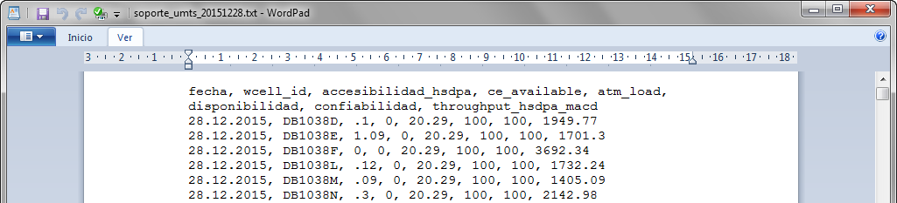
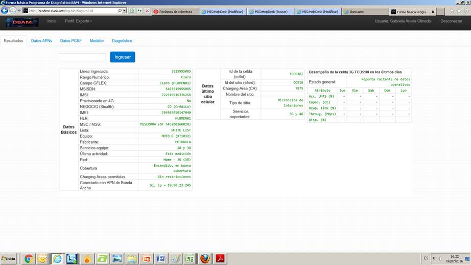
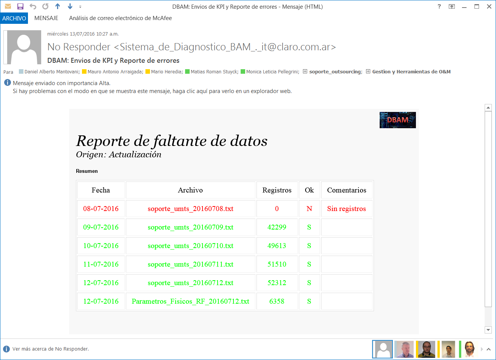

SOPORTE UMTS
============

1.	OBJETIVO
------------

El presente documento buscar explicar y detallar el proceso que genera el archivo Soporte UMTS

2.	ALCANCE 
-----------

Áreas involucradas: Performance de Red, procesos de operaciones y mantenimiento.

3.	DEFINICIONES 
----------------

•	Smart: Base de datos Oracle donde se encuentran las tablas de datos para la red de acceso, incluido GSM y GPRS
•	Perdido: Servidor UNIX en donde se aloja la base de datos Smart.  El nombre es perdido.claro.amx y la dirección ip física es 10.92.50.83

4.	DESCRIPCION GENERAL
-----------------------

El archivo de texto “Soporte Umts” se genera diariamente con un proceso Shell Script en el server Perdido, y toma como input la base de datos Smart.  Es utilizado por las herramientas WdC (Web de Cobertura) y PRADERE.

El archivo contiene la siguiente información diaria sobre cada una de las radiobases de la red.  

+	Fecha: el archivo es generado con la fecha del día en que corre el proceso
+	Wcell_id: sector de la radiobase umts
+	Accesibilidad HSDPA
+	Ce_available
+	Atm_load
+	Disponibilidad
+	Confiabilidad
+	Thrhoughput hsdpa macd

Nombre del proceso: soporte_umts_indicadores.sh

Path: /calidad/ps_spool/soporte/soporte_umts_indicadores.sh    

Server: perdido.claro.amx

Frecuencia de ejecución: DIARIA

Input: KPIs de 3G de la base de datos Smart

Output: archivo TXT ubicado en /export/home/soporte/soporte_umts_yyyymmdd.txt

Mecanismos de Control: si el archivo no se es generado, se recibe un mail del cliente indicando el faltante de datos

5.	MACRO FLUJO DEL PROCESO
---------------------------

6.	DESCRIPCION DETALLADA
-------------------------

Ubicación del script en el CRONTAB:
...................................

# Procesos Spool
30 08 * * * /calidad/ps_spool/soporte/soporte_umts_indicadores.sh    > /dev/null 2>&1
35 08 * * * /calidad/ps_spool/soporte/soporte_gsm_indicadores.sh     > /dev/null 2>&1

Descripción del Shell Script: soporte_umts_indicadores.sh
.........................................................

+	Este script ejecuta diferentes procesos SQL para obtener las últimas estadísticas de la red.
+	Luego se ejecuta la función de confiabilidad de datos (f_check_confiabilidad_70_percent).
+	Si la confiabilidad de datos es mayor al 70%, entonces:
+	El archivo txt (soporte_umts_yyyymmdd.txt) es creado mediante un proceso SQL (soporte_umts_indicadores.sql).
+	El archivo es movido al directorio final.

Shell Script soporte_umts_indicadores.sh
........................................

#!/usr/bin/ksh

# Declaracion de Funciones
. /calidad/control/unix.sh
. /calidad/control/include.sh
. /calidad/control/variables.sh

# Variables de entorno Oracle
export ORACLE_HOME=$oracleHome
export ORACLE_SID=$oracleSid
export ORACLE_TERM=$oracleTerm
export PATH=$path

# Comentarios
# Autor: Mario Heredia - 12.03.2010
# Actualizacion: Mario Heredia. Fecha: 18.01.2012. Motivo: Se saca del if a soporte_umts_parametros.sql
# Actualizacion: Mario Heredia. Fecha: 13.08.2012. Motivo: Se agregaron 5 .sql para asegurar siempre la mayor confiabilidad.

# Declaracion de Variables
DIA_DESDE=3
DIA_HASTA=1
FECHA_DESDE=`f_fecha $DIA_DESDE`
FECHA_HASTA=`f_fecha $DIA_HASTA`

cd $workDirSpoolSoporte

rm *.txt

for i in `f_CreateWindowDays $FECHA_DESDE $FECHA_HASTA`
do

  # sqlplus -S / @ ${workDirUmtsHourly}/iu/umts_c_nsn_iu_hour_au6.sql $i 00 $i 23

  sqlplus -S / @ ${workDirUmtsDaily}/iub/umts_c_nsn_iub_bh.sql $i $i

  sqlplus -S / @ ${workDirUmtsDaily}/service/aux_umts_c_nsn_wcell_bh.sql $i $i hsdpa

  sqlplus -S / @ ${workDirUmtsDaily}/hsdpa/umts_c_nsn_hsdpa_wcell_bh.sql $i $i

  sqlplus -S / @ ${workDirUmtsDaily}/hsdpa/umts_nsn_hsdpa_wcell.sql $i $i BH

  sqlplus -S / @ soporte_umts_indicadores_wcel_bh.sql $i $i

  if [ `f_check_confiabilidad_70_percent $i` = 'S' ]; then

     file="soporte_umts_`f_fecha_soporte $i`.txt"
  
     sqlplus -S / @ soporte_umts_indicadores.sql $i $file
  
     mv $file $workDirSpoolStorageSoporte

  fi

  fil2="Parametros_Fisicos_RF_`f_fecha_soporte $i`.txt"

  sqlplus -S / @ soporte_umts_parametros.sql $i $fil2

  mv $fil2 $workDirSpoolStorageSoporte

done

 
Proceso SQL soporte_umts_indicadores.sql
........................................

-- Autor: Mario Heredia
-- Actalizacion: Mario Heredia - 29.07.2010
-- Actalizacion: Mario Heredia - 16.06.2011
-- Actalizacion: Mario Heredia - 05.07.2013. Motivo: Se deja en 0 el campo de CE.
-- Actualizacion: Monica Pellegrini Fecha: 04.01.2016. Motivo: se cambia atm_load por load_amx
-- Actualizacion: Mario Heredia. Fecha: 28.01.2016. Motivo: Implementacion de multivendorObject2.

SET HEADING OFF PAGES 0 FEEDBACK OFF VERIFY OFF ECHO OFF HEAD OFF LINESIZE 140;
SPOOL ./&2

SELECT 'fecha, wcell_id, accesibilidad_hsdpa, ce_available, load_amx, disponibilidad, confiabilidad, throughput_hsdpa_macd' CAMPO FROM DUAL UNION ALL
SELECT FECHA||', '||
       WCELL_NAME||', '||
       ACCESIBILIDAD_HSDPA||', '||
       CE_AVG_AVAILABLE||', '||
       LOAD_AMX||', '||
       DISPONIBILIDAD||', '||
       CONFIABILIDAD||', '||
       THROUGHPUT_HSDPA_MACD SE
  FROM (
SELECT A.FECHA,
       A.WCELL_NAME,
       A.ACCESIBILIDAD_HSDPA,
       A.CE_AVG_AVAILABLE,
       A.LOAD_AMX,
       A.DISPONIBILIDAD,
       A.CONFIABILIDAD,
       A.THROUGHPUT_HSDPA_MACD,
       NVL(B.ESTADO, 'Comercial') ESTADO
  FROM (
SELECT TO_CHAR(FECHA, 'DD.MM.YYYY') FECHA,
       WCELL_NAME,
       ACCESIBILIDAD_HSDPA,
       CE_AVG_AVAILABLE,
       LOAD_AMX,
       DISPONIBILIDAD,
       CONFIABILIDAD,
       NVL(THROUGHPUT_HSDPA_MACD, 0) THROUGHPUT_HSDPA_MACD
  FROM NOC_UMTS_KPI_WCEL_BH
 WHERE FECHA = TO_DATE('&1','DD.MM.YYYY') --9462
       ) A,
       (
SELECT WCELL_ID,
       WCELL_NAME,
       WBTS_ID,
       WBTS_NAME,
       RNC_ID,
       RNC_NAME,
       ALM,
       MERCADO,
       PAIS,
       MR_ID,
       D.MR_NAME,
       FECHA_DESDE_MR,
       FECHA_HASTA_MR,
       DECODE(D.MR_NAME, NC.MR_NAME, 'No Comercial', 'Comercial') ESTADO,
       COUNT(*) OVER(PARTITION BY WCELL_NAME) CANTIDAD
  FROM (
SELECT WCELL_ID,
       WCELL_NAME,
       WBTS_ID,
       WBTS_NAME,
       RNC_ID,
       RNC_NAME,
       ALM,
       MERCADO,
       PAIS,
       MR_ID,
       MR_NAME,
       FECHA_DESDE_MR,
       FECHA_HASTA_MR,
       ROW_NUMBER() OVER(PARTITION BY WCELL_NAME ORDER BY FECHA_DESDE_MR DESC) ORDEN
  FROM (
SELECT B.WCELL_ID,
       B.WCELL_NAME,
       B.WBTS_ID,
       B.WBTS_NAME,
       B.RNC_ID,
       B.RNC_NAME,
       B.ALM,
       B.MERCADO,
       B.PAIS,
       MR_ID,
       C.ELEMENT_NAME MR_NAME,
       FECHA_INICIO FECHA_DESDE_MR,
       FECHA_FIN FECHA_HASTA_MR
  FROM NOC_UMTS_MR_OBJECTS A,
       OBJECTS_SP_UMTS     B,
       MULTIVENDOR_OBJECT2 PARTITION (MR) C
 WHERE B.WCELL_ID = A.WCELL_ID (+)
   AND A.MR_ID = C.ELEMENT_ID (+) 
   AND (TRUNC(SYSDATE) BETWEEN FECHA_INICIO
                           AND FECHA_FIN
    OR FECHA_INICIO >= TRUNC(SYSDATE))
   AND REAL_FECHA_INICIO >= TO_DATE('01.01.2016', 'DD.MM.YYYY')
       )
 WHERE (TRUNC(SYSDATE) BETWEEN FECHA_DESDE_MR
                           AND FECHA_HASTA_MR
    OR FECHA_HASTA_MR <= TRUNC(SYSDATE))
       ) D, NOC_MR_NO_COMERCIALES NC
 WHERE ORDEN = 1
   AND D.MR_NAME = NC.MR_NAME (+)
       ) B
 WHERE A.WCELL_NAME = B.WCELL_NAME (+)
       )
 WHERE ESTADO <> 'No Comercial';

SPOOL OFF;

EXIT;

Funciones utilizadas:
.....................

f_CreateWindowDays () {
  fechaDesde="$1"
  fechaHasta="$2"

  # Autor: Mario Heredia.
  # Actualizacion: Mario Heredia. Fecha: 13.08.2012. Motivo: Optimizacion.

  echo `sqlplus -S / <<EOF
  SET HEADING OFF PAGES 0 FEEDBACK OFF VERIFY OFF ECHO OFF HEAD OFF;
  SELECT TO_CHAR(FECHA, 'DD.MM.YYYY')
    FROM CALIDAD_STATUS_REFERENCES
   WHERE FECHA BETWEEN TO_DATE('$fechaDesde', 'DD.MM.YYYY')
                   AND TO_DATE('$fechaHasta', 'DD.MM.YYYY') + 86399 / 86400
     AND HORA = '00'
   ORDER BY FECHA;
  EXIT;
  EOF`
}

f_check_confiabilidad_70_percent () {
  echo `sqlplus -S / <<EOF
  SET HEADING OFF PAGES 0 FEEDBACK OFF VERIFY OFF ECHO OFF HEAD OFF;
 SELECT CASE WHEN INDICE < PRM_VALUE THEN 'N' ELSE 'S' END FLAG
    FROM (
  SELECT FECHA,
         CONFIABILIDAD,
         CANTIDAD,
         SUM(CANTIDAD) OVER(PARTITION BY FECHA) TOTAL,
         100 * ROUND((CANTIDAD / SUM(CANTIDAD) OVER(PARTITION BY FECHA)), 4) INDICE
    FROM (
  SELECT FECHA,
         CONFIABILIDAD,
         COUNT(*) CANTIDAD
    FROM NOC_UMTS_KPI_WCEL_BH
   WHERE FECHA BETWEEN TO_DATE('$1', 'DD.MM.YYYY') AND TO_DATE('$1', 'DD.MM.YYYY') + 86399/86400 
   GROUP BY FECHA, CONFIABILIDAD
         )
   GROUP BY FECHA,
            CONFIABILIDAD,
            CANTIDAD
         ),
         (
         SELECT PRM_VALUE FROM CALIDAD_PARAMETROS WHERE PRM_ID = 278)
   WHERE CONFIABILIDAD = 100; 
EXIT;
  EOF`
}

f_fecha_soporte () {
  echo `sqlplus -S / <<EOF
  SET HEADING OFF PAGES 0 FEEDBACK OFF VERIFY OFF ECHO OFF HEAD OFF;
  SELECT TO_CHAR(TO_DATE('$1', 'DD.MM.YYYY'), 'YYYYMMDD') FECHA FROM DUAL;
  EXIT;
  EOF`
}

Descripción de las variables: 
.............................

 A continuación se incrusta el documento variables.sh utilizado en la definición de funciones

 
