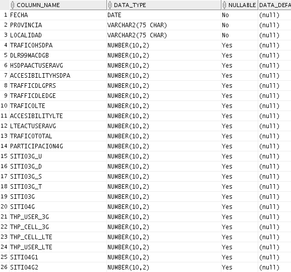
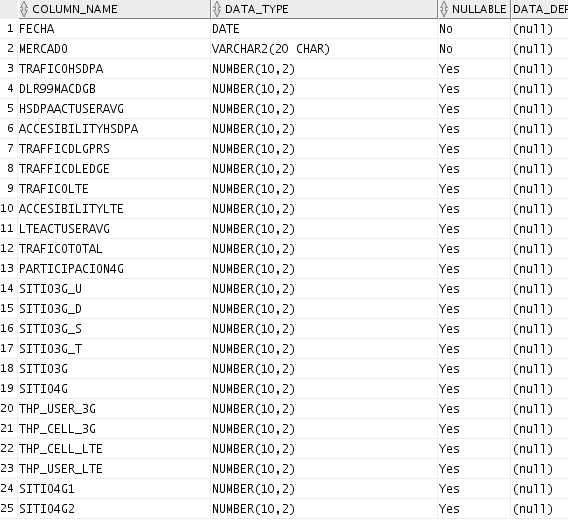

TABLERO PARTICIPACIÓN 4G CIUDAD/MERCADO
=======================================

1)	Objetivo
------------
El objetivo del tablero es poder comparar la evolución de las redes 3G y 4G del vendor Nokia, por ciudad y por mercado. Se espera ver una mejora en los diferentes KPIs de 3G a medida que evoluciona el despliegue de la red 4G y más sitios son puestos en servicio comercial. 
 
Los KPIs a visualizar son: tráfico de datos, usuarios simultáneos, accesibilidad de datos, throughput por celda, throuhgput por usuario, cantidad de nodos instalados. 
La sumarización de los KPIs es day week. 
Las ciudades a incluír son las capitales de provincia. 
Los mercados a incluír son los de Argentina y Paraguay.

.. _Tablero_Participacion4G_Ciudad_Mercado:  ../_static/images/documentos/Tablero_Participacion4G_Ciudad_Mercado.xlsx

Tablero_Participacion4G_Ciudad_Mercado_

2)	Alcance
-----------

Áreas involucradas: Performance de Red 

3)	DEFINICIONES
----------------

FD: Fecha desde, en formato DD.MM.YYYY
FH: Fecha hasta, en formato DD.MM.YYYY

4)	DESCRIPCIÓN DE LOS CAMPOS
-----------------------------

El nombre del tablero ciudad es: Tablero_Participacion4Gciudad

Campos para Ciudad: 

.. image:: ../_static/images/tablero4g/pag3.png
  :align: center 

El nombre del tablero mercado es: Tablero_Participacion4gmercado

Campos para Mercado: 

•	FECHA: FECHA DAYWEEK, corresponde al domingo de inicio de la semana, se considera que la semana comienza el domingo y finaliza el sábado.
•	TRAFICO HSDPA (HSDPAMACDGB): Tráfico umts hsdpa gb
•	DLR99MACDGB: Tráfico umts rl99 gb
•	HSDPAACTUSERAVG: Usuarios activos umts hsdpa promedio	
•	ACCESIBILITYHSDPA: Accesibilidad umts hsdpa
•	TRAFFICDLGPRS: Tráfico GSM GPRS DL GB 	
•	TRAFFICDLEDGE: TRAFICO GSM EDGE DL GB	
•	TRAFICO LTE (TRAFFICDL4G): Tráfico LTE DL GB
•	ACCESIBILITYLTE:   Accesibilidad lte
•	LTEACTUSERAVG (CELL_LOAD_ACT_UE_AVG): Usuarios activos lte promedio
•	TRAFICO TOTAL	: Tráfico umts hsdpa gb + Tráfico umts rl99 gb + Tráfico gsm gprs dl gb + Tráfico gsm edge dl gb + Tráfico lte dl gb
•	PARTICIPACIÓN 4G: Trafico lte dl gb / Tráfico total	
•	SITIO3G_U: Cantidad de sitios 3g simple portadora	
•	SITIO3G_D: Cantidad de sitios 3g doble portadora	
•	SITIO3G_S:  Cantidad de sitios 3g 4 - 6 sectores	
•	SITIO3G_T:  Cantidad de sitios 3g tercera portadora	
•	SITIO3G: Cantidad de sitios 3g	
•	SITIO4G: Cantidad de sitios 4g	
•	THP_USER_3G: Throughput de usuario 3g	
•	THP_CELL_3G: Throughput de celda 3g	
•	THP_CELL_LTE: Throughput de celda 4g 	
•	THP_USER_LTE:  Throughput de usuario 4g

SERVER
......

perdido.claro.amx (10.92.50.83) a falda.claro.amx(10.92.56.198)

BASE DE DATOS
.............

Oracle 10G. Instancia DSMART2

TIEMPO DE EJECUCIÓN
...................

Se ejecuta los días lunes a las 15 pm (cada 7 dias)

FRECUENCIA 
..........
Semanal 

DURACIÓN DEL PROCESO
....................

2 minutos aprox

UBICACIÓN DEL PROCESO
.....................

calidad/Tableros/RunAllTableros.kjb

LOGUEO DEL PROCESO
..................

El logueo del proceso se realiza en la ubicación calidad/tableros/PentahoLogs

5)	MACRO FLUJO
---------------

6)	TABLAS UTILIZADAS
---------------------

+	SELECT * FROM ALM_MERCADO;

+	SELECT * FROM LTE_NSN_SERVICE_NE_DAYW;

+	SELECT * FROM MULTIVENDOR_GPRS_DAYW;

+	SELECT * FROM OBJECTS_SP_GSM;

+	SELECT * FROM OBJECTS_SP_LTE;

+	SELECT * FROM OBJECTS_SP_LTE_NE;

+	SELECT * FROM OBJECTS_SP_UMTS;

+	SELECT * FROM OBJECTS_SP_UMTS_NE;

+	SELECT * FROM UMTS_NSN_HSDPA_MKT_DAYW;

+	SELECT * FROM UMTS_NSN_HSDPA_WCEL_DAYW;

+	SELECT * FROM UMTS_NSN_SERVICE_MKT_DAYW;

+	SELECT * FROM UMTS_NSN_SERVICE_WCEL_DAYW; 

+	SELECT * FROM UMTSC_NSN_HSDPA_MKT_DAYW;

+	SELECT * FROM UMTSC_NSN_HSDPA_WCEL_DAYW;

+	SELECT * FROM UMTSC_NSN_MACD_WCEL_DAYW;  

7)	DESCRIPCIÓN DETALLADA 
-------------------------

El Shell Script: 

.. _TableroRun:  ../_static/images/tablero4g/tableroRun.sh

TableroRun_ 
 
Los  procesos .sql denominado ciudad.sql y mercado.sql: 

.. _ConsultaCiudad:  ../_static/images/tablero4g/consultaCiudad.sql

ConsultaCiudad_

.. _ConsultaMercado:  ../_static/images/tablero4g/consultaMercado.sql

ConsultaMercado_ 

La ejecución de los procesos nos muestra los siguientes resultados: 

Cuidad: 

.. image:: ../_static/images/tablero4g/pag7.png
  :align: center 

Mercado: 

