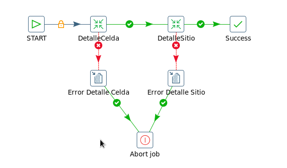

Tablero AMX Load LTE
====================

1.	OBJETIVO
------------

El presente documento busca explicar y detallar el proceso que genera el Tablero AMX LOAD LTE.

2.	ALCANCE
-----------

Áreas involucradas: Performance de Red

3.	DEFINICIONES
----------------

•	FD: Fecha desde, en formato DD.MM.YYYY

•	FH: Fecha hasta, en formato DD.MM.YYYY

•	Falda: Servidor UNIX en donde se importan los XML desde el proveedor, y en donde se encuentra Smart. El nombre es falda.claro.amx.

4.	DESCRIPCIÓN GENERAL
-----------------------

**TABLERO AMX LOAD LTE**

El desarrollo AMX Load LTE Nokia tiene como finalidad reportar el nivel de carga (load) de las celdas y sitios.
En base a 2 KPIs, uno de usuarios y otro de throughput, comparándolos con la capacidad de cada celda se determina si las celdas están sobrecargadas.

Hay cuatro condiciones posibles:

•	Normal (bajo throughput, bajos usuarios)

•	Alto throughput, bajos usuarios

•	Altos usuarios, bajo throughput

•	Alta carga (Altos usuarios, alto throughput)

Se crearon 2 tableros isabhw.

•	tablero_lte_amx_load_det_ibhw

Es un tablero de detalle en el que se pueden observar los valores throughput y usuarios para cada celda y para cada sitio y sus correspondientes capacidades.

•	tablero_lte_amx_load_res_ibhw

Es un tablero de resumen que muestra la cantidad de celdas y sitios que están en cada una de las condiciones expresadas arriba.

**Descripción:**

•	Server: falda.claro.amx 

•	Base de Datos: Oracle 10G. Instancia WILLY

•	Frecuencia del proceso:  Semanal

•	Proceso que genera el tablero:

	Los procesos se corren a través de Jobs: 

		o	P_TABLERO_AMX_LOAD_DET_JOB_DAY

		o	P_TABLERO_LTE_AMX_RES_IBHW
		
		o	P_TABLERO_LTE_AMX_RES_IBHW2
		
		o	P_TABLERO_LTE_AMX_RES_IBHW3
		
		o	P_TABLERO_LTE_AMX_RES_JOB_DAYW
		
		o	P_TABLERO_LTE_AMX_RES_IBHW
		
		o	P_TABLERO_LTE_AMX_RES_IBHW2
		
		o	P_TABLERO_LTE_AMX_RES_IBHW3

•	Duración del proceso:  2 minutos aproximadamente

•	Ubicación del proceso: falda.claro.amx

5.	PENTAHO
-----------

**PROCESO DE ENVÍO DE EMAIL**

5.1.		MACROFLUJO 
**********************

.. image:: ../_static/images/tableroamxloadlte/pag4.png
  :align: center

5.2.	Datos de Origen y Datos de Destino
******************************************

•	Server Origen y Path: Falda,  /calidad/TableroAMXLoadLTE
•	Frecuencia: Semanal (Los días Lunes de cada semana a las 7:00am)
•	Archivo de Salida: HTML

5.3.	Shell Copiar Archivos Origen a Destino y limpieza de los mismos
***********************************************************************

Los scripts son los siguientes:

.. _tableroAMX:  ../_static/images/tableroamxloadlte/tableroAMX.sh 
.. _tableroAMXLoad:  ../_static/images/tableroamxloadlte/tableroAMXLoad.sh

+	tableroAMX_

+	tableroAMXLoad_

5.4.	Tablas Utilizadas
*************************

Las tablas utilizadas son: 

•	TABLERO_LTE_AMX_LOAD_DET_IBHW

•	TABLERO_LTE_AMX_LOAD_RES_IBHW

5.5.	Proyecto
****************

•	Estructura: 

•	Proceso Pentaho End to End

•	Proceso Detalles

•	Proceso Resumen Celda y Resumen Sitio

Se realiza el control de los 11 mercados y países. 

El email se envía todos los Lunes a las 7:00am con el archivo adjunto: 

6.	REPROCESO 
-------------

Se crearon los procesos para los reprocesos con los siguientes parámetros:

• fecha_desde  Formato: DD.MM.YYYY
• fecha_hasta Formato: DD.MM.YYYY

begin
  -- Call the procedure
  p_tablero_amx_load_det_rec_day(p_fecha_desde => :p_fecha_desde,
                                                         p_fecha_hasta => :p_fecha_hasta);
end;
 
begin
  -- Call the procedure
  p_tablero_lte_amx_res_rec_dayw(p_fecha_desde => :p_fecha_desde,
                                 p_fecha_hasta => :p_fecha_hasta);
end;

7. CONTROL DE CAMBIOS
---------------------
.. raw:: html 

   

  <table border="3">
  <tr>
    <th>Fecha</th>
    <th>Responsable</th>
    <th>Ticket Jira</th>
    <th>Detalle</th>
    <th>Repositorio</th>
  </tr>
  <tr>
    <td>  </td>
    <td>  </td>
    <td> 

  </td>
    <td>  </td>
    <td> </td>
  </tr>
  <tr>
    <td>  </td>
    <td> </td>
    <td>  

  </td>
    <td>   </td>
    <td></td>
    
  </tr>
  </table>