TABLERO NQI
===========

1.	OBJETIVO

El presente documento buscar explicar y detallar el proceso que genera el Tablero NQI DAY

2.	ALCANCE 

Áreas involucradas: Performance de Red

3.	DEFINICIONES

•	FD: Fecha desde, en formato DD.MM.YYYY
•	FH: Fecha hasta, en formato DD.MM.YYYY
•	Smart: Base de datos Oracle donde se encuentran las tablas de datos para la red de acceso, incluido GSM y GPRS
•	Perdido: Servidor UNIX en donde se importan los XML desde el proveedor, y en donde se encuentra DSmart2.  El nombre es falda.claro.amx y la dirección ip física es 10.92.56.198

**TABLERO_NQI DAY**
-------------------

Descripción:
............

El tablero_nqi_day contiene información diaria sobre el tráfico de voz y datos, de las tecnologías umts y lte, agrupado por mercado y país. Para ver el tablero, una vez conectados a la base de datos Smart, con el PL/SQL ejecutar select * from tablero_nqi_day.  

Contiene los siguientes campos:

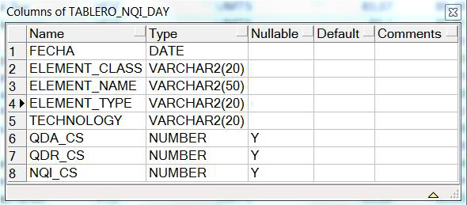

Descripción de los campos:
..........................

+ NQI CS : network quality index- Indicador a Nivel de Red

+ QDA CS : Factor de Accesibilidad

+ QDR CS :Factor de Retenibilidad 

Server:
.......

perdido.claro.amx (10.92.50.83).  

Base de Datos: 
..............

Oracle 10G.  Instancia WILLY

Frecuencia del proceso:
.......................
+  DIARIA

Proceso que genera el tablero:
..............................

El proceso tiene nombre " nqi_day_ins.sh " y actualiza la tabla diariamente y se lo puede encontrar en el crontab del equipo perdido, a continuación se lo transcribe:
15 09   *        /calidad/tablero/nqi/daily/nqi_day_ins.sh                  > /dev/null 2>&1
La ejecución entonces se realiza el minuto 15, de la hora 09, todos los días del año, todos los meses del año, todos los días de la semana (15 09 * *)

Duración del proceso: 
.....................

+ 2 minutos
Ubicación del proceso:
......................

+  /calidad/tablero/nqi/daily/nqi_day_ins.sh.  

Para poder ver el proceso se sugiere conectarse vía ftp al server perdido, con el usuario "calidad",

Logueo del proceso: 
...................

El logueo del proceso se realiza en el archivo nqi_day_ins.log (ubicado en el path /calidad/tablero/nqi/daily/) 

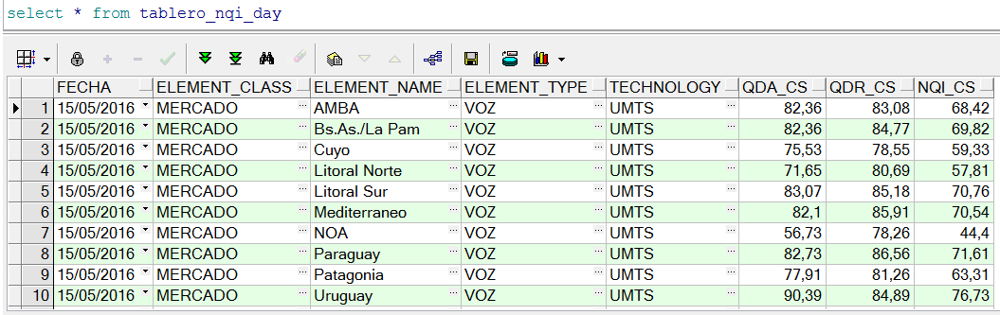

5.  MACRO FLUJO DEL PROCESO
...........................

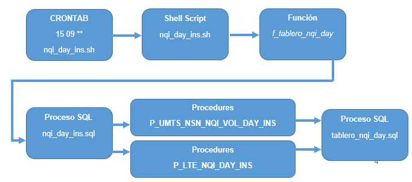

6.  DESCRIPCIÓN DETALLADA
.........................

El Shell Script **nqi_day_ins.sh** :

+ nqi_day_ins_

.. _nqi_day_ins: ../_static/images/tableronqi/nqi_day_ins.sh

La función denominada  **f_tablero_nqi_day** : 

f_Tablero_Nqi_Day ()
 
 {

  # Autor: Monica Pellegrini. Fecha: 27.07.2016.

  FECHA_DESDE="$1"

  FECHA_HASTA="$2"

  LOG=$3
  
  f_log 'Start NQI Day Ins' $LOG
  
  sqlplus -S / @${WorkDirNqiDaily}nqi_day_ins.sql $FECHA_DESDE $FECHA_HASTA
  
  f_log 'Finish NQI Day Ins' $LOG
  
  f_log 'Start Tablero NQI Day' $LOG
  
  sqlplus -S / @${WorkDirNqiDaily}tablero_nqi_day.sql $FECHA_DESDE $FECHA_HASTA
  
  f_log 'Finish Tablero NQI Day ' $LOG
  
  }

El logueo del proceso se realiza en el archivo **nqi_day_ins.log** (ubicado en el path calidad/tablero/minutos/):

.. _nqi_day_ins_log: ../_static/images/tableronqi/nqi_day_ins.log 

+ nqi_day_ins_log_

El proceso .sql denominado **nqi_day_ins.sql** :

.. _nqi_day_ins_sql: ../_static/images/tableronqi/nqi_day_ins.sql

+ nqi_day_ins_sql_

Los procedimientos **P_UMTS_NSN_NQI_VOL_DAY_INS** y  **P_LTE_NQI_DAY_INS** :

.. _P_UMTS_NSN_NQI_VOZ_DAY_INS: ../_static/images/tableronqi/P_UMTS_NSN_NQI_VOZ_DAY_INS.sql

.. _P_LTE_NQI_DAY_INS: ../_static/images/tableronqi/P_LTE_NQI_DAY_INS.sql

+ P_UMTS_NSN_NQI_VOZ_DAY_INS_

+ P_LTE_NQI_DAY_INS_

7.REPROCESO
...........

Para el reproceso del tablero nqi a nivel day, se debe conectar al equipo unix, en la carpeta:

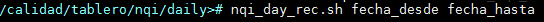

Formato de la fecha:  DD.MM.YYYY

Ejemplo:

8.SMART
.......

Los reportes en la herramienta Smart se muestran de la siguiente manera: 

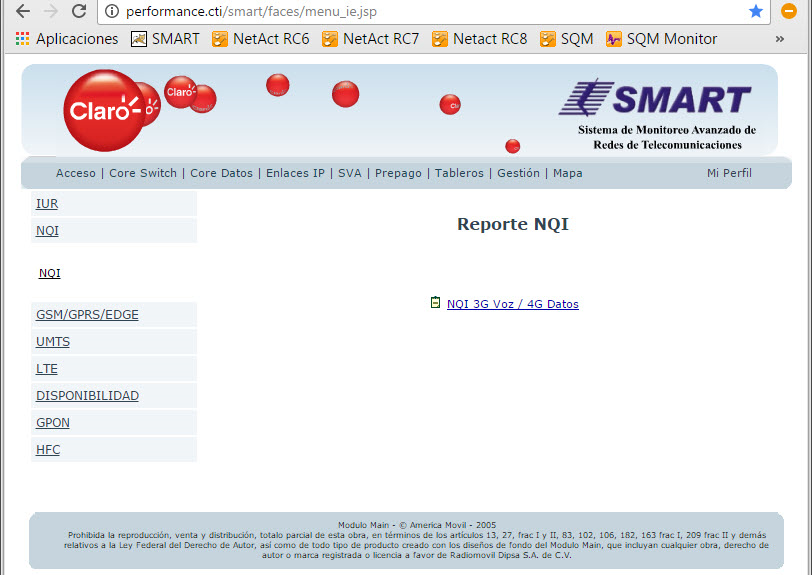

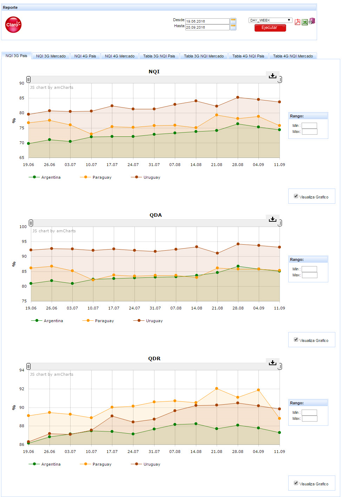

.. image:: ../_static/images/tableronqi/pag8.png
  :align: center

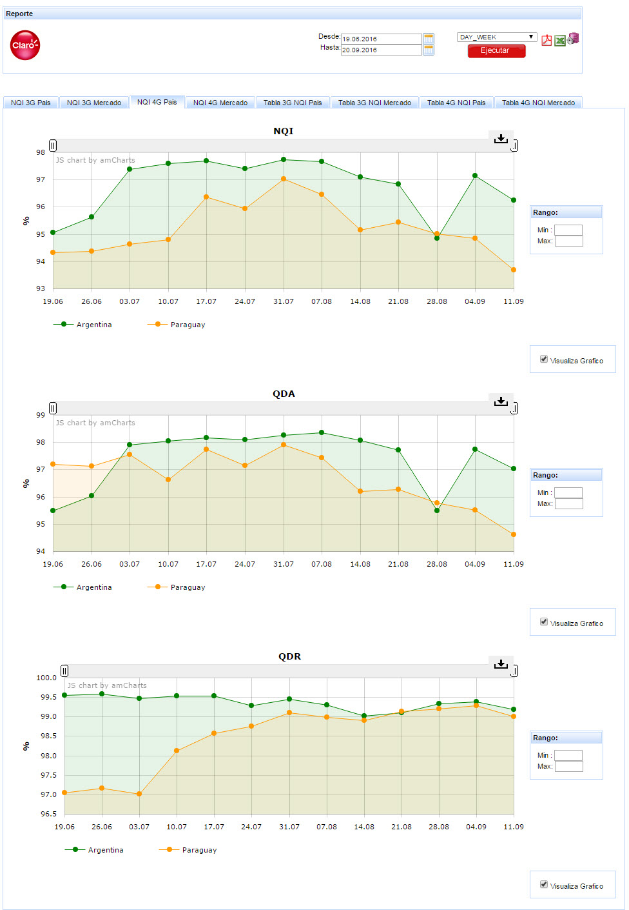

.. image:: ../_static/images/tableronqi/pag10.png
  :align: center

9. CONTROL DE CAMBIOS
.....................

.. raw:: html 

   

  <table border="3">
  <tr>
    <th>Fecha</th>
    <th>Responsable</th>
    <th>Ticket Jira</th>
    <th>Detalle</th>
    <th>Repositorio</th>
  </tr>
  <tr>
    <td> 12/01/2017 </td>
    <td> Monica Pellegrini </td>
    <td> 
<a href="http://jira.harriague.com.ar/jira/browse/CL-462"> CL-462 </a>
  </td>
    <td> Se creo el proceso para insertasr datos en tabla auxiliar. </td>
    <td> </td>
  </tr>
  </table>

**TABLERO QDA/QDR/Configuración (NQI HOURLY)**
---------------------------------------------

Descripción: 
************
  
El tablero NQI se puede consultar por nivel de sumarizacion y por elemento de red.
Los niveles de sumarizacion son: Horarios, Diarios y Semanales.
Los elementos de red disponibles son: Celda, Sitio, Elemento Controlador, Alm, Mercado, Pais.
 
Estos valores son iniciales.
 
La informacion que muestra el tablero de NQI es del lado de ACCESO y esto incluye tanto la parte de voz como la de datos.
El tablero NQI esta compuesta de algunas secciones: Trafico de Voz, Trafico de Datos (Tanto UpLink, DownLink como tambien discriminado por HSPA y por R99), Fallas en el establecimiento de las fallas (RAB y RRC), Indicador de Traffic Load y su apertura, Twmap y otros parametros de configuracion solo disponibles a nivel de celda (la gran mayoria).
 
Hoy por hoy, solamente se encuentra disponible el nivel de sumarizacion hour y a nivel del celda.
 
El nombre de la tabla con la info del tablero es TABLERO_NQI_HOUR.

Para ver el tablero, una vez conectados a la base de datos DSmart2, con el PL/SQL se debe ejecutar lo siguiente: 

  +  SELECT * FROM tablero_nqi_hour
  
Contiene los siguientes campos: 

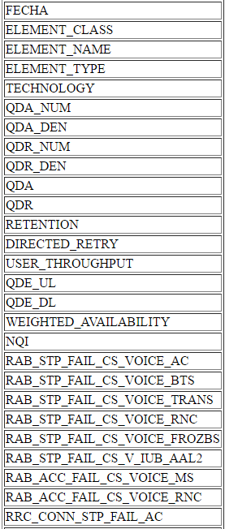

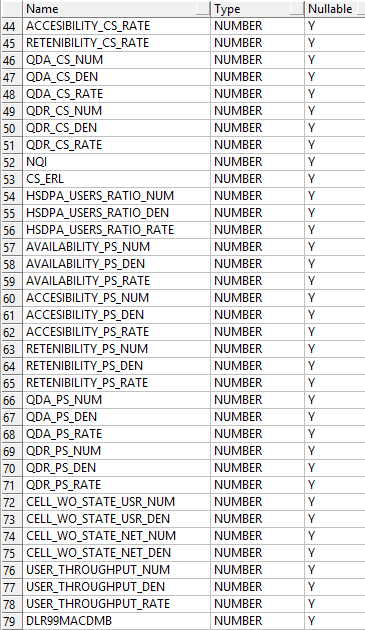

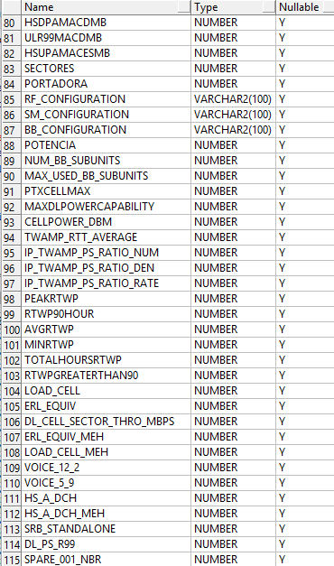

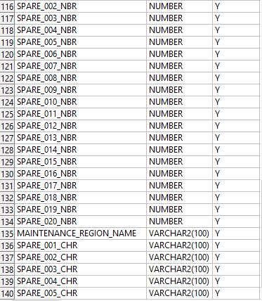

• Server:

falda.claro.amx (10.92.56.198).

• Base de Datos:

Oracle 12C. Instancia DSmart2

• Frecuencia del proceso:

Por Hora.

• Proceso que genera el tablero:
 
El tablero se procesa mediante un JOB en la BD, no contiene codigo script shell, ni tampoco Java, ni Pentaho. La insercion, mantenimiento y reprocesos de datos se hace pura y exclusivamente desde la BD.
El JOB se llama TABLERONQIHOURAUX, corre todas las horas y ejecuta el siguiente bloque PLSQL.
 
En la parte declarativa tenemos dos cursores y algunas variables.
El cursor FECHAS divide en ciclos predefinidos la ventana de procesamiento, cualquier sea su tamaño. Ejemplo: Si quiero procesar una ventana de 12 horas y el ciclo esta definido en 4 horas. El cursor devolvera tres periodos de tiempo de 4 horas cada uno que en total representarian la ventana de tiempo definida por el usuario para reprocesar.
Y el segundo cursor, llamado ELEMENTOS, detalla cada uno de los regionales que se tienen en cuanta para recolectar los valores e insertarlos en el tablero final.
 
Ambos cursores define la ventana de procesamiento... por cada regional se procesa un periodo de tiempo a la vez.
 
Cada ventana de procesamiento ejecuta dos procedimientos: P_AUX_TABLERO_NQI_HOUR_INS y P_TABLERO_NQI_HOUR_INS.
Todos los procedimientos y funciones invocadas durante todo el tratamiento del tablero NQI, se encuentra dentro del package G_TABLERONQIHOUR.
 
• Duración del proceso:

20 miutos aproximadamente

5.  MACRO FLUJO DEL PROCESO
...........................

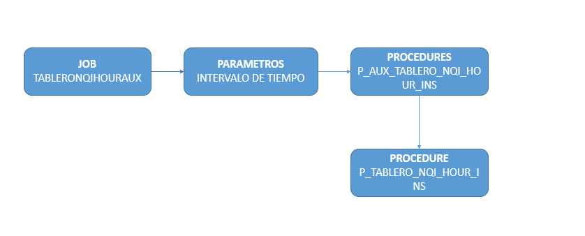

6.  DESCRIPCIÓN DETALLADA
.........................

7. CONTROL DE CAMBIOS
.....................

.. raw:: html 

   

  <table border="3">
  <tr>
    <th>Fecha</th>
    <th>Responsable</th>
    <th>Ticket Jira</th>
    <th>Detalle</th>
    <th>Repositorio</th>
  </tr>
  <tr>
    <td> </td>
    <td> </td>
    <td> </td>
    <td> </td>
    <td> </td>
  </tr>
  </table>