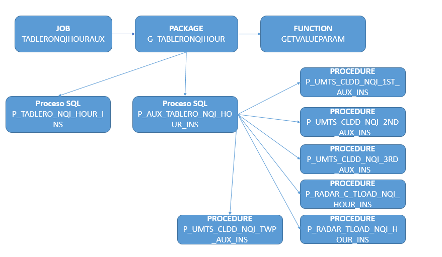

TABLERO NQI
===========

TABLERO QDA/QDR/Configuración (NQI HOURLY)
-------------------------------------------

1.OBJETIVO
............

El presente documento buscar explicar y detallar el proceso que genera el Tablero NQI HOURLY

2.ALCANCE
............

Áreas involucradas: Performance de Red

3.DESCRIPCION GENERAL: 
.......................
  
El tablero NQI se puede consultar por nivel de sumarizacion y por elemento de red.
Los niveles de sumarizacion son: Horarios, Diarios y Semanales.
Los elementos de red disponibles son: Celda, Sitio, Elemento Controlador, Alm, Mercado, Pais.
 
Estos valores son iniciales.
 
La informacion que muestra el tablero de NQI es del lado de ACCESO y esto incluye tanto la parte de voz como la de datos.
El tablero NQI esta compuesta de algunas secciones: Trafico de Voz, Trafico de Datos (Tanto UpLink, DownLink como tambien discriminado por HSPA y por R99), Fallas en el establecimiento de las fallas (RAB y RRC), Indicador de Traffic Load y su apertura, Twmap y otros parametros de configuracion solo disponibles a nivel de celda (la gran mayoria).
 
Hoy por hoy, solamente se encuentra disponible el nivel de sumarizacion hour y a nivel del celda.
 
El nombre de la tabla con la info del tablero es TABLERO_NQI_HOUR.

Para ver el tablero, una vez conectados a la base de datos DSmart2, con el PL/SQL se debe ejecutar lo siguiente: 

  +  SELECT * FROM tablero_nqi_hour
  
Contiene los siguientes campos: 

.. image:: ../_static/images/tableronqihourly/pag4.png
  :align: center

.. image:: ../_static/images/tableronqihourly/pag4.2.png
  :align: center

.. image:: ../_static/images/tableronqihourly/pag4.3.png
  :align: center

.. image:: ../_static/images/tableronqihourly/pag4.4.png
  :align: center

• Server:

falda.claro.amx (10.92.56.198).

• Base de Datos:

Oracle 12C. Instancia DSmart2

• Frecuencia del proceso:

Por Hora.

• Proceso que genera el tablero:
 
El tablero se procesa mediante un JOB en la BD, no contiene codigo script shell, ni tampoco Java, ni Pentaho. La insercion, mantenimiento y reprocesos de datos se hace pura y exclusivamente desde la BD.
El JOB se llama TABLERONQIHOURAUX, corre todas las horas.
 
En la parte declarativa tenemos dos cursores y algunas variables.
El cursor FECHAS divide en ciclos predefinidos la ventana de procesamiento, cualquier sea su tamaño. Ejemplo: Si quiero procesar una ventana de 12 horas y el ciclo esta definido en 4 horas. El cursor devolvera tres periodos de tiempo de 4 horas cada uno que en total representarian la ventana de tiempo definida por el usuario para reprocesar.
Y el segundo cursor, llamado ELEMENTOS, detalla cada uno de los regionales que se tienen en cuanta para recolectar los valores e insertarlos en el tablero final.
 
Ambos cursores define la ventana de procesamiento... por cada regional se procesa un periodo de tiempo a la vez.
 
Cada ventana de procesamiento ejecuta dos procedimientos: P_AUX_TABLERO_NQI_HOUR_INS y P_TABLERO_NQI_HOUR_INS.
Todos los procedimientos y funciones invocadas durante todo el tratamiento del tablero NQI, se encuentra dentro del package G_TABLERONQIHOUR.
 
• Duración del proceso:

20 miutos aproximadamente

4.  MACRO FLUJO DEL PROCESO
...........................

.. image:: ../_static/images/tableronqihourly/pag10.png
  :align: center

5.  DESCRIPCIÓN DETALLADA
.........................

**ESQUEMA DEL PROCEDIMIENTO PARA GENERAR EL TABLERO NQI Hour**

• El JOB TABLERONQIHOURAUX tiene el siguiente bloque PL/SQL:

.. _TABLERONQIHOURAUX: ../_static/images/tableronqihourly/JOB.sql

 TABLERONQIHOURAUX_

• El Package G_TABLERONQIHOUR tiene el siguiente bloque PL/SQL:

.. _G_TABLERONQIHOUR: ../_static/images/tableronqihourly/G_TABLERONQIHOUR.sql

 G_TABLERONQIHOUR_

• El Procediminto P_AUX_TABLERO_NQI_HOUR_INS tiene el siguiente bloque PL/SQL:

.. _P_AUX_TABLERO_NQI_HOUR_INS: ../_static/images/tableronqihourly/P_AUX_TABLERO_NQI_HOUR_INS.sql

 P_AUX_TABLERO_NQI_HOUR_INS_

• El Procedimiento P_TABLERO_NQI_HOUR_INS tiene el siguiente bloque PL/SQL:

.. _P_TABLERO_NQI_HOUR_INS: ../_static/images/tableronqihourly/P_TABLERO_NQI_HOUR_INS.sql

 P_TABLERO_NQI_HOUR_INS_

 • El Procedimiento P_UMTS_CLDD_NQI_1ST_AUX_INS tiene el siguiente bloque PL/SQL:

.. _P_UMTS_CLDD_NQI_1ST_AUX_INS: ../_static/images/tableronqihourly/uno.sql

 P_UMTS_CLDD_NQI_1ST_AUX_INS_

 • El Procedimiento P_UMTS_CLDD_NQI_2ST_AUX_INS tiene el siguiente bloque PL/SQL:

.. _P_UMTS_CLDD_NQI_2ND_AUX_INS: ../_static/images/tableronqihourly/dos.sql

 P_UMTS_CLDD_NQI_2ND_AUX_INS_

 • El Procedimiento P_UMTS_CLDD_NQI_3ST_AUX_INS tiene el siguiente bloque PL/SQL:

.. _P_UMTS_CLDD_NQI_3ST_AUX_INS: ../_static/images/tableronqihourly/tres.sql

 P_UMTS_CLDD_NQI_3ST_AUX_INS_

 • El Procedimiento P_RADAR_C_TLOAD_NQI_HOUR_INS tiene el siguiente bloque PL/SQL:

.. _P_RADAR_C_TLOAD_NQI_HOUR_INS: ../_static/images/tableronqihourly/cuatro.sql

 P_RADAR_C_TLOAD_NQI_HOUR_INS_

 • El Procedimiento P_RADAR_TLOAD_NQI_HOUR_INS tiene el siguiente bloque PL/SQL:

.. _P_RADAR_TLOAD_NQI_HOUR_INS: ../_static/images/tableronqihourly/cinco.sql

 P_RADAR_TLOAD_NQI_HOUR_INS_

 • El Procedimiento P_UMTS_CLDD_NQI_TWP_AUX_INS tiene el siguiente bloque PL/SQL:

.. _P_UMTS_CLDD_NQI_TWP_AUX_INS: ../_static/images/tableronqihourly/seis.sql

 P_UMTS_CLDD_NQI_TWP_AUX_INS_

6. CONTROL DE CAMBIOS
.....................

.. raw:: html 

   

  <table border="3">
  <tr>
    <th>Fecha</th>
    <th>Responsable</th>
    <th>Ticket Jira</th>
    <th>Detalle</th>
    <th>Repositorio</th>
    <td> </td>
  </tr>
  </table>